# 6月30日，月山詳細…まだまだリフト滑れるよ！

📅 投稿日時: 2013-07-02 00:47:57

🏷️ カテゴリ: [2013スキー滑走日記](c91dbe557f9a69230b1600e48622fdd61.md)

ってわけで．

日曜の月山の詳細レポートをば…

朝から天気が回復してきた月山．

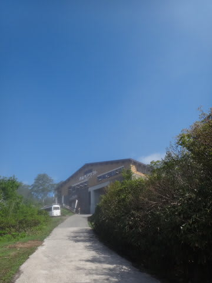

雪も減ったこの時期．

駐車場はタダ．

リフト券も一日券が3300円に割引になってますね～

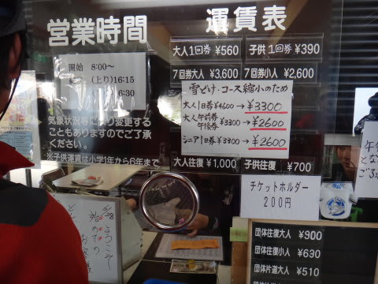

…でも．その代わり．

リフト乗り場には，もう滑り込めません…(泣）．

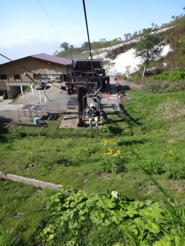

上にリフト乗り場の建物が見える，このあたりから…

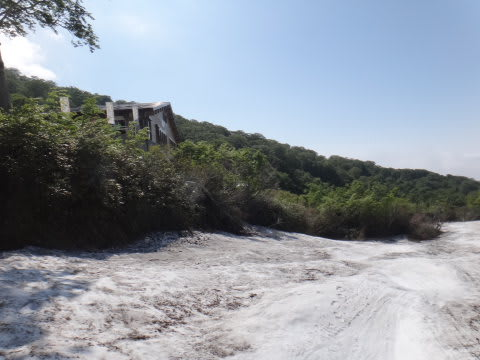

こんな風な上り道があるので…

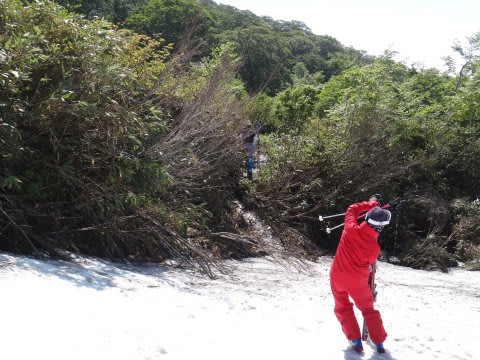

ここをえんやこら上って，リフト乗り場の建物下に出ます．

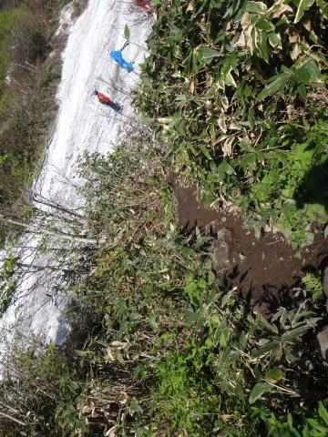

さらに，リフト乗り場の建物をひいこら上がってこないと，

リフト乗り場に出られないという…

体力不足を鍛えるにはもってこい（何か違う)．

降り場も…

リフトを降りてからゲレンデまでかなり歩くパターンに．

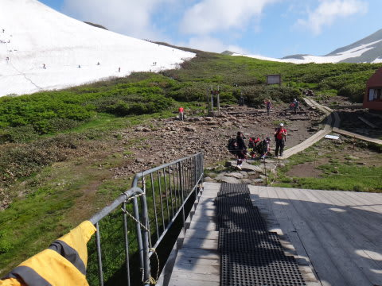

上の写真のリフト降り場から，木道をとおり…

さらに，こんな足場の悪い道を100mほど．

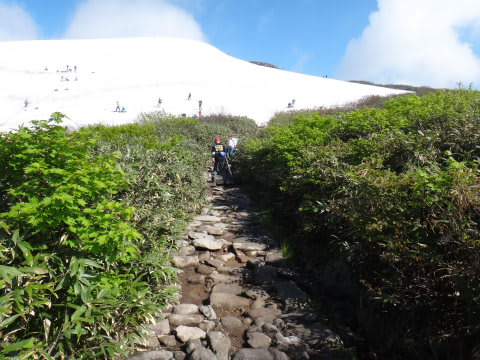

ひいこらあるいて，やっとゲレンデに出ます…

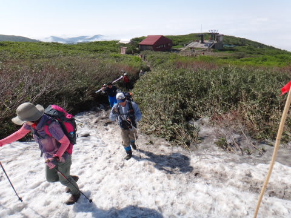

これも，体力をつけるには，いいトレーニングですねっ！（何か違う)

しかし．

ゲレンデの雪は，まだたっぷり！

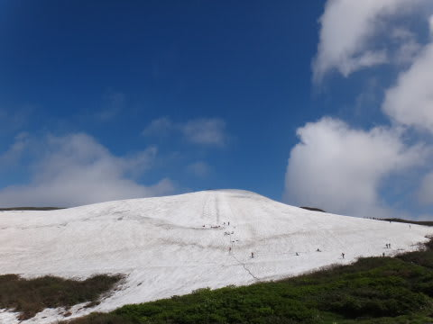

天気も最高！

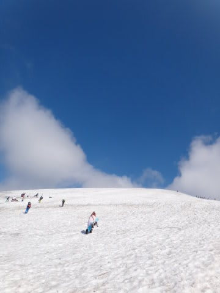

ゲレンデは，人に踏まれてない部分は，

まさに天然100%ナチュラルバーンですが．

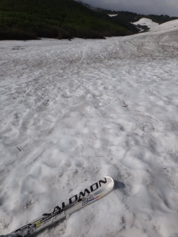

コースは，まだ全く藪こぎすることなく滑れます．

この時期に薮こぎ無くリフトが滑れるってのは，なかなか恵まれてますね．

で．大斜面ですが．

まだ雪がありますね～．

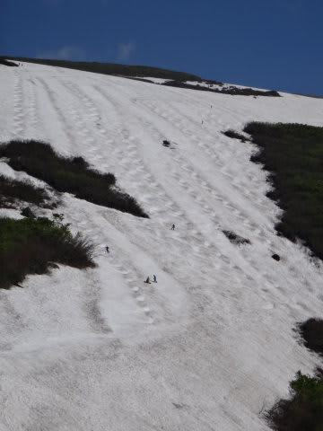

一番狭い部分でも，コブラインが2本通っているので．

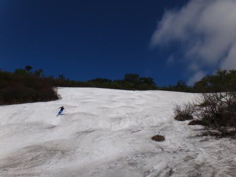

この時期としては十分ですよっ！

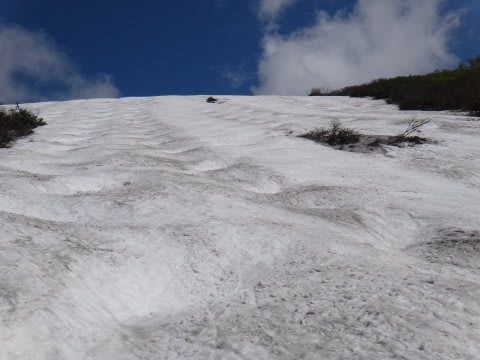

…来週末も，まだ滑れるんじゃないでしょうか？

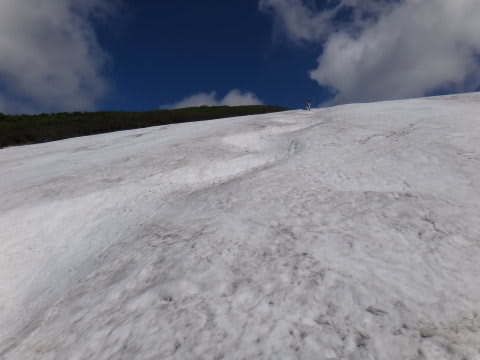

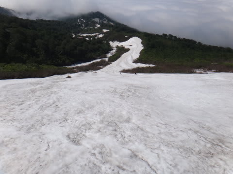

沢コースは…

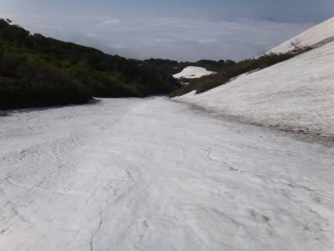

コース幅は前回より狭くなったものの．

こちらもまだ薮こぎ無く滑れます．

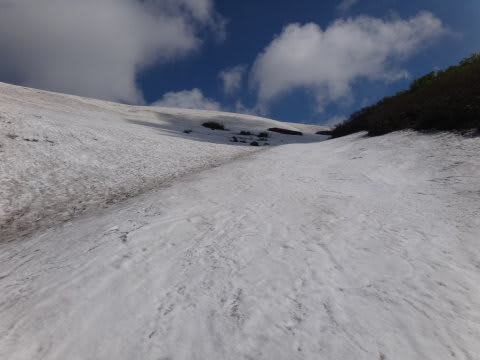

まぁ，でも雪が荒れてきて，幅も小回り程度の幅に

なってきちゃいましたね～．

沢コースのふもと部分，こんな感じでちょいとやばそうなところもあるので．

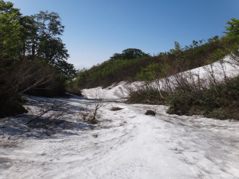

来週は板を脱がないと数箇所通れないかも．

ちなみに，去年の7月1日の大斜面ですが．

コース幅はこんな感じで．

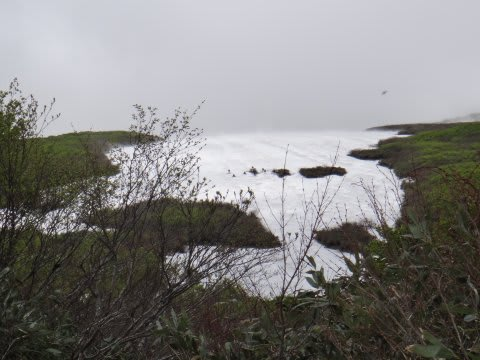

まぁ，まだ滑れそうなんですが．

大斜面の一番下の部分．

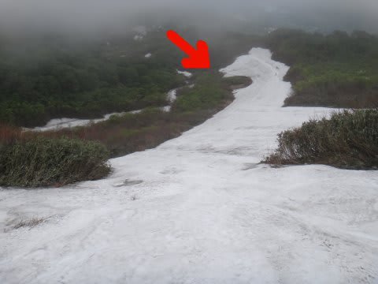

この矢印の部分が途切れてて．

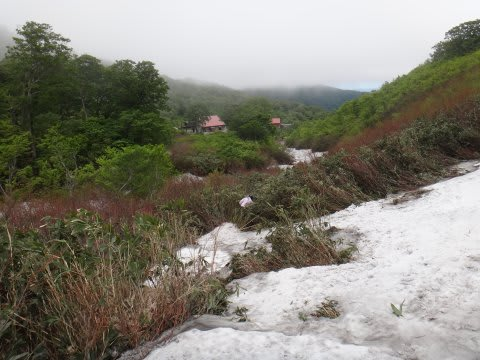

こーんな感じで，薮こぎ必須でした．

（真ん中に人が写ってるの，分かりますか？）

それでも，去年はまだ「7月1日にリフトが滑れるだけ

マシだ！」と思っていたのに…

今年は同じ場所がこんな感じですから．

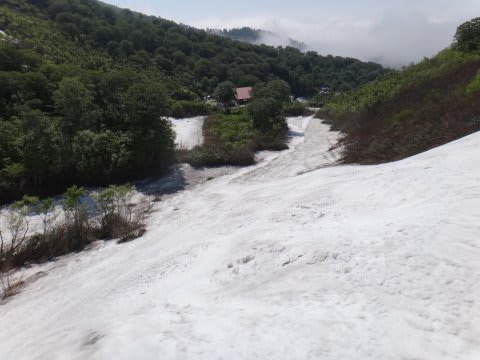

これはもう，かなり恵まれてますよっ！

で．

この日の天気は．

朝のうちは晴れ時々曇り．

日が差すと暑いくらい．

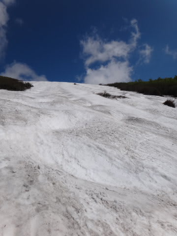

あー，典型的な夏スキーだなぁ…

と思っていたところ．

なんだか1時ごろにいきなり掻き曇り…

土砂降りに(涙)．

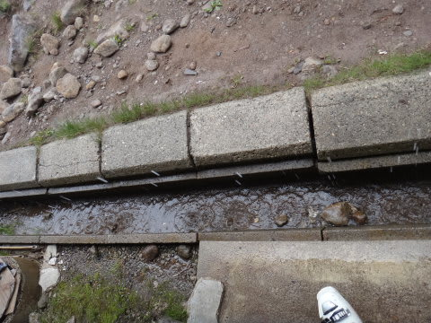

30分ほどで止んだから良かったんですが．

これでゲレンデにはほとんど人がいなくなりましたね～．

雨が止んでからは，時々ガスが出たものの．

基本的に晴れてましたよ～．

…まぁ．

途中ちょっと雨に降られたものの．

雪は十分．

天気もおおむね良くて．

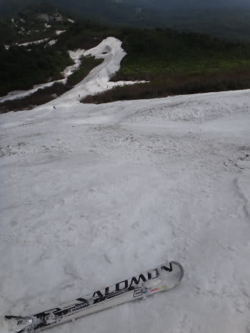

もう7月ってことを考えると，

そこそこ楽しめたし．

＃普通の神経の人は，リフト乗り降りがあんなに歩く

＃ことになると絶えられないのでは…？←一応突っ込みどころ

…もう一回，行こうか？

という，悪魔のささやきも聞こえますが．

とりあえず．

これにて．

長かったようで短かったような．

私の2013シーズンは終了…

ということにしたのでした．

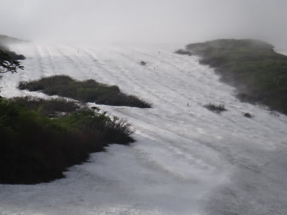

ありがとう！月山！

## 💬 コメント一覧

### 💬 コメント by (いか)
**タイトル**: Unknown
**投稿日**: 2013-07-02 01:28:18

まだまだ雪ありますね…

行ってみたいです(笑)

12-13シーズン、おつかれさまでした。

13-14シーズンが待ち遠しいですね(*^^*)

もう準備だけは万端なのですが(笑)

### 💬 コメント by (Skier_S)
**タイトル**: いかさま
**投稿日**: 2013-07-02 02:13:45

いやー．

今年は，3月ごろの状況を考えると．

この時期に滑れるとは，奇跡ですよね～．

ぜひ，行ってみてください(笑）．

こちらは，13-14シーズンの準備はまだまだです．

シーズンを迎えるためには，板を買わないと(＾＾

### 💬 コメント by (千春)
**タイトル**: おつかれさまでした！
**投稿日**: 2013-07-04 12:23:38

長い（短い？）シーズン、お疲れさまでした。

雪山への執念・執着はもちろん、

途中で車を買い替えられたり、

充実したシーズンでしたね！

日記を読んでてとっても楽しいです。

月山、私は数年前の5月に行ったきりです。

駐車場からリフト乗り場までの登りさえもへこたれたので、

（当時は駐車場からＴバーがあり、それに乗りました）

リフト乗り場まで滑り込めない状態になるまで行くなんてスゴイ！と

思いましたー。

### 💬 コメント by (Skier_S)
**タイトル**: 千春さま
**投稿日**: 2013-07-05 01:10:52

スキーに対する執念は，そんじょそこらの人に

負けてませんから(笑）．

リフト1本滑るのに，乗り場で3分，降り場で3分歩き，

リフト乗車15分，トラバースで3分…

ここまで苦労して，滑るのたったの2分．

…それでも滑るっ！！！！

…っていうか．

滑らないと死んじゃうので(笑）．

とりあえず，充実したシーズンでしたよ～．

でも，まだシーズンが終わった実感が無いんですが…

