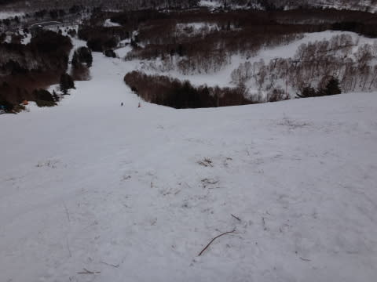

# 2月14日，日曜日の志賀高原速報…雨→曇り時々晴れ→夕方にとどめの雨．5月のかぐら並みの雪（涙）．

📅 投稿日時: 2016-02-15 00:57:23

🏷️ カテゴリ: [2016スキー滑走日記](c70c67ed5248e9432b899dcd5747048bb.md)

ということで．

4連休最終日の今日も．

帰宅が遅かったので，速報モードにて…

えー．

本日の朝．

予告通り．

超高温南風強風の雨で始まりました…（涙）．

2月上旬に，だ．

朝から気温プラス4度って何よ？

雨って何よ！？？（泣）．

ただ．

予想よりわずかに良かったのは．

風が思ったほどひどくなく，

焼額1ゴン，奥志賀ゴンドラは動かなかったけど．

…意外と焼額第2ゴンドラが，ちゃんと8時半から

減速運転ながら運転開始…

そして，リフトは多少営業開始が遅れた程度で，

全リフトが動き出しました！

＃1ゴンも10時半から運転開始

…で．

2ゴンで上がったゲレンデは雨の中…（涙）．

言うまでもなく，雪質は最低…（泣）

しかし．

なんと．

意外なことに．

9時半過ぎには雨も弱まり…

そして，10時ごろには太陽も出てきましたよ？？

で．

予想外に，午後2時ごろまでは

晴れたり曇ったりの天気で．

雨に濡れることはなかったです！

これは…

これは…っ！

私の日ごろの行いがいいからに違いな…（ビシィッ！！）←読者からの怒りの鉄拳に50mくらい吹き飛ばされる音

…し，し，失礼しまし…た…（ボコボコになりながら）

信心深い読者の皆様の，雨になるな踊りのおかげです……←そんな踊りあったっけ？

でも．

昼間は雨には降られずに済んだものの．

朝の雨＆高温にやられたゲレンデの雪質は…

もう，言葉がない…（涙）．

そして．

オリンピックコースなど，ところどころブッシュも…

うがぁ～っ！！！

な，なんてこったっ！！！

また，雪不足に逆戻りか？？？

そして．

最後に追い打ち．

午後3時半ごろから，また雨が…

…ダメだ．

どうしたことだ．

最後はもう，5月の雪になっちゃってました…（落胆）．

とりあえず．

明日はもっと衝撃の写真たくさんの

詳細レポートをやりますので．

皆様，覚悟のほどを…（泣）．

## 💬 コメント一覧

### 💬 コメント by (山さん)
**タイトル**: 助かりました
**投稿日**: 2016-02-15 19:29:08

夕方バッテリ－が上がっていた所助かりました。また毎週会いまでょう。

### 💬 コメント by (Goku)
**タイトル**: 覚悟してます
**投稿日**: 2016-02-15 19:39:12

ついにオリンピックコースがクローズになりました(T_T)

今日は朝から降っているようですが、週末までにどれだけ回復するのか・・・

詳細レポートは恐る恐る見ますね。

### 💬 コメント by (komu)
**タイトル**: あまりの暑さに…
**投稿日**: 2016-02-15 19:57:01

土曜に鹿沢行きましたがあまりの暑さに翌日、今月閉店してしまうアルペンに行き物欲大王にやられました(ーー;)

たって、去年モデルとは言えSXが諭吉4人半でしたのでつい…

という訳でまだまだ冷えてもらわないと困ります。

冷え冷えダンスを踊り続けましょう

### 💬 コメント by (Skier_S)
**タイトル**: 壊滅的な日曜でした…
**投稿日**: 2016-02-16 00:56:16

＞山さま

絶妙なタイミングで前を通過しましたよね…

ちょっと心配していましたが，無事帰れたんですね．

良かったです…

リンゴありがとうございました．ありがたくいただきました．

また毎週！！

＞Gokuさま

オリンピックコース，また明日から無事オープンのようです．

良かった…

今後ちょっと積もるかもしれませんが，

また19日に危険な高温状態が…（涙）．

ダメです．

今シーズンは，ダメです（泣）．

＞komuさま

あまりの暑さに遣やられたんですね（笑）．

昨シーズンのSX，もうそんな値崩れしてるんですか．

ってか，SXの在庫が残っているって珍しい…

長さが160cmとかでしょうか？

人気の165は在庫が無いと思うので…

うふふふ．

でも，SXはいいですよ～！！！！

とりあえず，SXの出番が来るように，冷え冷え踊りを

踊りましょう！

### 💬 コメント by (komu)
**タイトル**: いや…
**投稿日**: 2016-02-16 12:10:47

ふふふ、

165ですよ

金具はTLですけね

### 💬 コメント by (Skier_S)
**タイトル**: komuさま
**投稿日**: 2016-02-17 02:23:42

えー！

165cmですか！

komuさんの滑りなら，TLビンディングの方が

あってると思います…

それが4，5諭吉なら，いい買い物だったと思いますよ…

