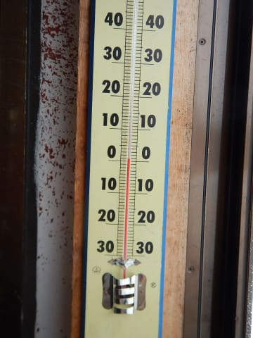
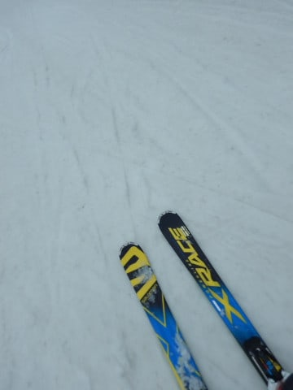
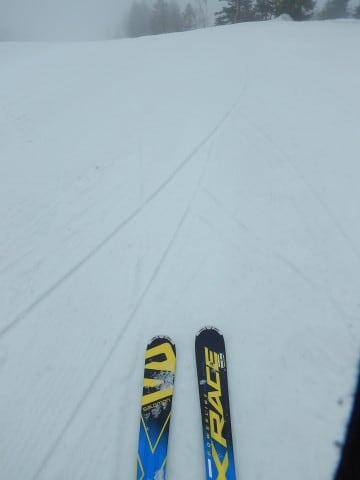

# 4月7日（土）の志賀高原は…曇りのち雪，時々晴れ間．午前はザブ雪，午後は荒れ荒れ＆うっすら新雪

📅 投稿日時: 2018-04-07 23:12:10

🏷️ カテゴリ: [2018スキー滑走日記](c11b88dc181f34079ab41db74a3587646.md)

というわけで．

今日も志賀高原を滑っていたわけですが．

…本日の天気は．

　土曜は基本的に曇り．

　雪雲が切れるタイミングは晴れ間が，

　雪雲が濃くなるタイミングは雪がぱらつく…

という予想がおおむね当たりましたっ！！

思ったより雪が強く降りましたが．

ええ．

降りましたが．

…でも，1cmほどしか積もってません…（涙）．

ってな感じで．

本日の志賀高原ですが．

昨晩からの雨で，道路に全く雪がなく，

気温もプラスと高めの朝イチ志賀高原．

まず，いつも通り焼額第1ゴンドラの

通常営業スタートに並びます…

ええ．通常営業です．

気温が高く，昨晩は雨だったので．

早朝から来る根性がなかったです…

んで．

朝イチゴンドラから見える景色が…

ええええ！！？？？

…オリンピックコースも…

えええええ！！？？？

オリンピックコース，これは

滑れないよね…（涙）

ってなわけで．

今週末は，先週まで滑れた

・オリンピックコース

・SGSコース→イーストコース

の2コース，ついにクローズです…（泣）

なんてこった…

この一週間，異常に気温が高く．

雨も何回か降ったようで…

かなりゲレンデは残念な感じです（涙）

で．

朝イチの気温は…

いきなりプラス気温ですか．

+1℃ですね…

朝イチの山頂は，ガスも出てるし（涙）

そして，雪質は…

朝イチというのに．

昨晩の雨で湿った，しっとり重い雪が

お出迎えです…（激泣）

早朝営業をやっているGSコースは，

通常営業開始時には，雪が柔らかいので

すでに結構荒らされちゃってる感じの

バーンになってます（涙）

あぁ…

朝イチというのに．

快感シマシマバーンからは程遠い…

そして．

GSコースにも，ちょっと土が出始めてきてるんですが…！？？

人工降雪をしっかり打ったGSコースに，

もう土が出てるとは…っ！！！

コース上にはところどころ

土やら石っぽいのも出てるし…

オリンピックコースはクローズだし…

パノラマコースは汚れが浮いてるし…

先週までは結構よかった白樺コースも．

ブッシュ危険看板が立ってて．

スタートしてしばらく，コースの左側半分は

土が出ちゃってるし…

第2高速リフトに乗ると，リフト下の雪が

かなり解けて，熊笹が出ちゃってるし…

あぁ…

春だよ…

春ですね…（悲）．

この一週間の雪の解け方．

半端なかったみたいなんですけど…（激涙）．

朝イチから午前中ずっと，バーンは

湿った重い雪でしたが…

とはいえ，今日は春休みも終わり，

ゲレンデは超ガラガラだったので．

人の少ないバーンは，昼近くまで意外とフラットで

もってくれたのが，せめてもの救いだったか…

天気は時折日も射したり，

雪雲が飛んできたりで．

「いやーー．

　今日も天気予想，かなり高精度で当てたよねっ！！」

と，自分で自分をほめてあげたい精度で

予想を当てたなぁ…

と，思っていた昼過ぎ1時近く．

午後に向かって気温が下がるという予想通り．

マイナスに下がっていき…

そして，1時ごろ．

…これは，本格的に雪？？

そして，うっすらと積もり始めて来ました…

うむ？？

今日は雪が降るのは夕方になると思ったのに…

まさかこんな昼過ぎすぐから降り始めるとはっ！！

熊笹にもうっすら積雪してますが．

ただ．

そんなに激しく積もる雪ではなく．

うっすらゲレンデを覆う程度の，1-2cm積雪．

ストックで表面の雪を掘ると…

すぐ湿った下地に届くレベルで．

そして，上に乗った雪は比較的まともなんですが…

その下には，午前中に荒れた湿った雪が，

低温でそのまま凍り始めた，凸凹ゴロゴロ

カタマリバーン…(泣）

かなり難しいバーン状況で．

たぶん滑ってても楽しくないので．

ゲレンデに人がいないのですが…？？

ってな感じで．

荒れた斜面が固まり始め，その上に新雪が

乗っていくという，かなり難しいコンディションのため，

誰もいなくなってしまったゴーストバーンを．

「難しい…バーンコンディションが厳しすぎるよ…（涙）」

と，泣きながらリフトストップまで滑った，

Skier_Sなのでした…

志賀高原．

現在全く雪が降ってません（泣）．

でも，明日朝にはそこそこ，3cm程度の

うっすら新雪が乗っている気が…

新雪が乗れば，明日は硬いバーン絵に

柔らかい圧雪という，いいコンディションの予感…！

## 💬 コメント一覧

### 💬 コメント by (naoちゃんねる)
**タイトル**: 娘のシーズンラストでした
**投稿日**: 2018-04-08 07:45:16

s様、最後娘と一緒に滑って頂きありがとうございました！バーンも荒れ荒れで雪も降ってきてもう嫌だ～となっていたところ、ご一緒して頂きとても楽しかったようです。

ハマったkamoshikaのカレーを食べ、家族スキーでシーズンを締めました。

私の休みが今月はもう平日しかなく娘はシーズンオフです…

私は平日に娘にナイショでまだまだ滑りますが(笑)

しかしビックリする程雪が減りましたね～⤵️

### 💬 コメント by (べー)
**タイトル**: お手上げ
**投稿日**: 2018-04-08 07:52:53

おはようございます。

昨日のバーンは心が折れました(ToT)

しかし人が少ないですね。来シーズンの春営業が心配です。

### 💬 コメント by (Hide)
**タイトル**: 土曜は・・・
**投稿日**: 2018-04-08 14:17:10

土曜の朝はS様の右斜め前（車の向きからだと左斜め後ろになる？）に駐車していましたが、周りの方々が皆お知り合いだったようでなかなかご挨拶のタイミングが合わずでした。

しかし土曜のコンデションはチョット悲しかったですね。

奥志賀、一ノ瀬、高天原、寺子屋と移動しましたが、どこも似たような状況でした。

引き上げる際の雪のり方に後ろ髪を引かれつつ帰路につきました。

日曜の朝はきっと4月とは思えないコンデションだったのでしょね・・・残念でした。

### 💬 コメント by (かず)
**タイトル**: Unknown
**投稿日**: 2018-04-08 18:41:01

土曜日あの後寺小屋行きましたけどガチガチでした　早朝どうでした？僕は奥志賀行きましたけどうっすらパウダーに下の氷にあたり 　難しい　明日良さそうなので仕事休んでシーズンラストです

### 💬 コメント by (Skier_S)
**タイトル**: 久々の冷え冷えスキー場でした
**投稿日**: 2018-04-09 01:51:22

＞naoちゃんねるさま

今シーズン後半は，かなりの頻度で志賀高原

にいらっしゃいましたね(笑)．

最後に一緒に滑れて良かったです．

雪が減ったのが残念ですが，なんとか

GWまで雪がもつように願って，

日々踊り続けましょう…

＞ベーさま

今週末は，お客さんが少なかったですね～…

ヤケビに限らず，志賀全域お客さんが

減っているので，来シーズンも何か

ゲレンデ・リフトの削減や，営業短縮とかが

ありそうな予感…

うーん．何とかなりませんかね．

＞Hideさま

あ，そんな近くに止めてらしたんですね…

焼額第1ゴンドラ駐車場は常連の社交場と

化しているので，知り合いばかりです…

だもんで，気にせず割り込んでください(笑)

土曜は残念なコンディションでしたが，日曜の

朝はこの時期としては最高のコンディションでしたよ！

＞かずさま

日曜早朝は，ちょっと下地のコロコロに

足を取られましたが，10cmの新雪で

結構楽しめましたよ～！

