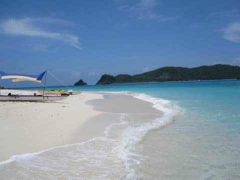
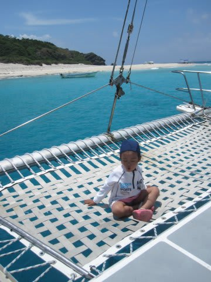

# 子連れで座間味に行ってみた　その10

📅 投稿日時: 2011-08-21 00:25:08

🏷️ カテゴリ: [ダイビング日記](ce3a7a8d424d112fce83ee85c81a0e344.md)

という感じで．

先日レポートしたバリの空港から無事帰宅しまして．

本日，片付けも終わりました．

これから，じっくり写真を整理しないと…

総撮影枚数6000枚を超えているので，すごいことに

なりそうな予感…

コモドから帰ってきたところというのに，座間味レポート続きます．

---------------

さて．

1本目エグジットすると．

船はちょっと走って，嘉比島の前へ．

体験ダイビング組は，ここで体験ダイビングのようです．

娘に，「泳ぐ？」と聞いたら「泳がない」とのことなので…

私一人，シュノーケリングで嘉比島へ上陸．

いやー．きれいですな～

しばしきれいな景色を堪能して戻ると…

お昼ごはんタイム．

こんなにきれいな海の上なので，ご飯がおいしい！！！

…子供づれになってから，一日ダイブボートの上で

過ごすことが無くなっていたけど．

ひさしぶりのボートの上で過ごすスタイルもいいものだなぁ…

ってかんじで．

次は午後のダイビングへ向かいます．
