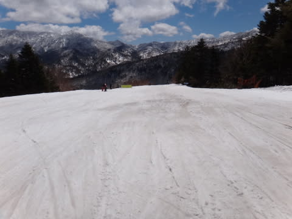
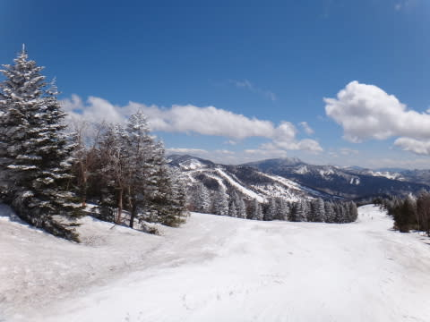

# 5月3日，4連休初日の焼額山は…この時期としては上出来！

📅 投稿日時: 2013-05-03 20:06:55

🏷️ カテゴリ: [2013スキー滑走日記](c91dbe557f9a69230b1600e48622fdd61.md)

えー，

まだまだ志賀高原に滞在中のSkier_Sです．

ということで．

ゴールデンな週間も，後半戦に突入ですね～．

4連休初日の志賀高原ですが…

今日は終日，晴天でした！

で．本日．

いつもどおり，7時から営業開始の焼額早朝営業のゴンドラに乗りますが…

…きょ，今日もおいしそうなゲレンデですな～（じゅるる）←よだれがたれる音

で，ゴンドラ山頂付近は…

…うむ．

今日も5月とは思えない景色が広がってますね(笑)．

なんてったって，今朝の温度表示が…

マイナス7度って…

あーた，どういうこと？

って感じの表示でしたから(笑）．

早朝のゲレンデは…

えーっと．

今日，5月なんですが…←このフレーズ，何度使ってるんだ 

で．

当然．

シマシマっ！

今日も，早朝は最高のトップスピードウハウハ幸せスペシャルバーンです！

気温が冷えてるのに，がちがちアイスバーンじゃなく，ホントに気持ちいい，

適度な硬さのバーン！

早朝ゴンドラをひたすら回し続け，2時間たった9時になっても…

気温が低いので，なかなか雪が緩みません！

トップスピードうひょうひょ最高ハッピー幸福バーンが続きます．

ただ．

今日は見事な晴天だったので．

気温はかなり低めで，滑っていると耳が冷たくなるほどだったにもかかわらず．

昨日までは無かった，強烈な日差しのために，10時ごろには…

さすがにちょっと緩み始め…

部分的に，板のすべりが多少悪くなるところも．

だけど．

強烈な日差しがあっても，気温は昼でもプラス3度程度にしか上がらなかったので…

昼前でも，こういうクリーミーな感じの雪で．

水を吸ったストップスノーになっちゃうことも無く．

比較的板が滑る雪だったのがラッキー！

ゴンドラの混雑は，毎回4-5人待ってるかどうかという程度で．

4連休にしてはすいてたけど…

昨日までの「ゴンドラ滑っても誰にも会わない」という状況を知ってしまうと．

これでも「混んでるなぁ…」と思ってしまう今日この頃．←何か基準が狂っている

午後になっても，気温が上がるどころかむしろ下がったので，

強烈な日差しがあるのに，雪はドボドボにならず，クリーミーな

感じでとどまってくれました．

でも，こういう雪で人が多く滑ると…

ちょっと荒れるんですね～．

という感じで．

夕方には急斜面とかは結構荒れてきましたが．

それでも，山頂付近は営業終了時間になってもこんな感じで．

昨日ほどではないにしろ．

5月としては，結構めぐまれた一日を過ごせたのでした…

しかし．

これまで，異常高温だった3-4月の憂さを晴らす冷え冷え祭りでしたが．

そう．幸せなときはいつか終わりが来るもの(悲)．

残念ながら，冷え冷え祭りは，明日の朝で終わりです…（涙)

明日の朝のお楽しみタイムの後は，恐怖の「妖怪板つかみ」が出現する

状況になりそうです…
