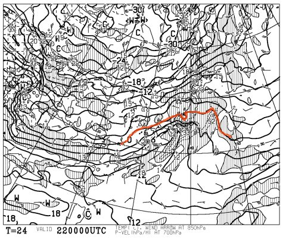
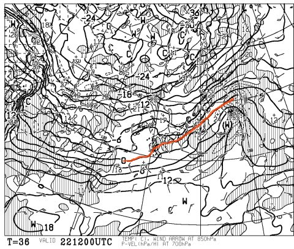

# みんなの祈りが通じたのだ！22日は標高が高ければ雪！

📅 投稿日時: 2012-12-21 21:25:18

前回の天気予想で．

22日は標高が高くても，終日雨！

…といいましたが．

今日の予想天気図を見ると．

改善しているのだっ！

みんなの祈りが通じたのだっ！

22日の朝9時の850hpa予想図では…

こんな感じで，志賀高原近辺を選んだかのように，その周辺だけ0度を下回ったエリアに入ってます．

信州の標高の高いエリアでは，運がよければ重い雪で，雨にならずにすみそう．

新潟方面の標高の低いエリアは，残念ながらちょっと雨っぽい感じかも…

でも22日夜9時の予想図は…

こんな感じで，スキー場は完全に0度以下のエリア．

ということで，標高の低いスキー場でも昼を過ぎたあたりからは雪に変わるでしょう！

ということで．

終日雨という最悪パターンはなさそうです！

22日の夜はどかどか積もりそう…

23日の朝はパウダー祭りかも．

23日の夜から24日にかけても積もりそうなので，

24日も続けてパウダー祭りかな～．

前回予想より，かなり条件が改善しました！
