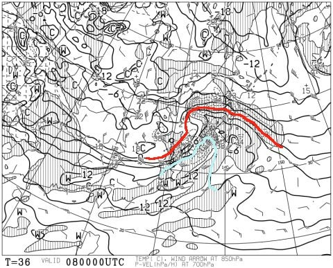
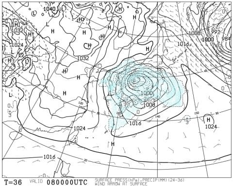
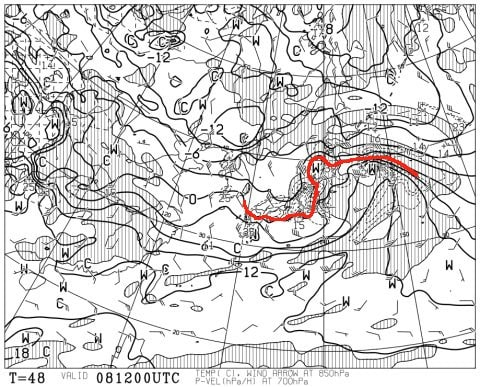
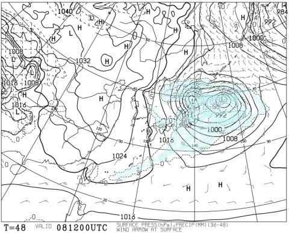
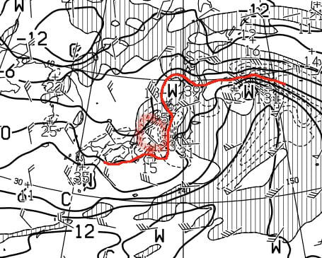
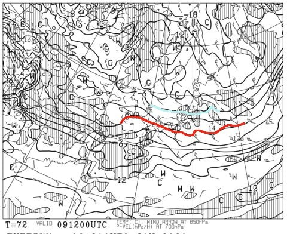
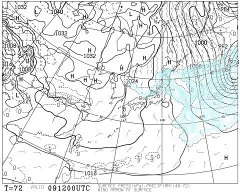
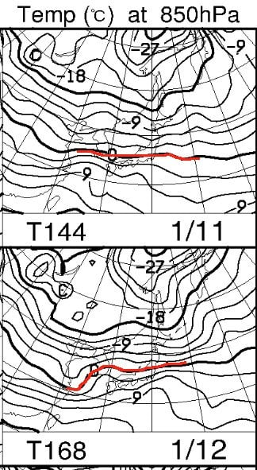
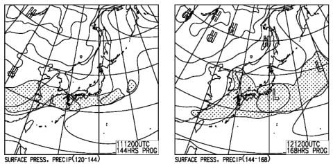
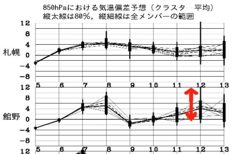

# 1月11～13日の3連休までに，スキー場に雨は降るのか？3連休前に雪が解けてゲレンデはダメダメになっちゃうのか？3連休までの天気を予想してみる

📅 投稿日時: 2020-01-07 02:39:23

えー． 数多くの志賀高原常駐の特派員から

個人的にレポートを受けていますが．

本日6日（月）の志賀高原，良かった

みたいですね…．

5日の雪で，ほぼ全面滑走可能になり．

最高冷え冷えの雪質で．

最高のシマシマ圧雪で．

かつ，大体晴れのいい天気だったようで… 

あぁ… こんな日に滑りたかった…っ！！

ってなことで．

本日は， 1月4日(土)の志賀高原スキー場の

詳細レポートをやろうかと思ったのですが．

5日の積雪でゲレンデが最高コンディションに

なった今．

今さら4日のレポートをやっても，

ちょっと時代遅れ（？）の感じがあるので．

本日は，4日の詳細レポートを

やめて，またまた天気予想ネタです！

果たして，昨日ネタにした，液体が空から

落ちてくる危機を迎える1月8日（水）．

最新の予想はどうなったのか…？？

最新の，8日の朝9時の予想天気図を見てみると．

昨日の予想と変わらず．

志賀高原には+9℃線が（激涙）

そして，地上天気図には，見事な

降水域が…（絶望）

これは．

8日早朝から．

志賀高原は空から液体が降ります．

それも，激しく降ります（泣）

ただ．

8日の夜9時の予想天気図では．

うむ…0℃線は何とかぎりぎり志賀高原の

南まで下がってますね！

これなら，8日は午後には雪に変わってくれそう…！

そして，地上天気図は，引き続き

志賀高原に降水域がかかっているので．

これは…8日の午後から，

ひたすら雪が降り続けそう！

しかし．

この図を拡大すると…

え？なに？

この赤くマークしたところ．

風速60ノット？

約30m/sの風ってこと…？？

…これだと，おそらく．

8日はリフトも動かないような強風

荒れ荒れ天気になりそう…（涙）

でも，心の支えになるのが，

翌9日（木）の天気図で．

水色の-6℃線が志賀高原にかかってるし．

地上天気図も，そこそこの冬型で，

日本海側に降水がありそうなので．

8日午後から9日にかけて，

志賀高原は結構な積雪がありそうです！

だもんで，10日朝は冷え冷えの

いい雪が積もっていて，

さらに晴れそうなので．

10日の金曜はかなりのねらい目かも…？？

その後の3連休ですが，

11日は0℃線が志賀より南．

そして，12日の予想は，昨日段階の

+6℃線が志賀にかかるという

エキサイティングな予想から変わって．

ギリギリ0℃線が志賀にかかるかどうか…

というレベルになってきました！

このままいけば，11，12日は雨に

ならずに済みそう…

これも，私が寝ずに冷え冷え踊りを

踊り続けているおかげですっ！！←違う．何度も何度もそれは違うと言っているのに…

降水域も，11日は志賀にかかっておらず．

12日にギリギリ志賀にかかっている程度．

だもんで．

今の天気図が正しければ．

11日は雲り，12日は曇り，午後遅くから

わずかに雪がぱらつく…

という感じかな．

…ただし．

まだ分からない．

12日の予想気温は，この図に赤矢印で

示したように，まだ予想ばらつきが

かなり大きいので．

皆さんの日ごろの行いが悪ければ，

12日は高温になり，液体が降る

可能性も…

皆さんの行いの悪さと，

私の必死の冷え冷え踊りの

効果がせめぎあっている

感じなので．

12日が雨になったら皆さんの日ごろの行いが悪かったせい．

12日が雪になったら私の冷え冷え踊りのおかげ

ということで，よろしくお願いします←むちゃくちゃ自分に都合のいい解釈じゃないか？？？

ってなことで．

まとめると．

7日（水）：朝から曇り空．朝の気温は-5℃程度．

　昼ごろから気温が上がり出し，リフト営業の

　頃から降り始める．

　降り始めは雪かもしれないけど，夜から

　雨になり，夜の間中ぱらつく．

8日（水）：朝の気温は+5℃超え．早朝から

　激烈な南風＆吹き付ける雨．

　この日はゴンドラどころか，リフトも運休

　する可能性が高い．

　雨は午前中降り続け，時折強く降る．

　昼ごろから気温が冷え始め，

　午後になると雨は雪に変わり，

　猛烈な吹雪になっていく．

　夜は雪がひたすら降り続ける

9日（木）：朝は-7～8℃程度の冷え冷え！

　昨晩から雪が降り続け，積雪20～30cm．

　あさイチはいい感じのふわふわ圧雪バーン！

　非圧雪コースは，降り始めの雪がちょっと

　重めの雪なので，手こずるパウダーかな．

　昼ごろまで時折雪が強く降る．

　午後は雪がほぼ止み，せいぜい時折

　パラパラ降る程度．

　圧雪バーンも，午後は雪がちょっと荒れてきそう．

　終日しっかり冷え冷え．

10日（金）：朝は-5℃以下．昨日までの雪が圧雪された，

　ピカピカ最高圧雪バーンでスタート！

　この日は朝のうちは雲が残るかもしれないけど，

　遅くとも昼には晴れそう．

　終日冷え冷えで，天気も良く，絶好のスキー日和．

11日（土）：この日も概ね晴れ．気温もマイナスをキープし，

　終日いい感じの圧雪で滑れるか．

　ただ，急斜面は午後になると下地の硬いのが出てきそう．

12日（日）：まだ何とも言い難い．

　運が良ければ雪がぱらつく天気で，

　運が悪ければ液体がぱらつく天気．

　どちらにしろ，ザーザードサドサ降らない．

13日（月）：3連休最終日は基本的に曇り．

　予想の気温ばらつきが大きく，まだ

　予想精度が低い段階だけど，

　おそらく何とかぎりぎり0℃以下をキープ

　しそうか…

という感じの天気になりそうです．

まだ，3連休の期間中の予想は精度が低いので．

明日以降，3連休の天気の予想を

改めてやります～！

## 💬 コメント一覧

### 💬 コメント by (Northfox)
**タイトル**: 私も祈ります！
**投稿日**: 2020-01-07 07:34:41

こんにちは。いつも天気予報ありがとうございます。

11日から13日は志賀高原に行く予定です。

ようやく今シーズン初めて志賀高原で滑られると楽しみにしています。

なので昨日の天気予報は愕然としましたが、何とか持ち直す可能性がありそうなのですね．．．．

私も全力で雨阻止と降雪のお祈りをしようと思います！

### 💬 コメント by (西館)
**タイトル**: Unknown
**投稿日**: 2020-01-07 16:41:33

初めまして。

志賀高原通い歴14シーズン目の西舘と申します。

ほっぽさんがいるので西舘にしました。

納得の天気予報ありがとうございます。

私も祈ってますよ、その証拠に壊滅的な予報が少し改善傾向になっているでしょう、

1月3日～6日滞在して、日毎に変化するゲレンデを体験できましたが、5日は整備ナッシング状態の斜面に吹雪で急激に積もった状態で、各斜面で沢山の人が沈んでいました。

そして、15時頃かな、噂(Twitter情報)ですが、上林辺りで乗用車の立ち往生に巻き込まれたのか？バスと乗用車との事故があったそうで、16時頃には回復したようですが、暫く片側通行だったようです。

5日中に帰らなければならない人は、さぞかし大変だったろうなぁと思います。

志賀高原離れが進まないと良いなぁと願うばかりです。

長くなって失礼しましてた。

今夜の天気予報、楽しみにしています。

今週末もお出かけ予定なので。

5日の吹雪ではまだ足りてない、まだまだブッシュはいっぱいあったし、西舘～高天原間連絡橋の高天原側には背丈50cm以上の雑草が(泣)。事前の整備しといてよ。。。しくしく

### 💬 コメント by (なるなる)
**タイトル**: Unknown
**投稿日**: 2020-01-07 20:28:18

本日の志賀高原、午前中は晴れ間もありました。

午後から雪が降りだし、最初はサラサラだったのですが、次第に雪の粒が大きくなり

リフト終了前には液体になりました。

まぁ、さすがに平日スキーなのでゲレンデが荒れる事もなく、サンバレーまでツアー

出来て楽しかったです。サンバレーなんて午後でもシマシマが残ってるし。

明日は荒れますか…(涙)

リフト動かなかったら、温泉入ったり普段出来ない事をして帰ろうかと。

ただ、下手にリフト動いちゃうと、このブログに影響されてる人としては、

雨に打たれる事になるのかなぁ…w

### 💬 コメント by (Skier_S)
**タイトル**: コメント回答遅くなりました…
**投稿日**: 2020-01-08 23:39:45

＞Northfoxさま

をを！3連休は志賀高原なのですね！

今日の雨は残念でしたが，9日に持ち直すはず…！！

では，3連休に焼額でお会いしましょう～！

＞西館さま

をを！

ほっぽさんに対抗して「西館」さんですか（笑）．

初めまして～！

よろしくお願いします．

3，4，5，6日の滞在ですか！

今シーズンで，一番いい時期の滞在かもしれませんね（笑）．

とりあえず，まだ積雪が足りませんが．

9日の雪で積もってくれることを期待…！

＞なるなるさま

8日は残念ながら，予想通りの荒れた天気になって

しまったようですが…

雨の中，滑られたのでしょうか？？

雨が避けられるゴンドラは動いておらず，午前はかなりきつかったのではないかと…

