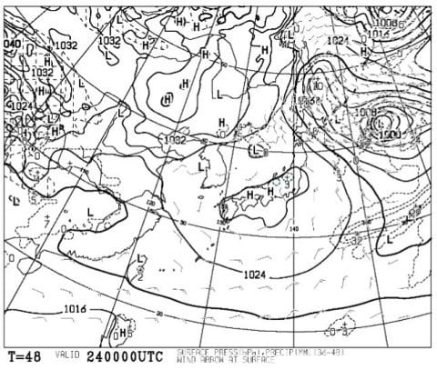
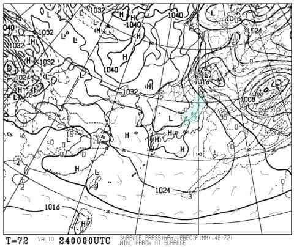

# またもや健康診断にて，保健指導を受けたわけだけど

📅 投稿日時: 2018-02-23 01:04:46

🏷️ カテゴリ: [日記](cc4b5682fb7b8b144980957a978653fb0.md)

えー．

はっちさんのコメントや，

[GokuさんのBlog](http://red.ap.teacup.com/gokurakuskier/872.html)に書かれているんですけど．

…土曜の天気，晴れそうな気配になってきました…

まず．

最新の，土曜の予想天気図ですが．

うむ？？

すっぽりと高気圧に覆われて…

日本海側の降水量予測もほとんどなくなりました！

さらに，風も西風ベースなので…

土曜は朝は雲が残るものの，午前早くから晴れて

きそうですね～！

これは，結構いいスキー日和になるかも…！

いや…

昨日予想した時点での土曜の予想天気図は

こんな感じで．

日本海側にプチ低気圧があり，

さらに北陸より北の日本海側では，

そこそこ降水量がありそうに見えるので…

これだと，降りそうな天気図だったんですけど…

一日で土曜の予想天気図，大きく変わりましたね…

日曜は，今のところ昨日の予想通り，曇り空かな～…

ってことで．

本題．

えー．

先日．

職場の健康診断があり．

…健康診断の最後に，保健指導が入るわけなのですが．

産業医「ここ3年くらい，標準体重よりちょっと低いくらいを

　ぴったりキープし続けていて，全く体重が変わってませんね…

　食事には気を使ってるのですが？」

私「ええ．食事はかなり気を使ってます．

　なるべく意識してたくさん食べるようにしています」

産業医「…え？」

私「気を抜くと痩せていくので，食事は

　気を付けていっぱい食べてます」

産業医「…え！？」

私「なるべく大盛りを食べてます」

産業医「…え！？？？？」

…そうなのだ．

私は[スキーダイエット](edd0452732278bcfc87b9419cd5bf3f1e.md)が効きすぎて，

気を抜くとあっという間に3kgくらい痩せちゃうので．

必死にご飯を食べないと，体重をキープできないのだ…！！

そして．

私の保健指導ではお約束の．

まるでテンプレートであるかのような会話が，

毎年繰り返されるのだった…

産業医「それって…なにか運動してるんですか？」

私「スキーをしてます」

産業医「スキーって，冬だけですよね？

　冬以外は何をやっているんですか？」

私「…いえ…冬以外も．

　10月上旬から7月頭まで，ひたすらスキーしてます」

産業医「…え！？」

私「板を履かないのは，8月と9月だけです」

産業医「…え！？」

私「さすがに6月に入ると毎週ってわけにいきませんが，

　10月から5月末までは，毎週末確実にスキーしてます」

産業医「…！？」

ということで．

産業医さんには，毎週スキーに行ってることは

理解してもらえたけど．

20000mクラブメンバーの，

リフトが動いている限り，休まず止まらず

飲まず食わず滑り続ける

ってところまでは想像できていないに違いない…

ってな感じで．

産業医さんを驚かせるほど，

効果絶大な[スキーダイエット](edd0452732278bcfc87b9419cd5bf3f1e.md)．

皆さんもぜひお試しください…←だから，普通の人はマネできないから．人より先にお財布が激ヤセするダイエットだから…！

## 💬 コメント一覧

### 💬 コメント by (サトシ父)
**タイトル**: お財布激ヤセ！
**投稿日**: 2018-02-23 07:11:14

体重は変わりませんがお財布ダイエットは大成功になってる今日このごろです…交通費がボディブローのようにきいてます。

今週末は久しぶりの奥志賀です、ヤケビに出張いたします。

### 💬 コメント by (はなげ親分)
**タイトル**: ベルトの穴1つ分細くなりました
**投稿日**: 2018-02-23 08:49:38

確かにスキーダイエットは効果アリのようです!!

今日から3連投？です。

朝イチのGSは超快適シマシマバーンです～

### 💬 コメント by (Skier_S)
**タイトル**: 今週末も志賀高原！
**投稿日**: 2018-02-23 20:05:36

＞サトシ父さま

私と同じ，お財布ダイエット仲間ですね（笑）．

今週末も焼額で滑ってます．

イチゴングルグルしている予定です～！

運が良ければ発見できるかと思います．

今週末，お会いしましょう～！

＞はなげ親分さま

あぁ…

今日は天気もコンディションも良かったみたいですね．

しかし．

スキーダイエットは効果絶大です．

むちゃくちゃ痩せます．

みんなに，毎週土日2日間，標高差20000m近く

ひたすら滑り続けるダイエット法を，

もっと広めたい…←広まらないから

### 💬 コメント by (しんちゃん)
**タイトル**: ダイエット効果ありです
**投稿日**: 2018-02-23 22:28:02

スキーダイエット、効果を感じている一人です。

今シーズン、ヤケビに行く回数が増えたので体幹と脚部の筋肉が引き締まった感じがしています。

同時に交通費も激増しているため、お財布の方はとてもダイエットされています。（めっちゃ赤字）(+_+)

### 💬 コメント by (Skier_S)
**タイトル**: しんちゃんさま
**投稿日**: 2018-02-24 08:07:09

スキーはやっぱりダイエットにむちゃくちゃききますよね…

お財布のダイエットにも(笑)

でも、変なダイエット食品やらサプリやらに頼るよりは健康的かと(^^)

