# ファミリーキャンプとやらをやってみた，…千葉県ACフルーツ村　その2

📅 投稿日時: 2015-09-23 02:32:46

🏷️ カテゴリ: [登山・旅行](c1d637a11a25b457ac978d197adbdafc5.md)

ってことで．

ファミリーキャンプに行くことになった，

Skier_S一家．

キャンプの候補地選びに入ったわけですが．

…なに？

オートキャンプ場って，1サイト利用料が5000円以上するの…っ！！！

さらに，それ以外に入場料が取られるところもあるの？

そんなお値段払ったら，普通に素泊まりホテルに

泊まれるじゃないか…っ！！！

っていう，すごい基本的なところから驚きだった私．

＃だってバイクで旅行するときは，寝るだけのためだし，

＃テント1張り500円とか，無料の所とかばかり

＃選んでいたんだもん…

そして．

今はキャンプブームなのか，

週末のキャンプ場って，かなり混んでる！

週末に空いてるところ，少ないよ…

人込みとか混雑とかが嫌いな私．

ひと気が少ない静かなキャンプ場で，ゆったり

過ごしたいところだよな…

…などと，つらつら考えていたところ．

シルバーウィークは，どこも超満員だけど．

その前の週は，どのキャンプ場も比較的空いてるぞ！

…そして，いろいろ調べたところ．

千葉県の「オートキャンプフルーツ村」ってところなら，

シルバーウィークの前の週だと，かなりガラガラで，

さらに1サイト4500円で追加費用無しと安く，

そのうえ，カヤックやら手作り体験とかが楽しめそう…

ということで．

今回．オートキャンプフルーツ村にて，

わが人生初の「ファミリーキャンプ」を

実行することにしたのだった…

----

…キャンプ当日の，朝．

今回のキャンプ地は，千葉県．

K奈川県から千葉県に行くには，いくつかルートがあるけど．

目的地のフルーツ村は，金谷から近いので．

ここはひとつ，横須賀～金谷間を，

東京湾フェリーで豪華クルーズといってみますか…

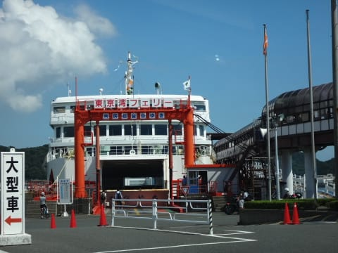

ということで，フェリーに乗り込み．

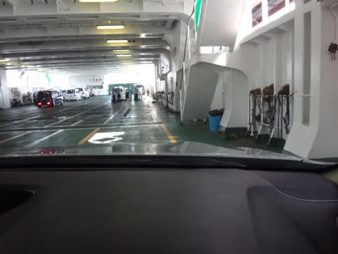

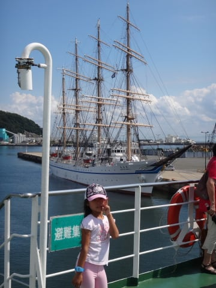

いざ，千葉県へ…！

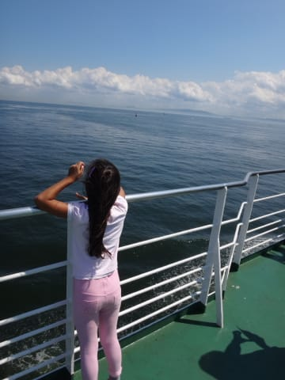

わずか45分で，対岸の金谷港着．

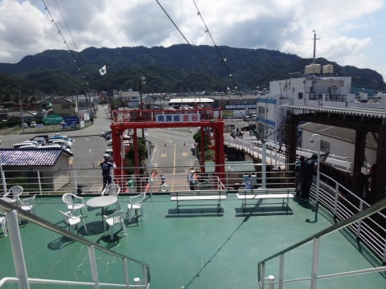

ふははは．

やってました，千葉県へ！

で．

なぜ，今回，フェリーを選んだのか．

その理由は…

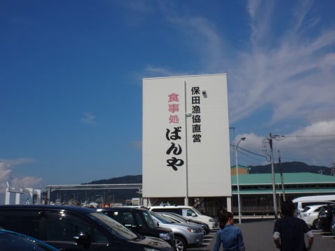

そう．

フェリー降り場から車で10分ほどの，

保田漁港にある「ばんや」でお昼ご飯を食べたかったのだ！！

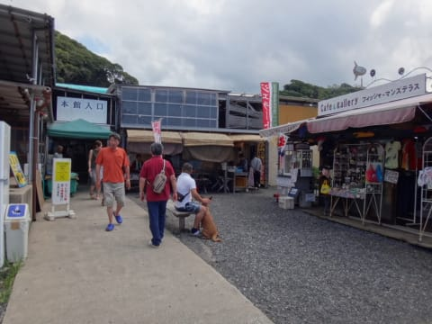

ここは，かなりお安く，すごくおいしいお魚料理が

食べられるのだ！

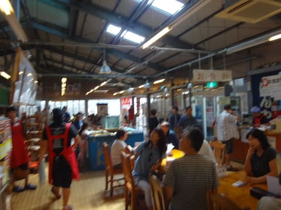

ちょっと混むのが難点だけど…

でも，この巨大な小エビかき揚げを見よ！

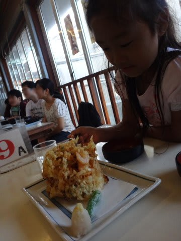

娘の顔と比べても，そのサイズが分かろうというもの．

この，「え？小エビ？大エビちゃうんか？」

って感じの，ぷりぷりのエビちゃんがどっちゃり入った，

サクサクかき揚げ．

これが630円だったり…

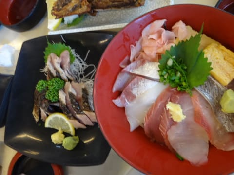

サバの刺身が700円台，

海鮮丼も外せない．

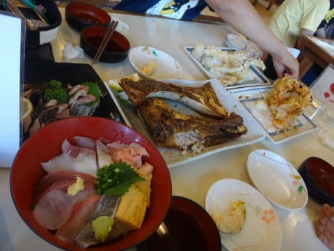

そして，この写真の真ん中に見えるマグロのカマ．

巨大カマが2個ついて，ありえないほど安い！

おいちい！

おいちいよ！

娘も私も，スーパーグレート満足状態…

あー．おなか一杯．

さて．帰ろうか…

…

…じゃなかった．

これから，キャンプへ向かうんだった！

という感じで．

「ばんや」

に来るのが今回の目的だったのでは？

これからのキャンプは，おまけだよなぁ…

ってくらいの気分で，キャンプ場に向かったのだった…

＃ぜんぜんキャンプ旅行記になってないぞ
