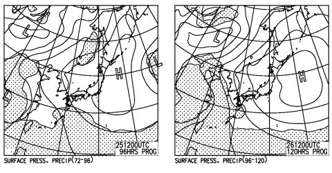

# なんと，今シーズン最後！この週末のスキー場の天気は…？

📅 投稿日時: 2013-05-23 01:08:39

あー．

ついに．

今週末でかぐらの営業が終わってしまうので．

10月から続いた，私の毎週末のスキー場通いも．

この週末で一区切りです…（涙)．

…ってことで．

10月から7ヶ月に渡って続けてきた，スキー場天気予想ですが．

今回をもって，2013シーズンは最終回になります…．

うーーーむ．

どうも，先週のかぐらの雪の量から言って．

まだまだシーズン終わりってのが信じられないんですが．

もう，シーズンも終わっていくんですね…(悲)．

…いまだに信じられないなぁ…．

＃来週も営業してくんないかな

で．

雨か晴れかの1ビット情報を伝えればよい，この時期の天気予想．

土日の天気図を見ると…

…

…

晴れますね．

土日とも．

高気圧に覆われてますので．

以上．

…だと，ちょいと寂しいので．

いくつか情報を加えると．

例年並の気温なので．

かなり暑く感じるかと．

ジャケットは全く不要ですね…

あと，これから天気図が大きく変わって，雨が降りそうな天気図になっちゃう…

って心配も全く無いです．

ご安心を．

うーむ．

私は土曜に行くかな～

営業最終日の日曜は，例年いろんな商品があたる抽選会を

やるので，そっちも魅力的だけど…
