# 2023年8月，座間味で親子3世代ダイビング！その9…旅行2日目の夜

📅 投稿日時: 2023-09-22 03:28:32

🏷️ カテゴリ: [ダイビング日記](ce3a7a8d424d112fce83ee85c81a0e344.md)

…ここ数日，毎度のことながらかなり

クリティカルな状況が続き…

昨日も気づいたら，床に寝転がって

気を失ってました…（涙）

うーん．明け方4時ごろまでは

意識があったんだけど．

その後寝ちゃった記憶がない…

気づいたら朝でした（泣）

…しかし．

Garminさんの睡眠履歴を見ると．

布団で寝てる日より，床で寝てしまった

日のほうが眠りが深いという分析に

なってるんだけど…？？

私はいい環境で寝るより，硬い床で

電気も消さず倒れたように寝たほうが

眠りの質がいいようです（笑）

（睡眠時間は相変わらず足りないけど…）

とりあえず，今日もいろいろヤバいけど，

書き溜めてあったダイビング旅行記，

[前回の続き](e34602b833ebed97e5d7fee56e94ded20.md)です！

ーーーー

てなことで．

本日のダイブが全て終了して．

ほかのチームも船に戻ってきたので…

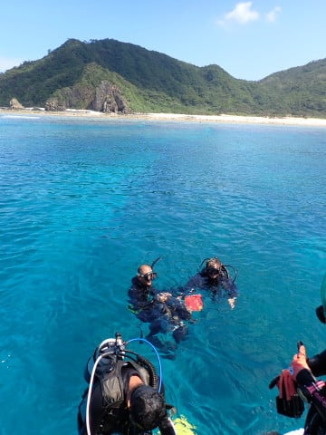

あとは，港に戻るだけ！

…でも，ホントに慶良間の海はきれい

ですね～…

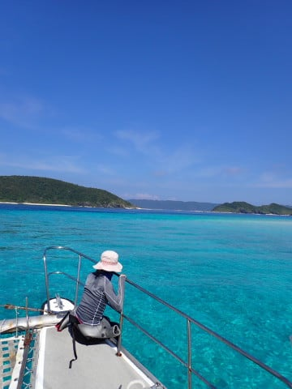

ってなことで．

ポイントを後にしてから20分ちょい．

午後3時過ぎには，港に戻ってきました…

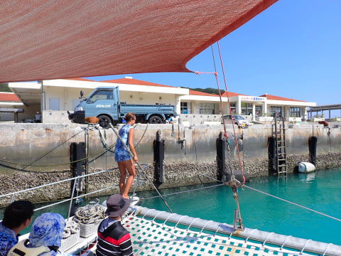

うむ．

ダイビング初日，みんなで無事潜れるか

心配だったけど．

天気も海況もきわめて良かったし．

娘も器材セッティングは忘れてたけど，

ダイビングの仕方は忘れてなかったみたいで．

無事みんなで潜れたので，満足！

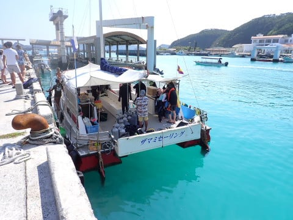

明日も潜るので，器材類は船に置いたまま，

身軽な格好で宿に戻ります．

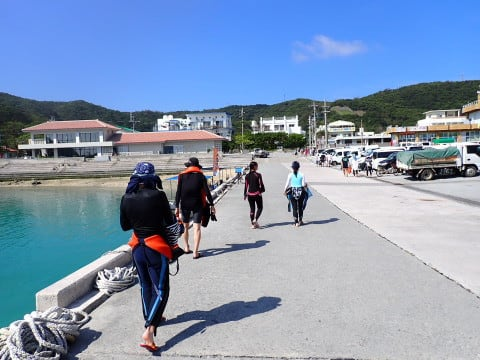

宿までは，徒歩で5分もかからず．

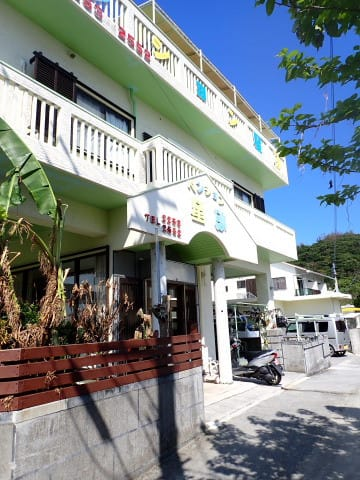

宿に戻ったら，カメラやら何やらを

宿の前にある洗い場で洗って，

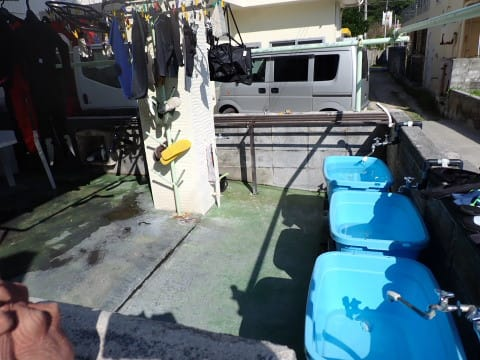

ウェットスーツも脱いで洗って．

器材洗い場スペースに干しておけます…

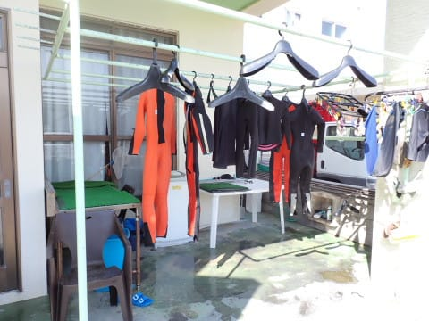

そして，

まずはシャワーを浴びて一息．

貸し切りスペースにある，このデッキチェアで

座間味の景色を見ながらくつろぐのが最高…！！

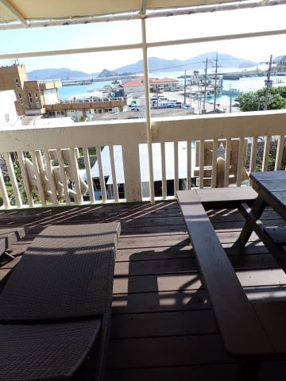

で．

一休みしたら，夕食まではまだ

時間があるのでちょっとお散歩に

出ましょうか…

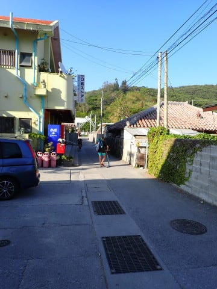

まずは定番，105ストアでアイスを買って

店の前で一息ついて…

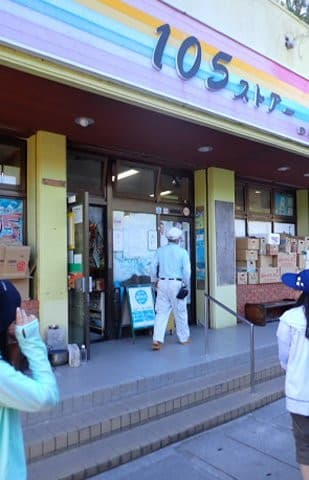

その後，街中をぶらつきますが．

座間味，猫が多いですね～

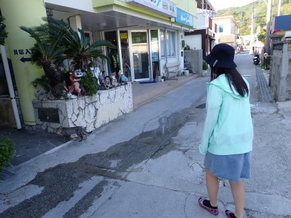

娘はそこら中の猫を眺めて満足

してました．

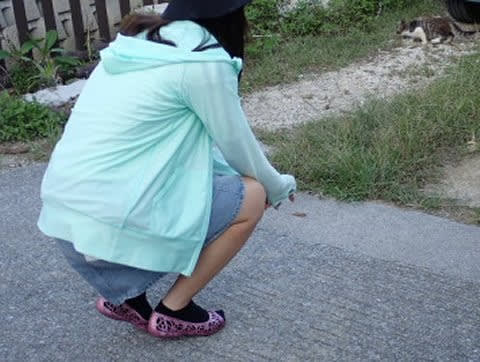

そして．

6時半ごろ，夜ご飯タイムになりますが…

今日の夜ご飯は，初めて行く

「まるみ屋」さんを予約．

座間味では結構人気のお店みたいで，

我々が行った時も満席で，予約が

ないと入れない感じでした…

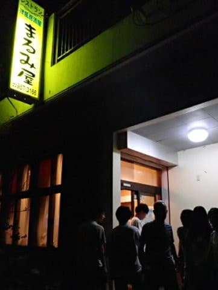

このお店は，自家製ジーマーミ豆腐が

有名みたいですが…

確かに，ジーマーミ豆腐やら

その揚げ出しやら，かなりイケる！

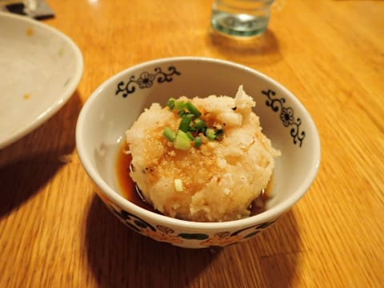

そのほかの料理も全体的に

おいしくて…

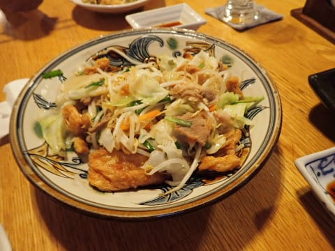

3世代で潜れた，久しぶりの今日のダイビングを

振り返りつつ，ゆっくりと夕食を楽しんだの

でした…

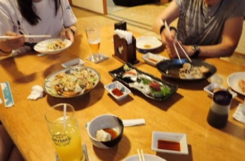

その後，宿に戻って．

広々としたダイニングで，全員でログ付けタイム．

いやー．

専用のリビング＆ダイニングがあって，

そしてベッドルームが分かれているって．

3世代での旅行には最適ですね！！

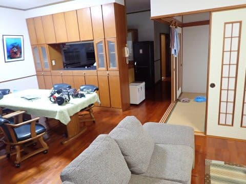

ってなことで．

夜10時過ぎまでログ付けをやって，

だべった後は…

今日の3本のダイビングの疲れで，

みんな早めに寝ちゃったのでした．

いやー．

でも，久しぶりのダイビング初日の今日．

満足の一日だったな！！

（[続く](e24a7648b377bc9ee6c6b09be429ba9ec.md)）

## 💬 コメント一覧

### 💬 コメント by (mae)
**タイトル**: Unknown
**投稿日**: 2023-09-24 22:49:31

座間味で夕食と言えばまるみ屋ですね。

夕食後、ショップに集まり泡盛を頂きながら一緒に潜ったメンバー達とのログ付けも楽しいですよね。

座間味もいいですが、ダイビングサークルの仲間達と何度も通ったシパダン島での滞在も良い思い出です。

### 💬 コメント by (Skier_S)
**タイトル**: ＞maeさま
**投稿日**: 2023-09-25 05:08:16

これまでペンション星砂さんで夕食を食べれたのであまり座間味の食事処を

知りませんでしたが，今回初めていろいろ行ってみました．

最近はインバウンドも増えて，宿で夕食を取らない人が増えたので座間味も食べるところがかなり

増えたといってました…

シパダン，今はもう島で泊れないし，外部からも潜れる曜日の制限があったりするし，

さらに海の様子も変わったようで，もう昔のシパダンと全然違うようです…

島に泊まれて潜り放題だった頃が懐かしい…（1度しか行ったことがないですが）

