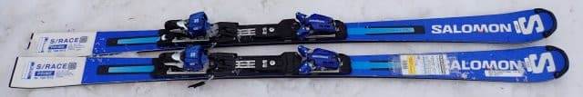
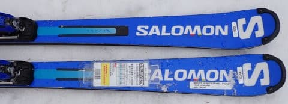
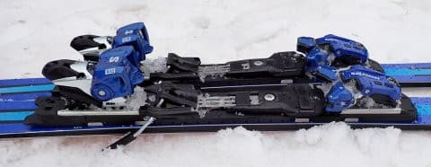
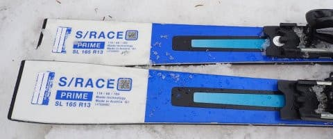
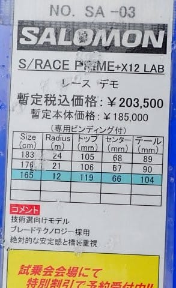

# 2024シーズンモデルのスキー板，試乗レポートその24…SALOMON S/RACE PRIME

📅 投稿日時: 2023-07-08 01:01:34

えー．

いつものことながら．

昨日も仕事が終わってない2時ごろに

床で寝てしまい…

そのまま朝7時ごろまで床で寝てました（涙）

ってなことで，更新できませんでした…

全国7億8000万人のこのBlogの愛読者の

みなさま，すみませんでした…←いや，このBlogの読者はそんなに多くないから！！

しかし．

我がGarminさんは．

なぜか布団で寝たときより，硬い床で

寝ていた時のほうが

「眠りが深い」

と判断することが多く．

今回，ものすごい深い眠りだっと判断され，

ここしばらくないくらいにボディバッテリーが

回復していることになってましたが…

ホントかな？

今後毎日，布団じゃなくて床で寝たほうが

いいのかも…←そんなわきゃない

ってなことで，本題へ．

本日も2024シーズンモデルのスキー板の

試乗レポート．

今回はサロモン編です．

では，どうぞ～！

〇SALOMON S/RACE PRIME X12LAB 165cm

基礎小回り．

これも昨年からのキャリーオーバーで，

コスメも何も，全く変わってないようですが…

履いた瞬間は，結構ずっしりした重さを

足元に感じます．

まぁ，X12LABビンディング，やっぱり

重いですから…

で．

この日は春の重い雪が荒れ荒れになって，

それが冷えていってボコボコに固まった

かなり難しいコンディションだったのもあり．

この板の重さゆえ，荒れたボコボコ斜面では

板の動かしにくさからちょっと手ごわさも

感じましたが…

まぁ，この板．

もともとコブ斜面とか突っ込むのは

難しそうと思ってた板なので．

やっぱり荒れた斜面を滑る板じゃなく，

整地を滑ってその本領を発揮する板

だと，あらためて認識．

ただ，荒れてないフラットなところでは，

重さを全く感じさせずに，すごい滑らかに

ナチュラルに切り替わってくれて，

オートマチックにターンしていける感じ！！

サイドカーブとたわみのバランスがすごく

良くて，キレイにたわみに沿って回って

いってくれて，板が勝手に切り替えを

やってくれるような，そんなオートマチック

性があります．

張りが結構強いので，R=12というかなり

サイドカーブがきつい小回り板だけど，

普通の人が履いて板なりに滑ったら，

中回りくらいになっちゃうんじゃないかな～…

しっかり踏むと小回りになっていくけど，

私の体力・脚力で快適に滑ると中回りに

なります．

かなりハイスピードで滑っても板にまだまだ

余裕がある感じで，かなりハイスピードで

滑っても，板がたわみ切らず小回り強制

マシンになったりしません．

なので，大回りから小回りまでの，

結構なオールラウンド性があります…

ずらしもできなくはないし，ずらしのコントロール

性もあるけど，板が重いのでずらすには体力と

脚力がいるかな．

ずらしを使うよりは，整地できれいに

がっつりグリップして，切り替えに向かって

すっとナチュラルに切り替わって板が

走っていってくれるという，

気持ちいい板のキレ・走りが感じられるので．

体力がある人が整地で履けばかなり

気持ちよく滑れる板です！

でも，ブーツはかなり固めのブーツと

合わせないと，この板の性能は

使いきれないんじゃないかな．

普通の気楽なゲレンデ履きでは，

SL PROのほうがいいかな～．

…とレポートはしてみたものの．

たぶん，このSL PRIMEは，もう売り切れて

入手できない気がする…
