# 2020/2/9(日)の志賀高原スキー場は…朝は脛パフ新雪！終日雪降りの激冷え！意外と混んだよ…

📅 投稿日時: 2020-02-09 22:46:17

🏷️ カテゴリ: [2020スキー滑走日記](c282e9230de179e245c7334eabeb0a3b3.md)

てなわけで．

今日一日滑ってみて，どうやら腰は

完治したような感じがする，Skier_Sです．

…でも．

今日の雪は，腰に優しくなかったですが…（ちょい涙）

とりあえず．本日2月9日の日曜日の志賀高原の

レポートです！

えー．まず．

今朝．

朝，起きてみると．

積もりましたね～．

積もりましたよ！！！

大体40cmくらいでしょうか…

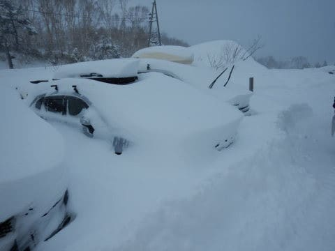

車も見事に埋もれてます（涙）

何とか運転席周りだけ雪を掘り出し…

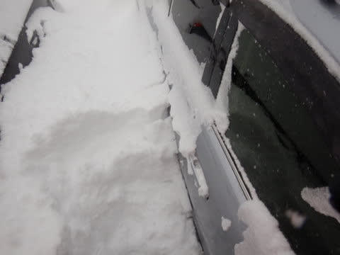

強引に脱出！

タイヤの前の除雪など一切なく，

するする脱出できました．

すごいぞ，LEVORG！

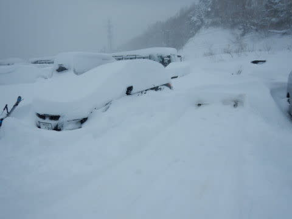

で．

これだけ積もったんだから，

朝イチ焼額は，ウハウハパウダーに

違いないっ！！

と，焼額にやってくると．

…えええ？

焼額第1ゴンドラ，まだ営業前なのに，

こんなに並んでるよ！？？

いつもの週末の1.5倍くらい人が

いるんじゃない？？

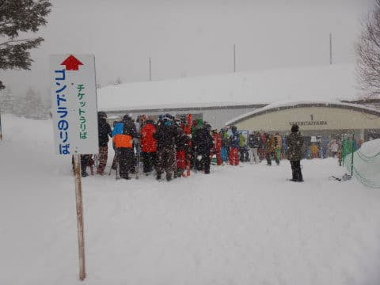

営業開始と同時に山頂へ上ると…

朝の気温は，-15℃！！

金曜夜の，-15℃クラスの冷えという予想を

ぴったり当ててるところがすごい！！←ものすごく冷えたところがすごいんじゃなく，当てたところがすごいのね

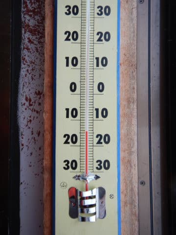

山頂は，結構強く雪が降っていて，

視界が悪く…

激烈に寒いよっ！！

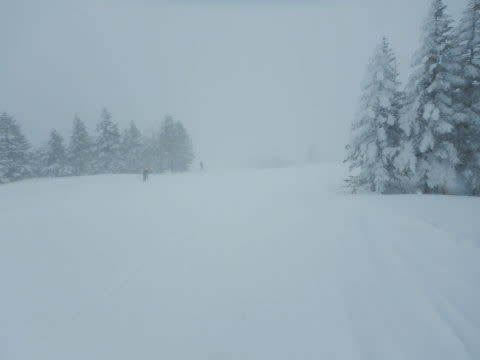

そう．

こんな日こそ，こいつにお出まし願わねば…

太板，出動だ！！

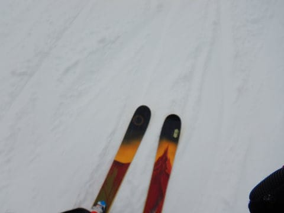

今朝は圧雪バーンも，10㎝ほどの軽い新雪が

積もってますが．

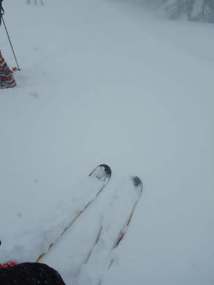

こんな日は，当然のごとく新雪狙いの

オリンピックコースに突撃！

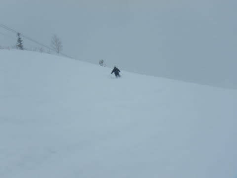

オリンピックコースは．

よーし！！

脛パフ！

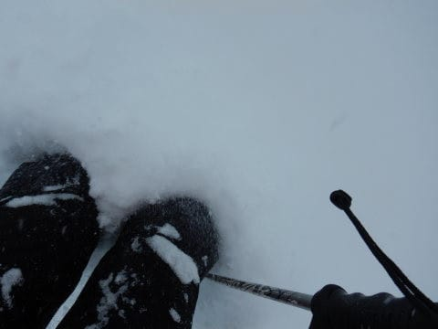

膝パフや太ももパフまで行かなかったけど．

今シーズン一番のパフパフ！！

パフパフ，いただきま～す！！

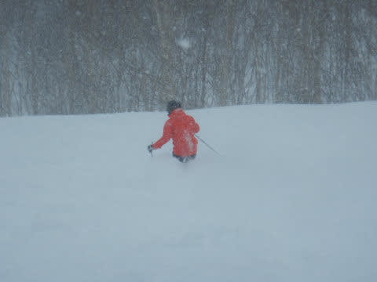

パフパフ！

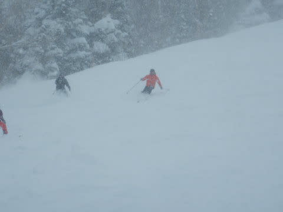

数本滑ると，かなり荒れて来ちゃって．

底付きもするようになって来たけど…

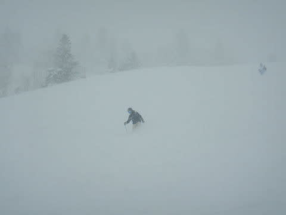

でも，パフパフ！！

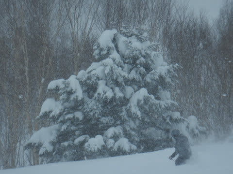

…今シーズン一番のパフパフ！！

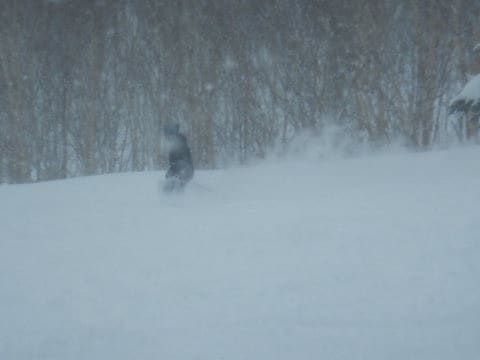

…だったけど．

美味しかったのは，

せいぜい4本程度．

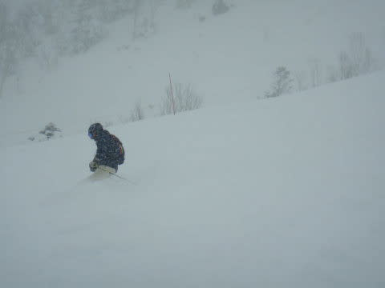

1時間も経つと…

単なる荒れ荒れこぶ斜面と化して

しまいました（涙）

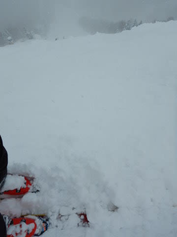

…ところどころ，パフパフが残ってるけど．

あらかた踏まれてしまったので，

踏まれてしまったところから，パフパフに

突っ込むと，ちょっと怖い感じ…

それも，視界が悪いので．

どこが凸凹なのか，新雪なのか

良く分からず．

ちょいと手ごわいバーンに

なっていきました…

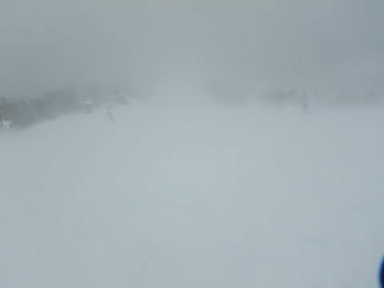

で．

さらに．

本日は，強風のため奥志賀が，

リフト・ゴンドラすべて全滅（涙）

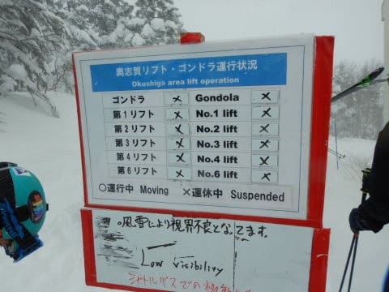

うーむ．

ここまで風が強まるとは予想

してなかった…

そのため，奥志賀に行くはずの人も

流れ込んだ，焼額第1ゴンドラは…

うぎゃーーー！

すごい列！

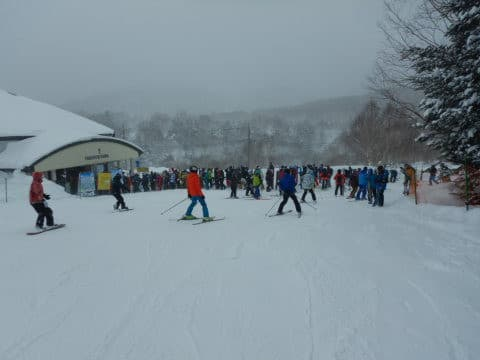

でも，輸送力の高い第1ゴンドラ．

これでも10分待ちません…

とはいえ．

ゲレンデの人口密度も高く．

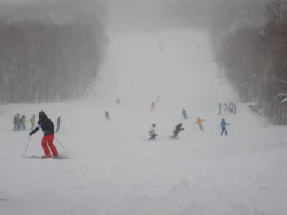

雪降りで，足元の凸凹が見えない中

人が多いので，ちょっと快適とは

言えない状況(涙）

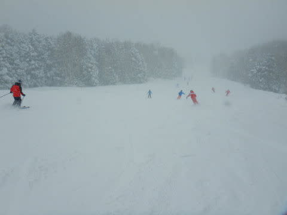

そして．

今日は混んでいるゴンドラから人が

リフトにも流れてきたので．

朝のゴンドラ混雑時は，リフトも

そこそこ混んでたし…

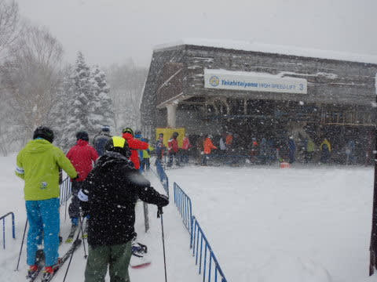

うーん．

惜しい．雪質が激烈にいいだけに，

混んでいるってのが，ちと惜しい…

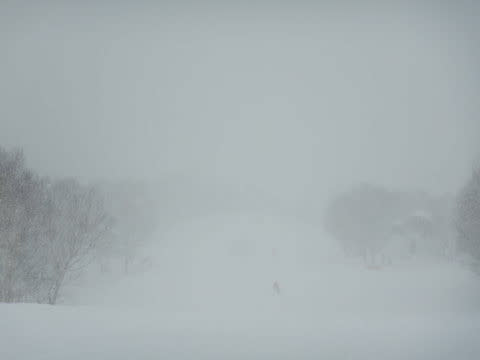

コースは午前中のうちから，かなり

凸凹になってしまい

（この写真だと，バーンが暗くて凸凹がわからない…）

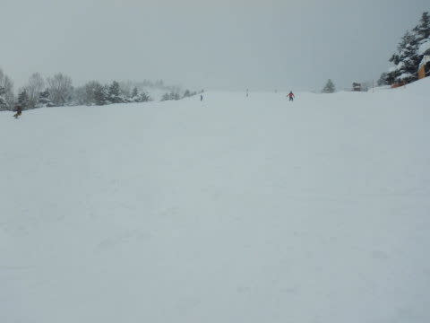

ゴンドラも，朝9時半から11時半ごろまで，

そこそこ混みました…（涙）

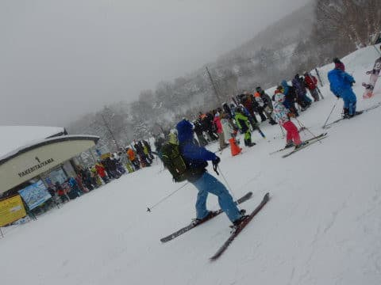

この日は，11:30～2時頃まで，

昼休みタイムはゴンドラはガラガラになったけど．

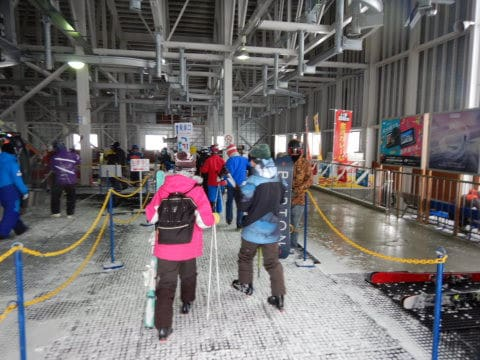

いつもの日曜なら，ゴーストタウン化する

午後になっても，またゴンドラが時々

ゲート外までの列になっていたのが，

ちょいと驚き…

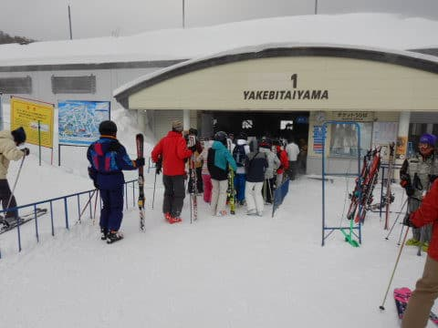

そしてさらに，

いつもならガラガラになる日曜の午後なのに．

ゲレンデの人口密度も高く．

おそらく，休みの谷間の明日が

休みで，今日帰らずに明日滑る人が

結構いるんだろうなぁ…

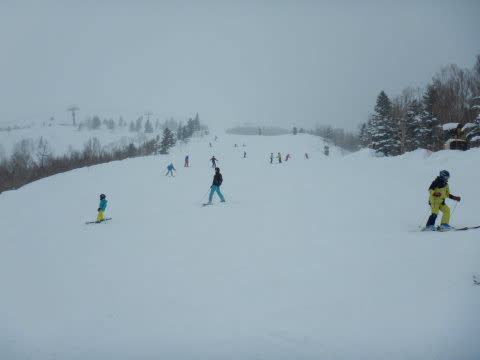

でも．

午後には雪が弱まるという予想が

当たり．

午後には時折日が射すタイミングもあり．

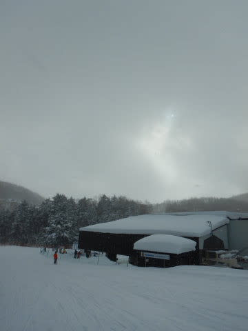

ゲレンデの凸凹が何とか見えるように

なってきましたよ！

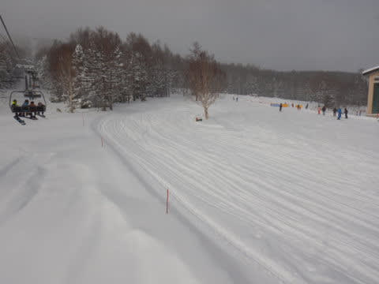

そして．

　でも，終日-10℃程度の冷え冷え！

　寒いよ！！

　午後はゲレンデがモサモサ凸凹に

　なっていく

という予想通り．

昼間も気温は-10℃までしか上がらず…

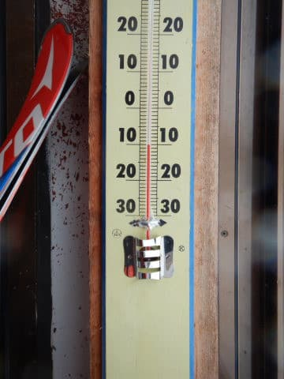

そして，ゲレンデは全面モサモサ

ぼこぼこに…（涙）

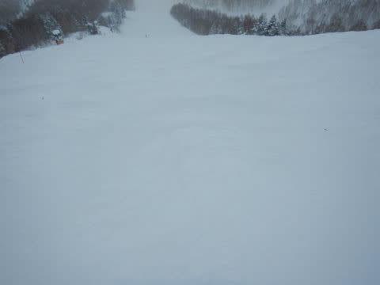

優しくない…

腰に優しくない…（涙）

でも．

雪質は圧倒的に文句なく今シーズン

ぴかイチの最高激軽勘違い雪！！

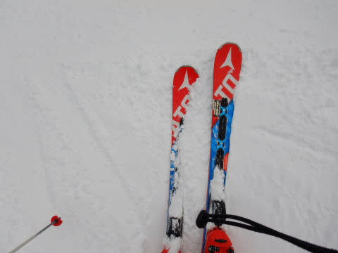

自分がうまくなったんじゃない？？

と勘違いできるような，志賀高原らしい，

激冷えの最高雪です…

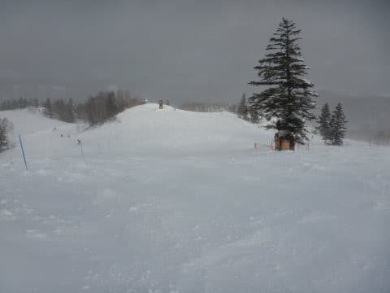

ただ．

どこに行っても完全凸凹なのがつらい感じ

だったけど．

凸凹に飛ばされながら．

今日も日が暮れるまで，

コースを攻め続けたのでした…

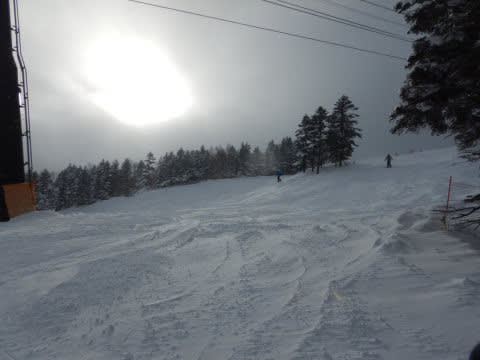

いやー．

雪は良かった．

雪はいいんだけど．

そろそろシマシマを滑りたいところ…

…

…

そうだ！！

ナイターに行けばいいんだ！！

ナイターのシマシマを滑ればいいんだ！！

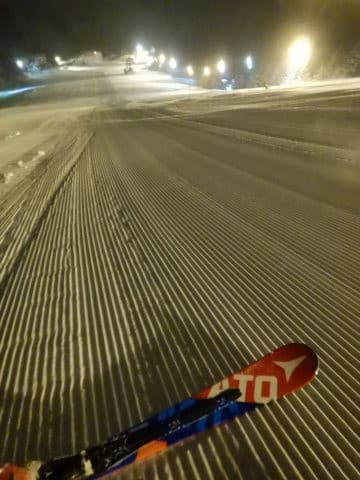

ということで．

今日も行きます，ナイターへ．

今日やっているのは，一の瀬ファミリー

ナイターのみなので．

遅いペアリフトを我慢しながら

滑ることになりますが…

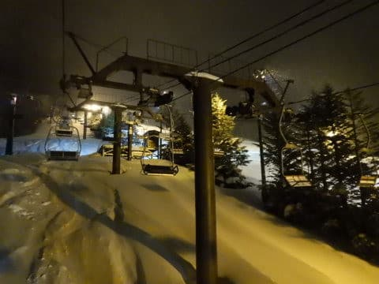

でも，シマシマ！！！

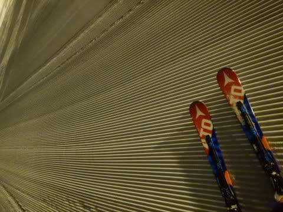

ってなことで．

シマシマやわらか雪を，思う存分

堪能したのでした…

けど．

あまりにも寒い上に．

ペアリフトがのろすぎるので，

乗っている間に凍死しそうになり．

ナイター終了30分前に切り上げて

しまったのは，私だけの秘密に

しておこう…←だから，ここに書いている時点でばれちゃってるから

とりあえず．

明日の朝は，新雪がほとんど積もらなさそうなので．

最高のピカピカ圧雪が滑れそう！

そして．

運が良ければ朝は晴れてるかも？？

午前中は最高シマシマ圧雪バーンを堪能できそうですよ～！！

…ただ．

午後から天気が一気に崩れ，雪が降り始めます．

午後は雪が結構激しく降るという覚悟を

しておいてください…

では，明日も志賀高原を滑ってます～！！

## 💬 コメント一覧

### 💬 コメント by (アツシ)
**タイトル**: Unknown
**投稿日**: 2020-02-10 00:36:50

昼ごろから夕方リフトが止まるまで、何度も上司に電話しようか迷いましたが、「雪が激烈に良すぎて帰れません。明日は休ませて下さい」が通じるとも思えず、諦めて帰りました。今日は信州中野ICまで１時間以上かかったのもあり、６時間かかって11時前の帰宅でした。

今日は何度か1ゴン乗り場でS様をお見かけしましたが話しかける間もなく上がって行かれました。噂に違わぬ早業ですね！

今日の私のお気に入りは、唐松でした。特に午後はコブとまではいかない程度のデコボコで、スピードを上げてデコボコに突っ込んでポンポンとばされながらテキトーにターンして降りる、で遊んでました。ただ２高は激寒でした。

明日、明後日も良さそうですね。腰に気をつけて、楽しんでくださいね。ブログ楽しみにしてます。

### 💬 コメント by (ほっぽ)
**タイトル**: ２日間お世話になりました
**投稿日**: 2020-02-10 00:47:09

Ｓさん

今日は１５時半にあがって風呂入って２２時前に帰宅しました。

２日間ありがとうございました。

昨夜の宴会が濃すぎて、刺激を受けた２日間でした。

また、毎週末よろしくお願いします。

http://www2.tokai.or.jp/nana_hoppo/

### 💬 コメント by (Northfox)
**タイトル**: Unknown
**投稿日**: 2020-02-10 08:10:26

おはようございます。

昨日は高天ヶ原スタートでしたが吹雪のため西舘山／ジャイアント、そしてサンバレーまで行ってきました。

西舘様の推薦とおり西舘山が天候的には一番平和だったと思います。

しかし昨日の荒れた雪面は身体へ厳しく、午後二時にはギブアップ状態でした。二時上がりをしようかと思ったほど。

スキー滑って身体が治るどころかダメージが蓄積して腰も背中も膝も軋んでいます。

もちろん今日も滑りますけどね。

> 西舘様

私も西舘山は好きなスキー場です。

滑りごたえがある楽しいコースですよね。崩落したコース何とか復旧できないですかね。

去年は発哺温泉の宿（スイスインです）に何度か泊まりました。今年も泊まる予定でしたが雪不足のためキャンセルしてしまいました。

トイレの件は知りませんでした。情報ありがとうございます。

（昨日はトイレを求めて右往左往していました ^^;）

### 💬 コメント by (西館)
**タイトル**: 本日は1ゴン入り待ち成功しました！
**投稿日**: 2020-02-10 21:33:44

本日はお仲間との時間に混ぜていただき、ありがとうございました。

(お仲間様に記憶していただいていてびっくりすると共に嬉しかったです、ありがとうございました。)

それと、ヒントを与えていただき、ありがとうございました。

まだまだ検証中でして、再びご相談の入り待ちをすると思いますが、その際にはよろしくお願い致します。

＞Northfox様、私にまで丁寧に返信いただき、ありがとうございます。

日曜日は寒くて応えましたよね。

S様ですら、お昼休憩を1時間も取ったほどですから

（Ｓ様、生身の人間だったのですね。サイボーＰーーー（あっ、またピー音が）だと思っていました。）

ほんとほんと、崩落したコース、何とか復旧していただきたいです。

来シーズンに期待したいですが、索道協会は西館～ブナ平・東館に対して冷たすぎるのでどうなることか｡｡｡

トイレ、分からないですよね。

旧来は建物から地下へ降りる形式でしたが、今は4ステップ3段なので便利にはなりました。

今も激しく降っているので、明日も膝上パフパフが楽しめるかも！

（昨シーズンは索道協会に見捨てられてナチュラルだからと放置されっぱなしでしたが、今シーズンは圧雪していただけています！）

### 💬 コメント by (西館)
**タイトル**: ＞Northfox様へのコメント内容訂正
**投稿日**: 2020-02-10 21:40:41

トイレへのアクセスについて、4ステップ3段って何じゃ。

ごめんなさい、階段を３段上がると書きたかったのに「４」って何？何で？あはは失礼致しました。

### 💬 コメント by (Skier_S)
**タイトル**: 明日もいい感じの一日になりそう！
**投稿日**: 2020-02-10 22:08:10

＞アツシさま

「雪が良すぎて帰れません」と，直球が通じなければ．

その時は，頭痛か腹痛になればよいのです…

と，言ってみる（笑）．

唐松良かったですよね～．

今日も唐松良かったですよ！

次の志賀高原予定はいつですか？

また志賀でお会いしましょう！

＞ほっぽさま

なかなか，普通では絶対にない強烈な飲み会でしたね（笑）．

また毎週～！

＞Northfoxさま

昨日の吹雪はつらかったですよね…

私もゴンドラ以外で滑ると凍死しそうで，

さらに昼休みをとってしまいました…

今日は朝は晴れて最高でしたね！

また焼額でお会いしましょう～！

### 💬 コメント by (Skier_S)
**タイトル**: ＞西館さま
**投稿日**: 2020-02-10 22:11:03

今日はわざわざイチゴンで待っていてくれてありがとうございました～！

また，週末はいつでもイチゴングルグルしてると思いますので，

また焼額に遊びに来てください！

お待ちしてます～！

