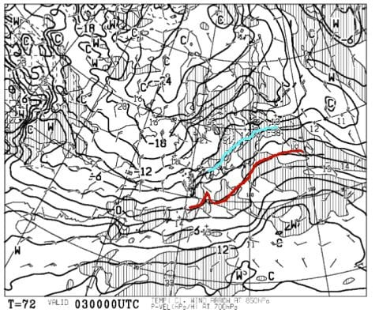
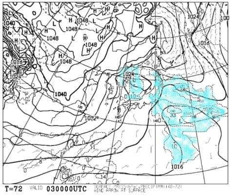
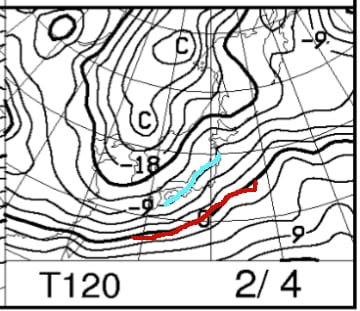
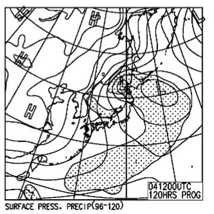
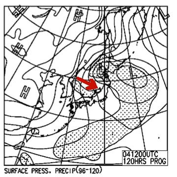

# 2月3，4日の週末の志賀高原スキー場の天気は？…雲が多そうだけどおおむね晴れるかな？積雪はほとんどなし．

📅 投稿日時: 2018-02-01 00:25:52

ということで．

なんだか関東にまた雪が降る予報が

出てますが…

…でも．

志賀高原はあんまり積もらなさそうな今日この頃．

みなさまいかがお過ごしでしょうか．

うーむ．

12月から年末年始はかなりのパウダー豊作だったけど．

1月に入ってから，週末はパウダーに恵まれて

ませんね～．

そろそろパフパフパウダーが滑りたくなってきたのですが．

今週末も，パウダーは望み薄です…（涙）

ってことで．

とりあえず，水曜夜恒例，週末の志賀高原の天気予想，

行くのだ！

えー．

まず．

土曜日，3日の850hpa気温を見てみると…

ふむ．

志賀高原は，水色の-6℃線より南にあるので．

うーむ．この時期としてはちょいと高めの気温で

スタートしそうですね．

とはいえ，朝は-7～8℃には冷えそうなので．

十分な冷え冷えの一日です！

で．

土曜の地上天気図を見ると．

うむ．微妙だ…

日本海と関東沖に二つ低気圧があって．

志賀高原はこの間に挟まれて．

普通なら悪天候になりそうだけど…

850hpaの気温傾斜もそんなに強くないし．

西～南西の風だし．

志賀高原は割と穏やかな天気で，

雲が多いかもしれないけど…晴れそうかな？

前日からの積雪はないので．

この日は朝は冷え冷えぴかぴか圧雪が楽しめそう！

次に，日曜4日の850hpa気温図を見てみると．

おっと．

この日はまた-9℃線が志賀高原にかかるので．

冷え込みが戻ってきますね～！

朝イチの山頂は，-10℃を軽く下回ってきそう！

終日冷え冷えの一日ですね．

日曜の地上天気図を見ると．

…うーむ．

この日も微妙…

西高東低の冬型っぽく見えるけど．

等圧線がきれいな縦じまになっておらず．

JPCZの雲が，矢印で示したように

かなり東に流れているので…

かなり西風ベースの天気ですね…

志賀高原では降らないパターンです．

雲は多めだけど，晴れるかな？

この日も土曜の夜から積雪はなく．

朝イチは冷え冷えシマシマバーンになりそう．

ってことで．

まとめると．

土曜：雲は多めだけど…太陽が時々雲で隠される程度の，

　日が差す天気かな．

　朝の気温は-7～8℃．最高気温は-3℃くらい．

　日が照ると，この時期としては比較的暖かく感じそう．

　朝イチはトップシーズンらしい，冷え冷え圧雪のシマシマが

　楽しめそう．

　終日いい雪質で楽しめるでしょう．

日曜：この日も，雲は多いかもしれないけど，朝から晴れそう．

　ただ，風向きが北寄りに変わると雪がぱらつくかも…

　この日の天気の予想はまだちょっと微妙．

　気温は朝は-12℃くらいまで冷え込む．

　朝イチは，冷え冷えの締まり気味の最高雪質バーン！

　雪は締まっているので，午後までそれほど荒れない

　フラットバーンが滑れそう．

ということで．

日曜がまだ，低気圧の位置によっては，風が北寄りに

回り，雪がちらつく可能性も残ってるけど．

でも，この週末も比較的天気に恵まれた，

いい雪質の週末になりそうな予感！

…でも．

フラットな冷え冷え最高雪のシマシマバーンもいいけど．

そろそろパウダーも滑りたいなぁ…←かなりの贅沢

## 💬 コメント一覧

### 💬 コメント by (かず)
**タイトル**: Unknown
**投稿日**: 2018-02-01 12:27:17

やはり降らないですか　僕の場合1日コケまくって体力消耗してるので明日の天気次第で今週末休みです

### 💬 コメント by (tomjii)
**タイトル**: 今はヤケビも雪が降っています
**投稿日**: 2018-02-01 21:15:17

今日は終日薄曇り。風も無く暖かく感じる天気でした。昼過ぎの山頂－5度。コースによっては貸し切り状態で適度に締まった圧雪。ゴンドラ、リフトも待ち無しでした。

夕方7時頃から軽い雪が降りだしています。どれくらい積もるか楽しみですが、10センチぐらいは行くでしょうか？

土曜もコンディション良さそうですね。楽しみにお待ちしております。

### 💬 コメント by (Skier_S)
**タイトル**: 今日は仕事に行けるのか？
**投稿日**: 2018-02-02 06:19:08

＞かずさま

土曜はダメです．

でも，日曜は降る可能性が出てきました．

まだ微妙です．

降ればブーツパフ程度．

降らなければ晴れて0cmという，

微妙な予想です…

＞tomojiiさま

初コメントですよね…！？

ありがとうございます．

志賀高原詳細レポートありがとうございます．

貸し切りの締まった圧雪，うらやましすぎます…

志賀は今晩はそんなに降らないと思います．

おそらく，予想通り10cmってところでしょうか？

土曜はいい感じになりそうですよ！！

### 💬 コメント by (tomjii)
**タイトル**: 大変失礼しました
**投稿日**: 2018-02-02 17:18:44

突然の初コメント申し訳ありませんでした。S様のブログの隠れファンの一人です。毎日（夏も）拝見するのを楽しみにしております。志賀には毎年お邪魔しますが未だ中級の域を越えられない老スキーヤーです。

いつも平日が多いのですが、今回は土曜までおりますので、思いきって初コメントさせて頂きました。

昨夜はS様の仰るとおり山麓では10センチ程度の積雪でした。朝一は晴れ、気温やや高めでしたが、良好な圧雪。

が徐々に曇り雪も舞う状況。午後は余り荒れませんが硬めのバーンが増えました。

今夜も少し降りそうで、あす朝もグッドと読みますがいかがでしょうか。

気をつけてお越し下さい。

長文失礼しました。

### 💬 コメント by (Skier_S)
**タイトル**: tomojiiさま
**投稿日**: 2018-02-02 21:15:47

いえいえ…

こんなしょうもないブログに対して，

ファンだなんて言ってもらえてうれしい限りです…（感謝）．

今回は土曜までいらっしゃるのですね！

土曜は朝イチからガンガン焼額第1ゴンドラ

回していると思うので，焼額第1ゴンドラに

乗っていたらお会いできるかもです…

＃午後は奥志賀とかに遠征するかも

しかし，ちょっと固めのバーンが午後は出てくるのですね…

でも，明日も朝イチは最高だと思います！

また明日，志賀高原でおあいしましょう！

