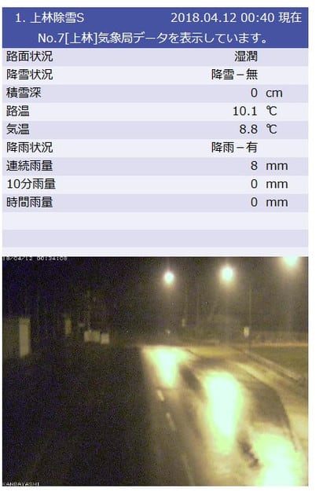
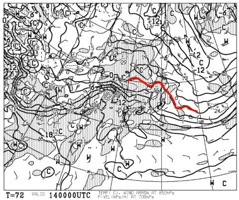
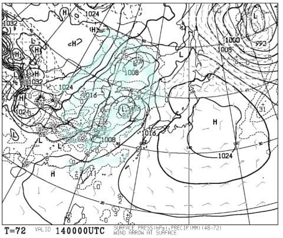
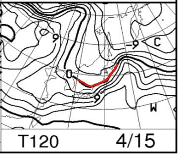
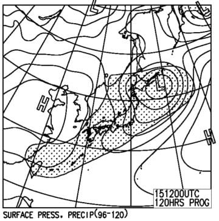

# 4月14，15日の週末の志賀高原スキー場の天気は…土曜は晴れのち曇り．日曜は…ちょっと雨が降りそう…

📅 投稿日時: 2018-04-12 01:29:46

えー．

新年度になり．

さらに，桜も完全に散ってしまったような，

この時期．

「今週末，スキーに行くんだ！」

というと，そろそろ一般人から

「まだ滑れるの？？」

と言われかねない今日この頃．

皆様いかがお過ごしでしょうか．

ってな感じなので．

この時期になると．

スキー天気予想を心待ちにしている人は

一体どのくらいいるんだろうか？

と，疑問に思うのですが．

しかし．

このBlogの読者なら．

「まだまだスキーシーズンでしょっ！！！」

って人が多いはず…

そう．

まだ，このBlogの読者なら．

スキー天気予想を待っている人がいっぱいいるはずだ！！！

ということで．

今日も，水曜深夜恒例のスキー天気予想，行くのだ！

…その前に．

どうやら現在，志賀高原では雨になっているようです…（涙）

雪が…雪が解けていく…（泣）

（[北信建設事務所HP](http://www.q0.ws302.smilestart.ne.jp/index.htm)より）

まぁ，この雨は明け方までには止みそうで，

そのあとは週末までは，雨は降らなさそう…

13日はちょっと冷えそうですが，

週末までは，雨も雪も降らなさそうです．

で．

肝心な週末の天気ですが．

土曜の850hpa気温図を見ると…

うーむ．

この日も赤くマークした0℃線は志賀の北…

そして，志賀高原は+6℃線が近づきつつ

あるので．

うーん．

朝から高めの気温になりそうです（涙）．

そして，土曜の地上天気図を見ると．

高気圧に覆われているので，朝のうちは晴れそう…

でも，西から水色で塗った降水域が近づいてくるので．

夕方近くには曇り始めるかな…．

この，西から近づいてくる降水域がいつ頃

志賀高原を通過するかが，微妙ですが…

土曜深夜～日曜朝かな．

土曜のリフト営業時間中は，

降水域に覆われることはなく．

天気はもちそうです！

そして，…日曜の850hpa気温図を見てみると．

うーむ．

0℃線は志賀の北側．

志賀高原は，+3℃線が近づいてくる

レベルなので…

うーむ．この日も，あまり冷えなさそうですね（涙）．

日曜の地上天気図を見てみると．

あうーーーん！！！

日本全体が，降水域を示す網掛けに

入ってますね…

…これは，残念ながら日曜は液体が空から

落ちてくることを覚悟せねばなるまい…

低気圧の通過タイミングを考えると．

雨は土曜深夜～早朝から降り始める感じか…

運が悪ければ昼過ぎまで降り続け．

運が良ければ通常営業開始のころには

止むかも…

うーむ．

まだ，今の天気図では，雨の時間の

正確な予測は困難です（涙）

ってな感じで．

まとめると．

14日土曜：朝は晴れ！

　早朝は気温がマイナスで，しっかり締まったいい雪でしょう．

　ただ，通常営業開始のころには気温がプラスに上がり，

　すでに雪が緩み始めてる予感…

　昼間の最高気温は+7～8℃くらいまで上がり．

　日が射すと暑く感じるほど．

　昼には雪はザブザブになっていくか…

　ただ，昼過ぎごろから曇りはじめ，夕方には

　本格的曇り空．風も夕方に向かって強くなって

　行くので…奥志賀ゴンドラ，夕方はヤバいかも？

　夕方になっても気温は高めで，日が陰っても

　雪は固まらないレベルでしょう．

　気温は高いものの，朝は天気も良く．

　リフトストップまで雨に祟られることもないし．

　まぁまぁの感じの春スキーの一日かな．

15日日曜：朝は雨（涙）．早朝から気温はプラスで，

　早朝からしっとりと水気を含んだ重い雪でスタート．

　朝は風も強そうなので…早朝営業ができない可能性も．

　雨の降り終わりがいつ頃になるか，まだ予想は

　難しいけど…

　運が良ければ通常営業開始ごろ，

　運が悪ければ昼ごろまで降り続ける．

　奥志賀ゴンドラは，強風で午前中はアウトの

　可能性が高いです．

　午後は雲の合間から日も射すタイミングもあるかな．

　雨が止んでも，昼間の気温は+5℃以上と高いままなので．

　この日は水気を吸った，重い雪が終日続く一日．

　

ってな感じで．

日曜はちょっと残念な感じの雪質＆天気になりそうですが．

雨がいつごろ降り始め，いつ頃降り止みそうかは…

また直前に最終予想します．

…しかし．

雨になっても，雪がもってくれる

ことを祈るばかりですが．

とりあえず．

日曜の営業開始までに雨がやんでいるのか，

それとも雨の中滑らなくてはならないのかは．

皆さんの日ごろの行いにかかっていますので．

くれぐれも，これから週末までの

言動には注意しましょうっ！！←また，他人のせいにするつもりか…？

## 💬 コメント一覧

### 💬 コメント by (Hide)
**タイトル**: 今シーズン終わりました・・・
**投稿日**: 2018-04-12 09:03:28

S 様

私は先週でシーズン終了です。

今シーズンは、やっとS様にごあいさつさせて頂き、また、ステーッカーまで頂きありがとうございました。

志賀高原シーズン終了後の月山レポートも楽しみにしています。

また来シーズンも焼額でお会いしましょう。

### 💬 コメント by (Skier_S)
**タイトル**: Hideさま
**投稿日**: 2018-04-13 01:25:07

あら…

今シーズン終了ですか．

まだまだ雪があるんですが…

とりあえず，今シーズンは無事お会いできましたね（笑）．

また来シーズンも焼額でお会いしましょう！

