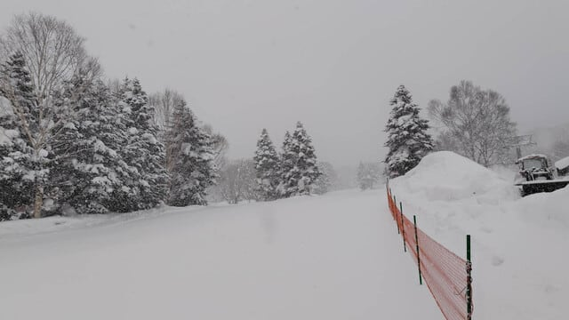
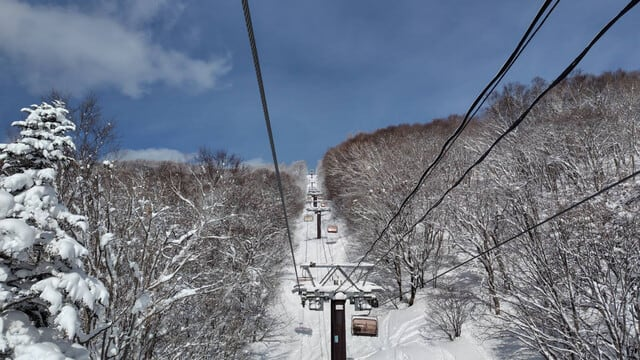
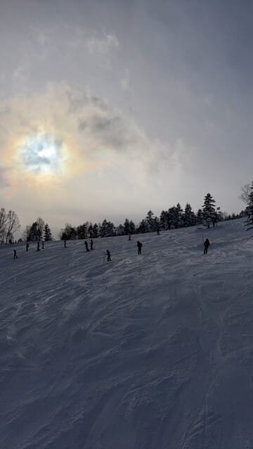

# 2月7日(金)の志賀高原特派員によると，雪のち晴れ！2月8日(土)～11日(祝)の志賀高原の天気は土，日はかなり雪が降りそう．月曜も雪が降り，火曜午後は晴れかな

📅 投稿日時: 2025-02-08 00:57:48

🏷️ カテゴリ: [日記](cc4b5682fb7b8b144980957a978653fb0.md)

えー．

本日の志賀高原も，特派員から写真が

送られてきました…！！

朝までの積雪は約30cm．

朝もかなりのガン降りで，

午前中だけで10cmくらい雪が積もる

ような天気だったようですが…

なんと！昼過ぎの1時ごろからは晴れて，

青空がのぞくいい天気になったよう

です…！

ただ．

新雪が思いっきり積もった今日は，

午後は当然のごとく凸凹バーン

だったようですね…

ってな感じで．

西風ベースの天気だったので新潟ほど

積もってはいない志賀高原ですが，

西風だったにもかかわらず，激烈な

寒気が入ったおかげで，西風では降らない

志賀高原にしては良く積もったな…

という感じですね～…

で．

この雪ふりの天気は今後も続きそうですが…

カレンダーをよく見ると，11日が祝日

じゃないですか！！！

だもんで，これから祝日の11日までの

天気をざっくり予想すると，

8日(土)：朝から雪．終日雪．

　朝までに40cmくらい積もるか？

　昼間も降り続け，時折強く降る．

　昼間も10～20cm，ヘタすればそれ以上

　積もるかも…

　気温は激冷え．朝は-15℃くらい．

　昼間も-10℃をわずかに上回る

　くらいの激冷え．

　寒い，雪降りの一日なので，根性の

　無いスキーヤーは振り落とされていく．

　終日モフモフのエンドレスパウダーデー

9日(日)：この日も朝から雪．終日雪．

　この日も朝の気温は-14℃くらいと

　激冷え．

　朝までに積雪20cmほど？

　朝イチは圧雪コースも冷えた新雪が

　5-10cm乗っている．

　土曜ほどは激しい雪ではないが終日

　降り続ける．

　昼からバーンはモサモサで，午後は

　荒れたバーンになる．

10日(月)：この日も朝から雪．

　朝イチの気温は-12～-13℃とこの日も

　寒い．

　朝までの積雪は10cmほど？

　朝イチは圧雪の上にうっすら新雪．

　昼間は雪が降ったりやんだり．

　運が良ければ時折日が射す一瞬も？

　雪は柔らかめなので，

　この日も午後はバーンは荒れそう…

11日(火・祝)：朝はたぶん雪．

　朝イチの気温は-10℃程度．

　相変わらず冷える．

　朝イチは柔らかめのシマシマバーンの

　上にうっすら新雪か？

　朝は降っていて，夕方には晴れそう

　だけど，何時ごろに降り止むかは

　まだ予想が不正確．

　運が良ければ午前早いうちから晴れ，

　運が悪ければ夕方まで曇り～雪．

　運が良ければ，冷え冷え新雪が

　降った後の晴れ間でいい感じの

　一日になりそう．

ってな感じでしょうか．

私は明日から予定通り志賀高原なんですが．

どうやら上信越道の長野ICより北が

雪のため通行止めのようで，早めに

出発しないといけない感じなんだけど…

さっきやっと一仕事終えて，今は

もう深夜1時なんですが？？

まだお風呂にも入ってないんですが？

これからお風呂に入って，早めに

3時に出発となると…

おそらく1時間寝られないんですが？？←こんなBlog書いてないで早く寝ようよ

ってなことで．

ほぼ徹夜で雪道の長距離運転という

ご無体で，今日も志賀高原へ向かいます～！！

## 💬 コメント一覧

### 💬 コメント by (アツシ)
**タイトル**: Unknown
**投稿日**: 2025-02-08 02:29:25

上信越道の通行止めも影響大ですが、名古屋以西は高速も国道も止まってるので、明日は関西方面からの人が来れなくて空いてるかもしれませんね。私？私は16:30で早退してダッシュで大阪を出たので、ギリギリ通行止め前に中央道まで抜けられました(^^)v朝まで仮眠して、朝イチ目指します！

### 💬 コメント by (地元民)
**タイトル**: Unknown
**投稿日**: 2025-02-08 07:48:09

郷も30㌢です。

夜中の吹雪はすごかったです。・・・なのに、雪、重い。雪かき死にそう。

### 💬 コメント by (副院長)
**タイトル**: Unknown
**投稿日**: 2025-02-08 08:45:26

午前中は仕事。午後から出撃（京都から）さて、どうやって、名古屋まで行けますかな。行けても、夜中到着かも。京都は雪国になってます。第二名神開けてくれないかな。

### 💬 コメント by (地元民)
**タイトル**: Unknown
**投稿日**: 2025-02-08 22:28:01

土曜日。郷も一日中降り続けていて、どんどん積雪が増えていき、まだまだ降りそう。

志賀高原、猛吹雪で悲惨だったんじゃないかと・・・。

### 💬 コメント by (Skier_S)
**タイトル**: 明日も積もるよ
**投稿日**: 2025-02-08 22:37:58

＞アツシさま

無事到着おつかれさまでした！

無事今日は滑れたのでしょうか…？

ゲレンデでお会いしませんでしたが…

＞地元民さま

志賀も重めの雪でした…

一日吹雪いてました（泣）

でも，パウダー楽しめましたよ！！

明日も終日パウダー楽しめそうです…（逆説的に言うと，終日天気が悪いともいえる）

＞副院長さま

明日，無事到着できることを祈ってます…

なかなか志賀の上り下りの道路も視界が悪くて危ないので，

安全運転でお越しください！

### 💬 コメント by (アツシ)
**タイトル**: Unknown
**投稿日**: 2025-02-09 16:01:41

土曜日、日曜日と焼額から一歩も出ず、第３高速を中心に回してました。しかし１回も会いませんでしたね。焼額も広いですね。

### 💬 コメント by (Skier_S)
**タイトル**: ＞アツシさま
**投稿日**: 2025-02-09 23:19:07

えええ！！

ずっと焼額？？？

でも，一度もお会いしませんでしたね…

私もずっと焼額にいたのに，なぜ？？

