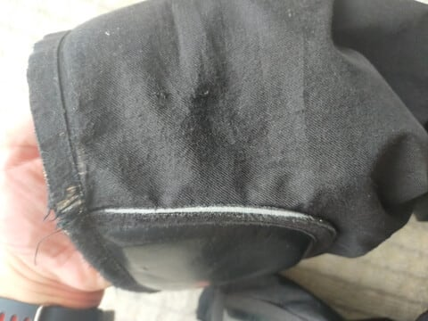

# スキー用具は消耗するよね…どんなふうに消耗するかでスキーバカをレベル分けしてみた

📅 投稿日時: 2024-05-22 03:54:26

🏷️ カテゴリ: [スキー雑談](c1f9d2cb7478308da16419928ea3945e9.md)

えー．

1シーズンで12月からGWまでの50日以上，

朝からラストまでひたすら志賀高原で

滑り続けるシーズンを過ごし．

さらに10月からはイエティ，

GW以降はかぐらと月山で6月末まで

滑るような生活をしていると…

スキー道具が半端なく消耗していく

わけですね（泣）

スキー道具で，2シーズン以上

生き残ってくれるのは，

ストックとウェア，ヘルメットくらい

ですかね…

あ，メインの板をFISCHERにしてから，

今回奇跡的に板も3シーズンもって

くれましたね～…

かつてはブーツも4シーズンくらいは

履いていたけど．

最近では，新品と変わらず使えるのは

2シーズン，

3シーズン目はインナーもシェルも

ヘタるし，予備用として使っている感じ…

ってな感じで．

私の使っている道具で一番長持ちしているの

はストックで8シーズン．

次はウェアで大体4シーズン．

（4シーズン目はさすがにボロボロだけど，

　ウェアは滑りに影響しないので

　買い替えるモチベーションが低い）

ってところでしょうか…

ってな感じで．

激しく道具が消耗していく私ですが．

今回，

「いや～．スキー道具ってこんな感じに

　消耗しますよね…」

と言って，みんなに納得してもらえる

ランキング（？）を作ってみました～！！

納得度1位

〇使いすぎてグローブに穴が開く

…グローブって，使い込むと穴が開きますよね．

特に私のようにゴンドラに乗る回数が

半端なく，板を掴むとエッジで

やられて，1シーズンもたずに穴が開い

ちゃいます…

穴が開いてすぐ捨てるのはもったい

ないので，穴が開いてもテープを

巻いてしばらく使いますが…

みすぼらしいといわれます（笑）

でも，グローブに穴が開くのは皆さん

納得してもらえるところ．

　

納得度第2位

〇経時劣化でゴーグルスポンジがダメになる

ゴーグルのスポンジがダメになるほど

長く使う前に，レンズが傷ついたり

曇り止め効果が落ちてきたり…

というところで買い替える方が

多いかと思いますが．

まだ，ゴーグルスポンジがヘタるとか

そのあたりは皆さんが理解できる

レベルだと思います…

第3位

〇スキーブーツのインナーがつぶれる

これ…

ホントに悲しいんですよね．

ブーツのインナー，100日も履くと

結構つぶれてゆるゆるになってきて．

150日を越えてくると，ホールドが

効かなくなったり，

足の出っ張りを覆っている部分が

薄くなって当たるようになってきたり，

さらには内張りの布が緩んで皺に

なってきたり，穴が開いたり…

やっぱりシーズン70日滑ると

何とか2シーズン．

3シーズン目は結構厳しい感じに

インナーがつぶれてしまいます（泣）

皆さんがブーツを買い替えるのは，

インナーのつぶれを感じで買い替える

人も多いんじゃないでしょうか．

第4位

〇スキー板がヘタる

ヘタる．

スキー板は，ヘタる！！

かなり日数を滑る焼額の常連さんたちは

「板がヘタる」というのが通じるけど．

板がヘタるのを体感したことがない人も

多いようで．

「スキー板ってヘタるの…？」

と聞かれることも．

このあたりがわかるようになってくると，

ヤバい人の仲間入りですね…

第5位

〇スキーパンツの裾が雪で擦れて穴が開く

このあたりになると…

なかなか同意を得られる人が少なく

なってきますよ～！！

春スキー，特にGW以降の重い雪を

滑ると，

スキーパンツの脛の部分に重い雪が

バサバサ当たり，

ヤスリのようにスキーパンツの裾を

削っていき，生地が薄くなっていきます…

そして．こうやって雪で布がすり減って

裾がほつれていくだけじゃなく…

最悪，気づいたら穴が開いているという

すごい状態に…

…でも．

皆さんここまですり減ったウェアを

来ている人を見たこともないし．

「スキーパンツ，すり減るよね」

と言っても，あまり同意してもらえないです…

第6位

〇スキーブーツシェルがヘタる

私もかねてから聞いていたけど，実際に

体感したことはほとんどなく…

昨シーズンに初めて体感したのですが．

スキーブーツのシェルもヘタります（泣）

板のヘタりも，最初はわからなかったけど．

板を小回り・大回りとか2セット履き分ける

ようになってから，古い小回り板と新しい

大回り板を履き替えたときに

「…これは…ヘタっている？？」と

はじめて気づいたように．

2シーズン前からフレックス違いの

ブーツを履き分けるようになって，

シェルのヘタりに気づくようになりました…（泣）

いや．

ブーツも1足しか使わなければ，

シェルのへたりにはほぼ気づかないと

思います．

ブーツを2足以上使い分ける

ようになってから，気づくように

なってしまい．

「あぁ…ブーツがヘタった．買わないと」

という悲しいことが起きるようになります．

これに関しては．

「いやー．ブーツのシェルがヘタって来てね～…」

という話を他人から聞いたことがないので．

納得してもらえる人は，あまりいないん

だろうなぁ…

第7位

〇ストックリングがすり減る

…これ．

以前もネタにしたことがある気が

するけど．

すり減りますよね…ストックリング．

え？

すり減らないの？？

いや…

皆さん，ストックは雪面で引きずって

滑らないんですか？？

削れますよね…

ストックリング．

7シーズン前はこんな感じだったけど…

今はここまで削れてしまってます…

ストックリング，すり減りますよね．

すり減るはず！！

皆さんは，なんでストックリングが

すり減らないんですか！？？

とりあえず．

私以外でストックリングがすり減っている

人をいまだに見たことないし．

この件に関しては，いまだに一人も

納得してもらえた人はいません…

非常に納得度が低いようです．

…ってなことで．

スキー道具の消耗の納得度ランキング

でしたが．

皆さんは何位まで納得してもらえたでしょうか…

というか，どの順位まで道具をヘタらせた

ことがあるでしょうか．

とりあえず，

ストックリングがすり減る

というのが私だけじゃないことを

確認したくてこの記事を書いたので．

ストックリングが減るよ！！！

という人は，コメントください…

コメントお待ちしてます！！

## 💬 コメント一覧

### 💬 コメント by (副院長)
**タイトル**: Unknown
**投稿日**: 2024-05-22 08:44:03

S様、申し訳ない、6位までは激しく同意しますが、ストックリングは経験ないです。でも、ストック3本トランクに入ってます。一つは深雪用リング大きいやつ、シーズン最初のちょっと長いやつ、脚力ついてきて、低く滑れるようになって使う（メイン）、短いやつです。今シーズン深雪用は出動機会なしでした。

### 💬 コメント by (ドック)
**タイトル**: Unknown
**投稿日**: 2024-05-22 15:12:47

リングはサーマーゲレンデで使うと減りますね。雪上のみでは、あまり減った記憶ないです。

ブーツシェルは２シーズン履くとヘタリます。１年で足首の前にクラック入った事あります。板も２シーズンで減ったてきます。

### 💬 コメント by (にしやん)
**タイトル**: Unknown
**投稿日**: 2024-05-22 18:52:45

ポールを強く突くからヘタるねん

### 💬 コメント by (r)
**タイトル**: Unknown
**投稿日**: 2024-05-22 20:39:00

パイプ飛んだりしていると　金具が一番に壊れます

あと身体も壊れます

### 💬 コメント by (Skier_S)
**タイトル**: 雪面でストックリング減る人はいなかったか…
**投稿日**: 2024-05-23 00:47:02

＞副院長さま

ストックリング，減りませんか…

しかし，ストック3本？

状況によって板やブーツを履き替える私も，状況でストックを使い分ける発想はなかったです…

＞ドックさま

サマーゲレンデだと減るんですね！！

やっとリングが減る仲間が見つかってうれしいのですが…

雪面では減らないんですね（ちょい涙）

ブーツもやっぱり2シーズンですか…

板はATOMICのSXだと，40日でヘタりますよ！（笑）．

4セット中3セットが40日ちょいで剥離しましたし（涙）

＞にしやんさま

ストック自体はヘタらないんですよ…

リングが減るんです…

ストックを突いているわけじゃなく，滑ってる間ずっと雪面を引きずるので

削れていくんです…（涙）

＞rさま

あ，金具が壊れるんですね！！

30年ほど前は，板の脱ぎ履きをしすぎると，ビンディングのバネがヘタって行くのか

開放値をどれだけ上げてもすぐ開放するようになったことがありましたが…

最近のビンディングはヘタらなくなったなぁ…と思っていたところ，

最近でも，パイプ飛ぶとビンディングが壊れるなんてことがあるんですね．

ぶつけて壊れるんでしょうか…？

### 💬 コメント by (G)
**タイトル**: Unknown
**投稿日**: 2024-05-23 11:29:33

カービングテクニックになって、年間数日しか滑らないレベルの私でも１日滑っただけで板がヘタりを実感します。カービング時代の初期、カービング特性尖った板で調子こいて滑っていたら２日でベント逝って泣いたです。

### 💬 コメント by (まあぽ)
**タイトル**: Unknown
**投稿日**: 2024-05-23 14:59:33

どれもヘビーユーザーあるあるですね～。

あともうひとつ個人的に加えたいのが、スキー板のトップの部分の削れです。

雪の摩擦抵抗ってすごいと思いました。

まあ研いだエッジがアイスバーン数本ですこし丸くなりますものね。

### 💬 コメント by (Skier_S)
**タイトル**: コメントありがとうございます~！
**投稿日**: 2024-05-24 01:56:31

＞Gさま

え！！？？？2日でベントが逝っちゃう？？？

そんなひどい板があるんですか…！！

1日でへたりがわかるレベルってのは恐ろしすぎますね…

＞まあぽさま

左右の板をぶつけてトップが削れるんじゃなく，雪でトップが削れる？？？

それも私は経験したことがないです…

でも，ストックリングやスキーパンツがすり減っていくんだから，雪での摩耗は

舐めちゃいけないんだと思います…

### 💬 コメント by (ｽﾉﾎﾞﾀﾞ)
**タイトル**: Unknown
**投稿日**: 2024-05-24 18:29:27

ウェアは擦り切れてからが格好良くなるという認識です👍

### 💬 コメント by (Skier_S)
**タイトル**: 意外とこの記事コメントが多い…
**投稿日**: 2024-05-24 22:30:23

＞スノボダさま

なるほど…擦り切れてからが格好良くなるという認識はなかったです！！

ダメージジーンズならぬダメージウェア…

はやるといいんですけどね（笑）

