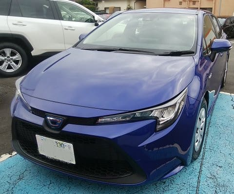

# TOYOTA　カローラツーリングに試乗してみた

📅 投稿日時: 2019-11-07 02:30:35

えー．

この9月にカローラフィールダーから

モデルチェンジして，登場したばかりの

カローラツーリング．

日本国内ではほぼ死に絶えた

ワゴン車の，数少ない生き残りで．

かつ，トヨタの先進的ハイブリッド技術を

惜しみなく注ぎ込んだという，

この車．

これは乗ってみないわけにいくまい…

と，試乗してきました．

試乗したのは，ハイブリッドの2WDモデル，

一番お安いHybrid G-X．

正当ワゴンスタイルなので，大きめに

見えますが．

サイズとしては，Mazda3とほぼ同じ．

意外とコンパクトな車です…

リアシートは，

インプレッサやLEVORGと比べると，

ちょいと狭いです．

まぁ，Mazda3とほぼ同じ寸法と

考えると

「こんなものかな…」

という広さ．

トランクは，さすが正当ワゴンスタイルの

車だけあって，このサイズの車の割に

広いです．

そして，

運転席に座りますが…

うむ．

一番安いグレードだから仕方がないけど．

ちょっと内装のプラスチック感が…

ハイブリッドのこのグレードだと，

270万くらいする車と考えると，

最近のSUBARUやMazdaの車が内装が

頑張っているので，それと比べると

ちょいと残念なことに，

かなり安っぽく見えます…

まぁ，高いグレードにすると

ステアリングも本革になり，

もう少し高級感が増すので，

一番安いグレードだから，という

ところを割り引かないと．

ってなことで．

走り出しますが…

かなり軽めのステアリングフィール．

停止時からクルクル回せちゃいます．

低速でも，かなり軽く回せます．

そして，アクセルを踏むと…

をを！！

モーターパワー，結構すごい！

アクセルを踏んだ瞬間から，

クッと気持ちよく加速します．

このあたり，スバルのe-BOXERや

ホンダのFITなんかのハイブリッドよりも，

モーターアシスト感はかなり強いです．

走り出してもエンジンはなかなか

かからず，信号からのスタートでも

しばらくはモーターのまま走っていきます．

ただ，運転手が意図しているわけでは無い

タイミングで，突然エンジンが掛かったり

止まったりするので，

不思議な感じ…

エンジンを操って走るという，

一般の車の概念でいると

かなり不思議に感じます．

そして．

エンブレは弱くて，

パドルシフトが無いので，下りでの

スピードコントロールはATを

「Bモード」に切り替えるか，

ブレーキでやることになりますが…

ハイブリッド車のブレーキペダルは，

メカブレーキを掛けるのではなく，

回生電力の発生量コントロールでの

減速G制御なので．

フェードなどを心配せず，志賀高原の

下り坂とかの長い下りでも，ずっと

ブレーキを踏んでいって大丈夫

なんですよね…たぶん．

…古い人間には，下り坂でずっと

ブレーキを踏んでるとフェードしそうで

ちょっと心配になります．

でも，ブレーキフィールはGood!

回生とメカブレーキの繋ぎは分からず，

すごい自然なブレーキ感とペダルタッチです．

ふーむ．

さすがにトヨタのハイブリッド．

気持いい加速と，違和感のないブレーキ．

素晴らしく熟成が進んでいますね．

足回りは…

これは新たな感触．

驚くほどのあたりの柔らかさ．

継ぎ目，段差をほとんど感じない．

優しい．

路面がどんな状況なのかの

インフォメーションが全く

分からないくらい，いい意味でも

悪い意味でも路面の状況が

伝わらない．

街乗り用途と考えるといいかも．

山道を攻めるとどうなるんだろう？

ただ，タイトさやメカ感は全く無く，

山道を攻めよう！

とか，いつまでも走っていたい…

というワクワク感は，正直あまりないの

ですが．

とはいえ，Go-Stopのある街中の

燃費もいいし，

強いモーターアシストで，パワー感もあるし．

段差や凸凹も感じさせない，優しい

乗り心地で，

そこそこコンパクトで小回りも効く，

無敵の街乗り車…って感じでしょうか．

…でも．

ハイブリッドの4WDを選ぶと．

一番安いグレードでも．270万するのか…

うーーん．

ちと高いですね…（涙）
