# 2020/2/8(土)の志賀高原スキー場は…終日雪降りなれど，時折晴れ間も！雪は最高！幸せな一日

📅 投稿日時: 2020-02-08 23:55:17

🏷️ カテゴリ: [2020スキー滑走日記](c282e9230de179e245c7334eabeb0a3b3.md)

ということで．

本日も志賀高原へ来ているわけですが．

いやーーーー．

良かった．

今日の雪は，良かった．

そして．

皆さんが心配してくれている腰も．

いろんな方がコメントくださった

ロキソニンパワーと，

私の回復力で．←そこはみんなのおかげって言っておくところでしょ…

無事完全復活しました～！！

今日，私と滑った方は．

もう100％完全復活宣言を納得いただけるかと…

いつも通り，ガンガン攻めて滑れました～！！

いや…よかった…

ってなことで．

本日の志賀高原ですが．

朝の登り坂はかなり本格的な雪道

でした…

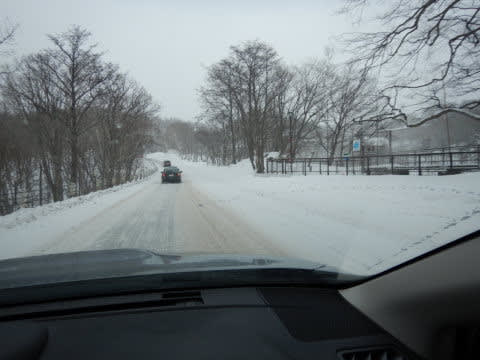

明日はもっと積もってそうなので，

志賀高原への登り坂はご注意を！

自信のない方は，上林チェーンチェックの

場所でチェーンを巻いていくことを

おススメ！

そして．

いつも通り焼額第1ゴンドラの営業前に

並びますが．

2月の週末にしてはちょいと人が少な目で．

今日もそんなに混まなさそう！

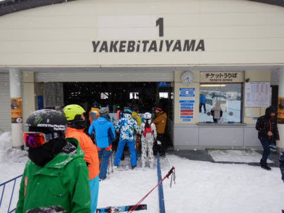

山頂にやってくると…

気温は-9℃と，-10℃近くまで冷える予想の

通りの気温ですね…

最近，素晴らしく予想精度が

上がってますね（自画自賛）

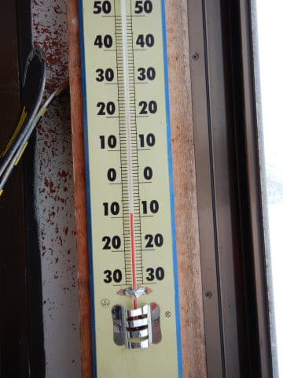

そして，天気は…

雪降りだけど，うっすら日が射して，

ゲレンデは意外と

見やすいよ！

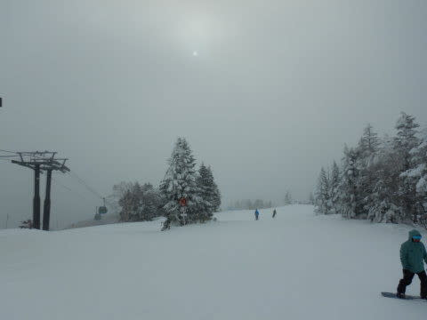

で．雪は…

やわらか圧雪の上に，うっすら新雪！

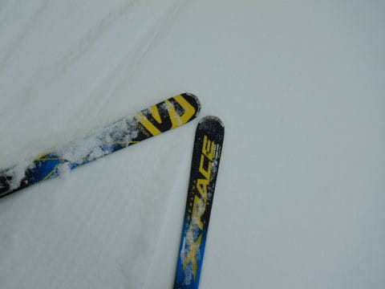

雪は朝に降り始めたばかりのようで，

新たな積雪はせいぜい10cmほどでしたが．

ゲレンデの上に乗ってる新雪は軽くて．

ほとんど下の圧雪を滑ってる感じで，

滑れます…

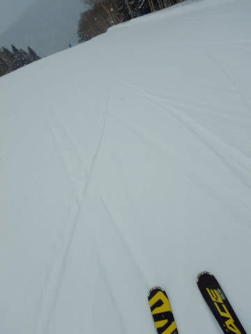

何にしろ，すごい軽い激軽パウダー！！

朝イチは，いい感じで圧雪の上の

パウダーをまき散らしながら

かっ飛ばせます…！

そして．

コース脇は新雪10㎝！

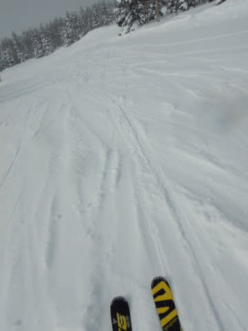

…正直，もう少し多いかと期待してたので，

ちょっと期待外れでしたが…（涙）

いつもなら新雪を期待するオリンピックっコースも，

せいぜいこの程度の積雪で．

あまり新雪っぽくなかったのがちと

残念…

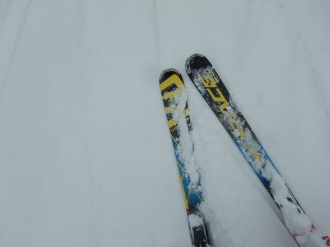

とはいえ．

激軽やわらか圧雪の上に，ふわふわ

羽毛パウダーが乗った，最高ゲレンデを

朝イチはいい感じでかっ飛ばせます！！

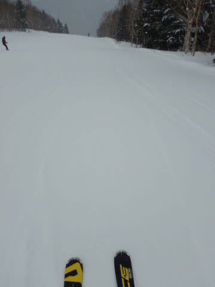

と．

気持ちよくかっ飛ばしていたら．

時々，雪が強く降って，前が見にくくなったり…

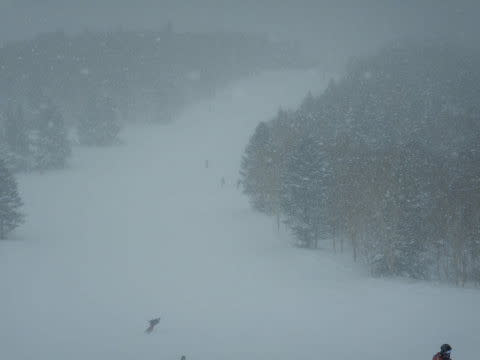

また，うっすら日が射したりを繰り返す，

落ち着かない天気で．

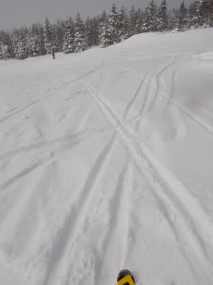

…そんな中，さすが2月の週末．

人気のGSコースは，ゲレンデの人口密度が

上がっていき．

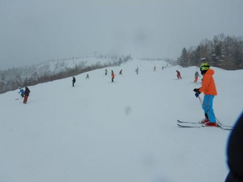

こちらも人気のパノラマーサウスコースも

ちょいと人口密度が高めに…（ちょい涙）

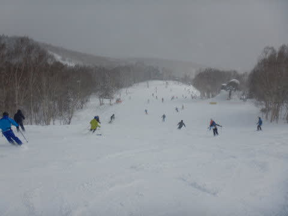

でも．

いつも通り．

隠れ家的な白樺コースやイーストコースは，

人が多い時間帯でもこの程度！

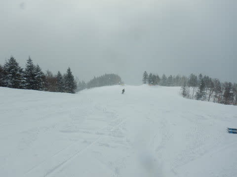

ゴンドラも，午前10時半ごろのピーク

時間には，ちょっとだけ並んだけど…

でも，第1ゴンドラは最大で3分待つかどうか，

というこの程度で．

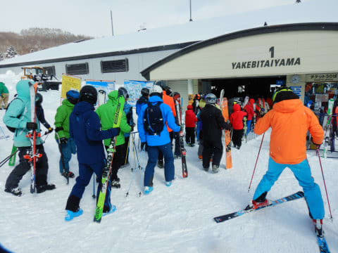

…第2ゴンドラは最大10分待ちまで

行ったようですが．

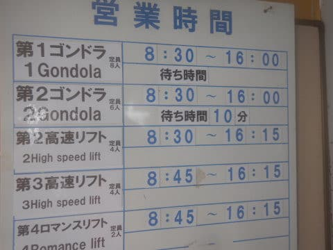

でも，午前中でも，ほとんど

ゲート外まで人が並ぶことはなく…

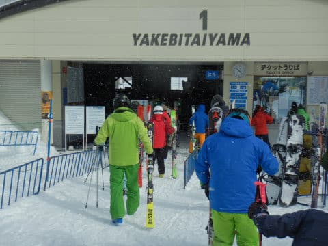

午後はほぼ飛び乗り！！

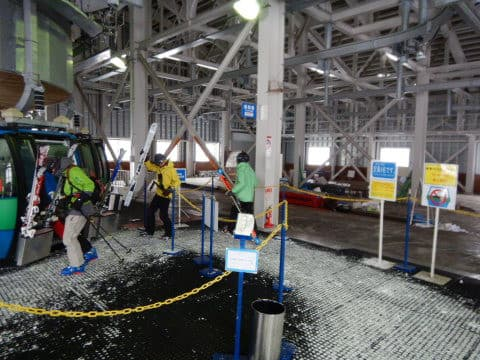

リフトは終日．ほぼ待ちなしでした…！！

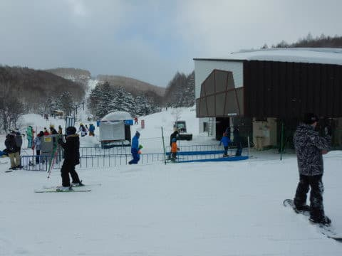

そして．

終日曇り～雪降りの予想を裏切って．

時折日も射す，いい感じの天気に

なることも！

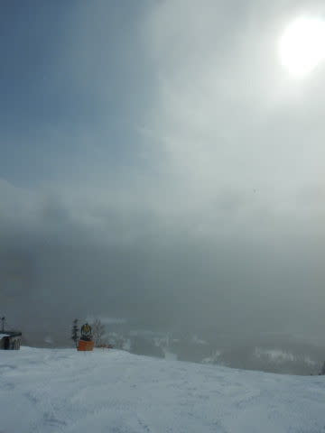

そんな長い時間ではありませんでしたが．

午後は雪も弱まり，ゲレンデの状況が

すごくよくなってきました…

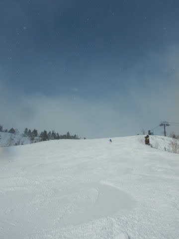

雪質も，すごい柔らかく，

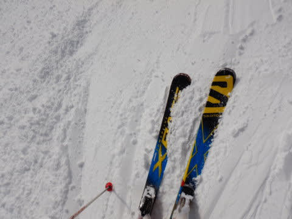

気温も，最高気温が-3℃程度

までしか上がらなかったので．

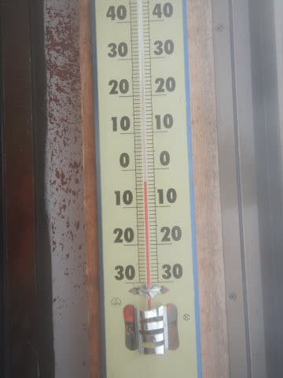

TOPシーズンらしい，いいコンディションを

終日キープ！！

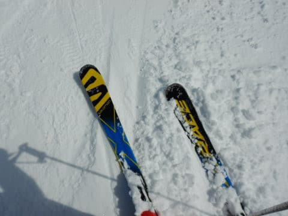

気温も，昼間に-3℃程度までしか

上がらず．

いや…

いいよ…

完全トップシーズの雪ですね！！

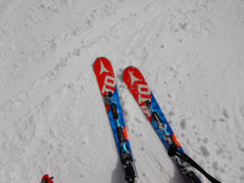

雪がやわらかく．

昼間も時折雪が降ったりしたので．

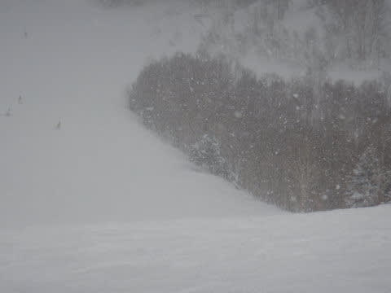

ゲレンデはところどころ，

多少荒れ気味になったものの…

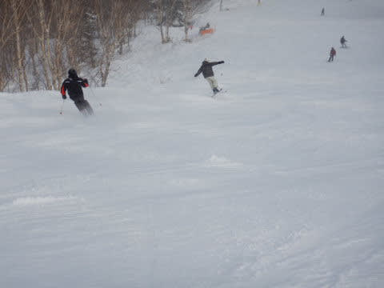

オリンピックコースなんかも，

それ程深いこぶ斜面になることはなく．

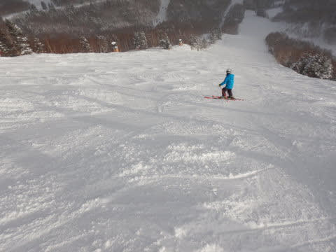

夕方になっても，大回りができる程度の

凸凹に収まってくれたので．

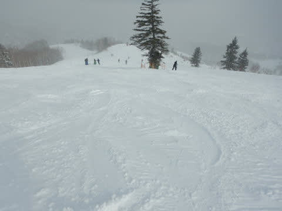

終日やわらか雪だったのに．

夕方ラストリフトまで，

そこそこフラットなバーンを

たのしめる…という．

結構楽しい一日となり．

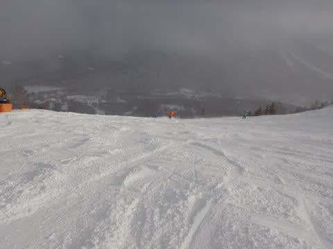

夕方のラストリフトまで．

腰を心配する必要も全くない，

優しいやわらか雪の一日を

過ごすことができたのでした…

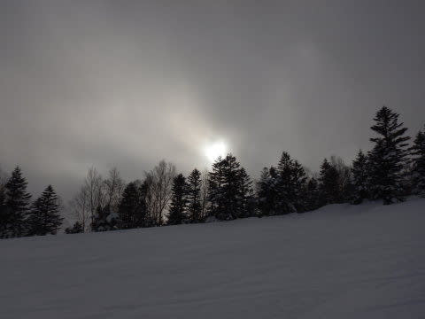

いやーーー．

いい一日だった．

志賀高原のトップシーズンは，

こうだよね！！

って感じの．

混みもせず，

最高冷え冷えやわらか雪の，

いいコンディションだった…

…

…

ならば．

行かずばなるまい．

ナイターへ…！！！！

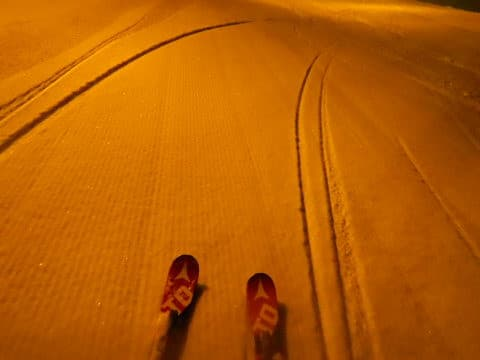

ってことで．

今日は宿の夕食をキャンセルし，

夜6時からの焼額ナイターへ参戦！！

うははははははは！！

最高冷え冷えパウダーが圧雪された，

超一級の最高コンディション！！

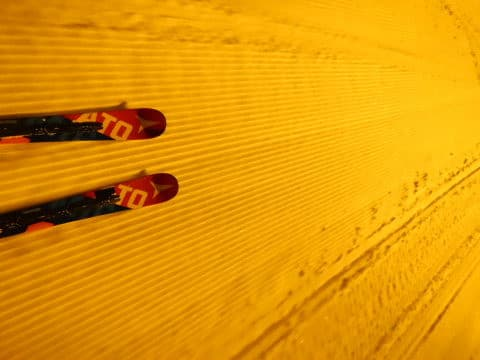

うほう！！

シマシマっ！！

シマシマっ！！！

…

と，喜びながら．

人が少なく，ガラガラで．

営業終了の8時まで，全く雪が

荒れることがない，

完全フラットバーンのやわらか

最高圧雪を，

思いっきり傾き続けながら

滑り倒したのでした…

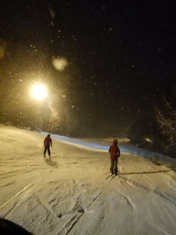

いやーーー．

良かった．

ホントに楽しかった…

おかげさまで．

腰もなんともなく．

完全100％復活で，

最高コンディションを最後まで

楽しめました～！！！

…明日は朝は20㎝は積もってくれるかな～．

膝パフとかまではいかないけど．

脛パフ程度の，終日雪降りの激冷えパウダーを

楽しめる日になりそうです…

PS.スキー板にお供え物をくださった方，

ありがとうございました…

## 💬 コメント一覧

### 💬 コメント by (Northfox)
**タイトル**: Unknown
**投稿日**: 2020-02-09 06:51:34

昨日は朝にS様に挨拶した後、Goku様／Goku妻様にお会いすることが出来良かったです。

昨日は焼額エリアをグルグル。今シーズンようやく白樺コースや唐松コースを思う存分滑ることが出来ました。

結構疲れていたけれど勢いで焼額のナイターにも。最高のゲレンデコンディションを堪能しました。

S様の姿は見当たらず、さすがにナイターは控えて静養だろうな、と思っていました。

が、最後のリフトを降りて一息入れていたらS様御一行がやってきて驚きました。やっぱり滑っていましたか．．．．

“怪我は滑って直す（治す）”は20000倶楽部の掟なんですね。

ともあれ、今日もトップシーズンの雪を楽しもうと思います！

東舘、西舘、ジャイアントもまだまともに滑れていないので楽しみです。

### 💬 コメント by (yumi)
**タイトル**: Unknown
**投稿日**: 2020-02-09 19:28:01

病気🏥😷💉も 滑って 直す（治す）ですぅ😅

### 💬 コメント by (ゆうこ)
**タイトル**: Unknown
**投稿日**: 2020-02-09 20:02:14

火曜まで、白馬に来ています。

こちらも雪がやわらかくトップシーズンの最高な雪でした。

腰が治ってなによりでした。

無理せずご自愛ください。

### 💬 コメント by (新米パパさん)
**タイトル**: Unknown
**投稿日**: 2020-02-09 20:49:59

娘の所用の為、土曜たんばら、本日湯沢でしたが、湯沢も本日はシーズンベスト、朝一は膝上でした。

あー、志賀高原に行きたい、行きたすぎる。

12.15.16は志賀高原予定ですが、、、

雨が心配です。

### 💬 コメント by (西館)
**タイトル**: .☆.+:＾ヽ(∇＾*)ｏ【♪祝♪】ｏ(*＾∇）ノ^;+.☆.
**投稿日**: 2020-02-09 21:34:51

良かった、本当に良かったよぅ、完全復活おめでとうございます！

本日は、相棒くんがS様に一度ご挨拶がしたいと１ゴンで出待ち致しましたが会えず｡｡｡さては浮気しましたね？

西館は午前中は膝パフ以上で、所によっては腰パフでした。

私は太腿の段階で。相棒君は腰上の段階で急ブレーキが掛かって転倒。

脱出するのにまさに七転八倒致しました。

テククラ検定の不整地のコースになっていたらしく、午後からは、練習の成果のかなり成長したコブまみれになってしまいましたが、まだ柔らかいコブなので、我が家は、不整地大回りをして「うさちゃんコース！」と楽しんだのでした。（焼額のオリンピックコースも「うさちゃんコース」で楽しかった♪）

明日も、オリンピックコースに出没しますよ！

>Northfoxさま、西館の宣伝をさせてくださいませ。

高天原は特に15時以降は強風が吹くため。一瀬高所は人が多いため雪面がすぐに固くなってしまうのですが、西館は風が吹かないし、最近人気が無いので荒れなくて、雪が柔らかいです。

残念なことに、レストハウスが閉まってしまって休憩できるところはフーディクワッドの中だけになってしまいました。

トイレはフーディクワッドの降車側駅舎側面にあります。

私、西館林間コース入り口辺りの風景が好きなんですよ。

雪を付けた木の枝の感じが何とも良い感じなんです。

是非是非、西館周辺も応援してやって下さいませ（ぺこり）

### 💬 コメント by (Skier_S)
**タイトル**: 今日は寒かった…
**投稿日**: 2020-02-09 22:55:03

＞Northfoxさま

20000mな人々は．

怪我は滑って治すというのもありますし．

怪我をしてても滑らないと生きていけないという，

やむに止まれず滑っているのです…(笑)．

＞yumiさま

yumiさんも，滑って治す（直す？）たちですよね(笑)．

ちょっとの風邪くらいなら滑ってれば治りますし(笑)．

＞ゆうこさま

あら．

志賀じゃなく，白馬なんですね．

白馬も楽しめているようで何よりですが，

また志賀にお越しください～！！

＞新米パパさま

12，15，16で志賀ですか！

12日はまだいい感じですが…

15，16はどうなることやら．

まだ予想ばらつきが大きく，どうなるか分かりませんが．

かなりガリガリのバーンを覚悟した方が良いかも…

＞西館さま

あら！

すみません．待ってらしたんですか！

今日は，あまりもの寒さに，1時過ぎから2時過ぎまで，

私にしては珍しく，昼休みをとってご飯を食べてました…

それ以外は1ゴングルグルしていたので，

（あまりの寒さにゴンドラ以外乗る気が起きなかった）

おそらく，お昼休みの時間に来られたのかと．

…お会いできず，すみませんでした．

まだ明日，明後日もおりますので，またお会いしましょう！！

