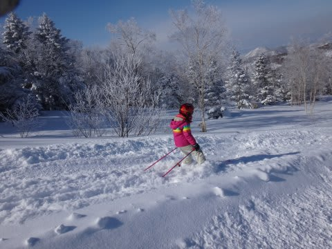
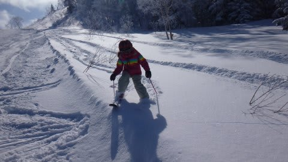
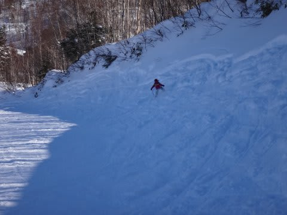
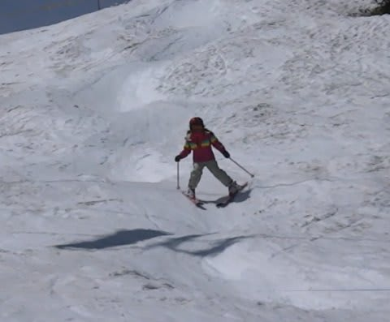
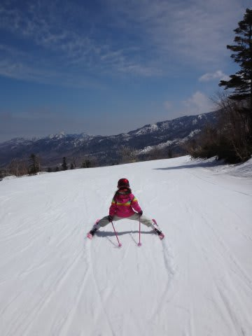

# わが娘＠6歳，今シーズンのスキーの上達具合は…？

📅 投稿日時: 2014-06-03 00:57:58

ってことで．

娘のスキーシーズンは終わってしまったので．

＃私はまだだけど…

今シーズンは30日近く滑った娘．

今シーズンの上達具合は，どんなもんかいな～，

ってところを振り返ってみましょうか．

…いや～．

それはそれは，もう．

驚くほどうまくなりましたね～．

まず．

どうしたわけか．

今シーズンは．私に似たらしく．

パウダーが大好きになってきましたね～

コースの端っこに雪がたまっているのを見ると，

迷わず突っ込んでいきます（笑）

パウダーを求めて，こんなところにも

登っていっちゃうし…

とりあえず，パウダーは大好物のようです…

そして．

昨年から好きになって，滑りまくっていた

コブ斜面．

今年も，かなり滑りまくってましたが．

…そのおかげか．

今年のこぶ斜面の滑り．

かなりスピードアップしたんですが…

＃早送りじゃないよ！！

[去年と比べると](e62793b917728d35af0fa72ed1a948875.md)，かなり安定度も増したなぁ…（感動）

うーむ．

コブは何にも教えてないんだけどな～．

子供のバランス感覚はすごい…っ！

まぁ，このくらい足を開いても，

平気で滑れるくらい，体が柔らかいので．

…その柔軟性もコブ上達に効いてるのかな？

しかし．

コブの速さもびっくりだけど．

今年一番のびっくりは，コブ斜面じゃないのだ．

冗談で「こんなことできる？」

と，娘にやらせてみた，とある滑り．

まさか，ホントにできるとはっ！

（明日に続く）

## 💬 コメント一覧

### 💬 コメント by (komu)
**タイトル**: あんなに上手ければ…
**投稿日**: 2014-06-04 00:53:46

娘さんスキー強制終了しなくて、月山デビューいかがですか？

あんなに楽しいところ終わった人だけでは勿体無いかも…

### 💬 コメント by (Skier_S)
**タイトル**: komuさま
**投稿日**: 2014-06-04 01:08:35

いやー．

娘は，月山に連れて行ったことはありますが…

あそこを滑らせるのは，やっぱりちょっと（笑）．

娘にはまっとうな人間に育ってほしいものですから…

（すでにまっとうなレベルは超過している気もしてますけど）

### 💬 コメント by (aqura)
**タイトル**: Unknown
**投稿日**: 2014-06-08 13:01:26

お嬢さん、うま過ぎ(+o+)

私よりうまい　(；一_一)

### 💬 コメント by (Skier_S)
**タイトル**: aquraさま
**投稿日**: 2014-06-08 18:13:11

うちの娘、日数だけは滑ってますから…

うまいというより、慣れているのかと。

はやく上手くなってほしいなぁ、と思いつつも。

いつか、私を追い越していくんだろうな～、

と。

ちょっと複雑な気分…

