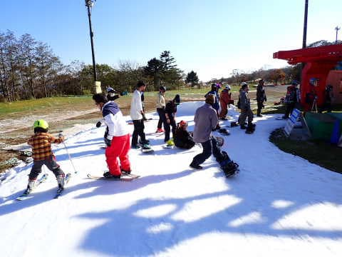

# 2022/10/23(日)，2022/2023オープン2日後のイエティで滑ってきたよ！…コース状況速報

📅 投稿日時: 2022-10-24 03:15:20

🏷️ カテゴリ: [2023スキー滑走日記](cd943df30cfcc3d0896469e2ff98720cd.md)

ついに．

ついに，始まりましたよ～！！

耐えがたきを耐え，待ちに待った，

私の2022/2023シーズンが！！

ってなことで，

この金曜にオープンしたばかりのイエティへ．

本日，初滑りに行ってきました～！！

とりあえず．

今日は初日にもかかわらず，ナイターにも

ちょっと参戦してきたので，帰宅が夜遅く．

さらにいろいろ仕事もやっつけたので，

もうこんな時間…（涙）

なので，今日はいつもの速報モードにて！

本日のイエティですが．

天気は時折雲が出るものの，ほぼ晴天という，

概ね昨日の予想の通りで…

薄手のジャケットで十分な，十分に暖かい

天気で…

あさイチのゲレンデはガラガラ！

ただ，やはり午前10時を過ぎると

混み始めてきて…

コース上の人口密度はちょいと上がり気味（涙）

今日はだいたい終日こんな感じの

人口密度でした…

でも，コーズ幅は，オープン日より

ちょっと広がったのかな？

リフト待ちは，クワッドとペアの2本が

動いていたことがあり，それほどひどくなく．

クワッドは最大このくらい待ったけど…

少ないときはこのくらい．

お昼休みの時間とかは，もう少し

少なくなるタイミングも…

まぁ，でも，クワッドがこのくらい

待っても，ペアの待ち時間はゼロなので

リフト待ちはマシだったかな…

雪の厚みもそこそこあって，

夕方にはコースは荒れ気味になったものの，

最後までコースに穴が開くようなことは

なかったですね…

ただ，最後の急斜面だけ，夕方になると

ちょっと雪が薄くなってるところも

ありましたが，完全に穴が開いたり

しなかったので，まだ良かったかな．

とりあえず，いつも通りコース上の

人口密度は高いけど．

リフト待ちやコースの状況はそこまで

ひどくなく．

この時期に滑れただけシアワセ…

と思っていられる一日でした．

ってなことで．

コースの状況の動画を見て，どのくらいの

混雑＆コース幅か感じてください…

まぁ，この時期，ひどいリフト待ちなく

雪の上を滑れるだけでシアワセなので．

コース上がこんな混雑でも夜まで

滑っちゃったけど…

冷静に振り返ると．

トップシーズンにこんな人口密度の

ゲレンデだったら，5秒で帰るだろうな

と思ったSkier_Sなのでした…

## 💬 コメント一覧

### 💬 コメント by (スシネコ)
**タイトル**: Unknown
**投稿日**: 2022-10-24 13:01:41

シーズンイン、おめでとうございます。天気も良くて大混雑にもならずに良かったですね。

イエティは10年ほど前、トップシーズンにナイターだけ数回滑りに行きました。カチカチに凍ったＤコースが苦手でそれ以来ご無沙汰してまっています。（確かに一番近いスキー場なんですけどね。）

リフト上で爆睡して落ちないように、くれぐれもお気をつけください。ｗ

p.s.

VAAM記事、ちょっと意識が飛ぶところもありますが、楽しく読んでます。( •⌄• )ﾉ

### 💬 コメント by (アリス)
**タイトル**: おめでとうございます
**投稿日**: 2022-10-24 16:14:39

S様

シーズン初滑走おめでとうございます。

いよいよシーズン到来ですね。

今シーズンも誰よりも早く滑走して、誰よりも長く滑走できることをお祈りしております。

動画を拝見しましたが、ほとんどがボーダーでスキーヤーは数えるくらいの人ですね♬

### 💬 コメント by (Skier_S)
**タイトル**: 初滑り！
**投稿日**: 2022-10-25 02:08:08

＞スシネコさま

無事シーズンインできました…

イエティはトップシーズンには行ったことがないのですが，バーンが硬いみたいですね…

VAAM記事は今週木曜に次の記事を書く予定です！

＞アリスさま

シーズン始まりました～！！

誰よりもいっぱい滑りたいです…

イエティはボードが9割ですかね？

スキーヤーは絶滅危惧種です

