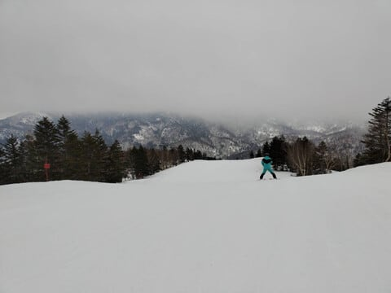

# 今週末も志賀高原スキー場で滑ってます！…土日とも晴れて気温がぐんぐん上がりそう．土曜午後は曇るかも．

📅 投稿日時: 2024-04-06 00:35:37

えー．

本日の志賀高原スキー場の特派員からの

写真，1枚しかないのですが…

今日の志賀高原は朝はそこそこ冷えて

硬めのバーンながらも，ちょうどエッジが

かかるくらいのいい感じのバーンで，

曇り空で日が射さず，午後はちょっと日も

射して雪は多少緩み始めたみたいですが，

朝の低温と午前中の曇り空と，人が少なかった

というトリプルコンボのおかげで，雪は

最後までそんなにザブザブに荒れることなく，

楽しめたみたいです…

…明日もそんな天気ならいいな，と思いながら．

明日土曜は，早朝は多少硬めの雪

かもしれないけど，朝からすっきり

晴れなので，通常営業のころには

緩んだ雪になりそう…

そして，日が射して気温がぐんぐん上がり，

昼前にはもう斜面は荒れ始めそう（泣）

西斜面の一ノ瀬側は，昼前までは

もつかな…

午後は10℃近くまで気温が上がり，

荒れ荒れの春のバーンになります．

日曜は，夜中に気温が冷えないので

早朝から緩めの雪．

この日も昼間も日が射し，朝からもう

かなり緩いザブザブ雪で，あっという間に

荒れていきそうな感じ…

ってな感じで．

うーん．せめて曇り空なら，

そこまでひどく雪は緩まなさそうだけど…

残念ながら，土曜の午後以外は晴れそう

なので，すごい雪は緩むだろうなぁ…

まぁ，暖かい春スキーを楽しみましょう．

とりあえず．

焼額は明日から第1ゴンドラで朝6時からの

早朝営業スタートです！

8時からは第1，2ゴンドラと第2高速で通常営業です．

そして，終了時間が15:30とちょっと早くなります…

間に合うなら明日も雪が締まった早朝営業から

滑りたいところだけど．

仕事終わった今，もう深夜0時半（泣）

早朝営業に行ったら完全徹夜で

滑ることになり，死んじゃいます．

だもんで，明日も通常営業から参戦予定．

…それでも3時間後に出発なので，

2時間ちょいしか寝られませんが…（泣）

ということで．

今週末も志賀高原でお会いしましょう～！
