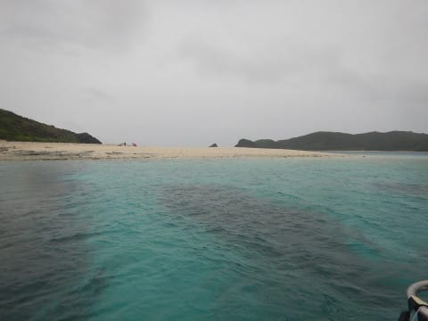
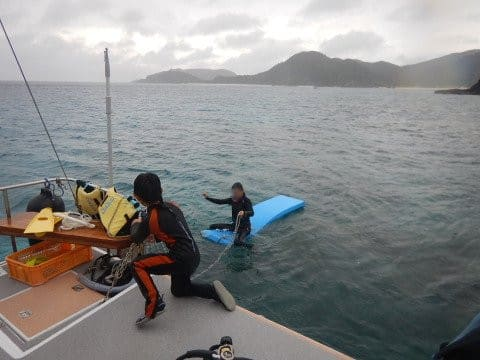

# 2019年8月，座間味で小6の娘と親子ダイビング！その4…午後になったら天気回復

📅 投稿日時: 2019-10-16 02:10:23

🏷️ カテゴリ: [ダイビング日記](ce3a7a8d424d112fce83ee85c81a0e344.md)

ってなことで．

2本目のダイビングを終えたわけですが…

相変わらずのどよーーーんと

した天気の中．

嘉比島のビーチ前で，

お昼ご飯タイムですが…

…違う．

いつものすっきり晴天の，

トロピカルな南の島と，

違いすぎる…（涙）

お昼ご飯は，いつも通り

泊まった宿の，ペンション星砂さんに

作ってもらう，1食500円という

かなりリーズナブルかつ

美味しいお弁当．

（これは2人前）

ですが．

雨に濡れないよう，

周りにビニールシートを貼られた

ボートの天幕の下で食べるのは，

ちょいと寂しい感じ…（涙）

…しかし．

子供たちは意外と元気で．

ご飯を食べたら，雨が降る

海に飛び込んでました…

いや．

8月だけど，日が射さないと

結構寒いんだけど．

それでも雨の中，遊ぶのね…

そして．

食事時間を含めて，1時間半ほど

休憩すると．

ボートは3本目のポイントへ移動します…

移動中も，雨で向こう側がかすんで見える

天気（涙）

そんな雨の中，阿嘉島と慶留間島を

結ぶ橋をくぐってやってきたのは…

阿嘉島の先，「サクバル」という

ポイント．

ってなわけで．

本日最後の3本目のダイビング，

エントリー！

エントリーした直後から，

ちょっと空が明るくなりはじめ

ましたね…

いつもの逆光アングルで，

太陽がきれいに入るように

なってきました！

うむ．

逆光で明るい太陽がきれいに

入るようになると，

海が明るく見えるので，

写真も明るくなります！！

やっぱり，海が明るいと

いいですね～！！

…と．

海の中を進んでいたら．

あ，いますね．ここに．

何かが．

分かりますか？

そうです．

ウミガメ発見！

さりげなく，このアオウミガメを

挟んで，娘と逆のポジションに

入り込んでいたので…

娘とアオウミガメの写真を

Getしようと思いますが…

…ちょっと娘，

もう少しかっこよく泳いでくれない？？

…よし．

娘とアオウミガメ，いい位置関係に

入ったかな…

と思ったら．

なんじゃ，そのポーズはっ！！！

…カメラを向けられると，

つい謎のポーズをとってしまう，

わが娘でした…（涙）．

とはいえ．

天気が良くて，日差しがしっかり

海の中を照らすようになってきたので．

これまでよりは明るい海の中を

堪能できて．

「雨が降ってても，海に入っちゃえば

濡れちゃうから同じでしょ？」

と言われそうですが．

やっぱり，晴れの方がいいわけで．

…だけど．

撮った写真を後で見返すと．

普段ならあまり撮らない，

ごくありふれたハタタテハゼを

撮っているところを見ると…

それほど見どころのないダイビング

だったような，この1本．

最後はボート下の戻ってきて…

エグジット．

ってなことで．

座間味ダイビング初日は．

午前の2本は日が射さなくて残念で．

午後の1本は日が射したものの，

見どころ的にはちょいと残念という，

ダイビング的には，ちょっと惜しい

感じの一日だったのでした…
