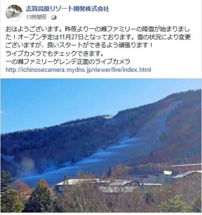
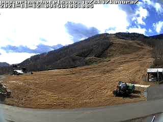
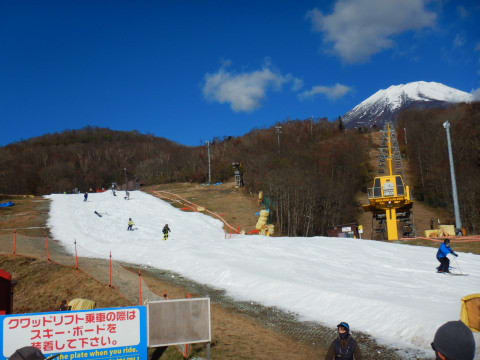
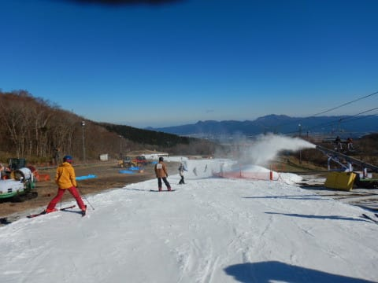
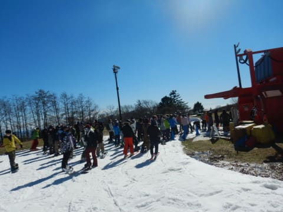
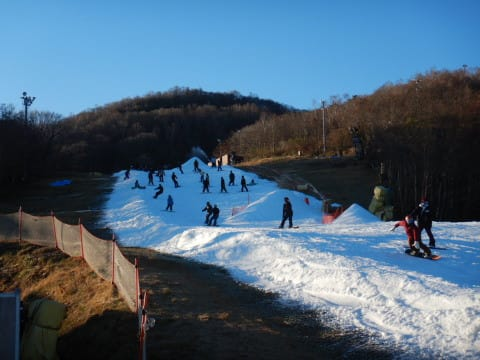
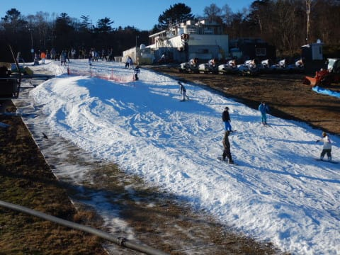

# 2021/11/13(土)のイエティ速報レポート＆コース混雑状況動画…リフト待ちは2-7分，コース幅は広がったけど相変わらず人が多いよ

📅 投稿日時: 2021-11-14 00:09:14

🏷️ カテゴリ: [2022スキー滑走日記](cc9cb73e4320f6a97af6fccc37587a61a.md)

どうやら，志賀高原の一の瀬スキー場．

オープンまでまだ2週間あるのに，

11月27日オープンを目指しての人工降雪を

昨晩から始めたようですね…

（[志賀高原リゾート開発Facebook](https://www.facebook.com/ShigaKogen.Ski/)より）

しかし．

27日オープンなら，まだ予定通りの

オープンに期待が持てますが．

20日オープンのゲレンデは…

やはり，最新の天気図を見ても，

予定通りにオープンできそうな

気配は全く無い

ですね（涙）

20日オープン予定のはずのかぐらは，

ライブカメラを見ても，全く雪が

ありません…（泣）

（[かぐらスキー場ライブカメラ](https://live-media.monitorbox.jp/media/90/movie/calendar/20211113/15.mp4)より）

うーむ．

一体いつになったら冷えてくれるのか…

とりあえず．

まだ熊の湯も横手も滑れない状況のため．

本日もまたYetiで滑ってきたので．

速報レポート＆コース状況動画です！

えー．

まず．

今日の天気は終日晴天！

でも気温はそれほど上がらず．

日が射す昼間はそれほど寒くないけど，

夕方はジャケットを着ていった方がよく．

ナイターはすごい寒いくらいの一日でした！

で．

雪は今週前半の高温＆雨に耐えてくれた

ようで，コース幅は先週末よりちょっと

広がった感じ…！

午前中は気温が低かったのもあり，

雪が融けず，ざらざらした砂っぽい

感じの雪．

板が潜る感じで，ちょいと滑りにくいけど．

ザブザブの張り付き雪よりいいな！！

リフト待ちは，朝は少なかったけど，

クワッドで大体3-5分．

ピークで7分ちょい待ったかな？

ペアリフトは終日待ち0で．

昼間のリフト待ちは，それほど苦には

ならなかったかな…

ただ…

コース幅は広がりつつあるものの．

やっぱりコース上の人口密度は

相変わらず高めで…

夕方になってくると，砂っぽい雪が

ちょっと荒れ気味に凸凹してきてて，

さらに手ごわさアップ…

…でも，気温が低めだった今日は，

終日張り付くような雪にはならず，

さらにコース上に穴が開くことも

無かったので．

コースコンディションとしては，

まぁまぁ良かったかな！

とりあえず．

今日のイエティがどんなだったのか．

コース幅，混雑，雪質，そしてリフト待ちが

どのくらいかは，この動画を見てもらえば

分かります！

（音は消してます）

…しかし．

相変わらず手に汗握る人口密度ですね…

…ってなことで．

本日，すでに今シーズン5日目のYetiだった

わけですが．

たぶん来週もYetiなんだろうなぁ…

## 💬 コメント一覧

### 💬 コメント by (ikkun)
**タイトル**: Unknown
**投稿日**: 2021-11-14 21:38:30

お疲れ様です いやいや 暖かい状況で滑れるだけども幸せですよね  ちなみに志賀に往くか行かないか？(笑)  地元で松茸( *´艸｀)かな？

### 💬 コメント by (Skier_S)
**タイトル**: ＞ikkunさま
**投稿日**: 2021-11-14 22:58:39

まぁ，混んでいてもこの時期に滑れるだけありがたいです．

今シーズンは，志賀高原のシーズン券が12月まで使えないので，

私は11月の熊の湯は行かなさそうです…

