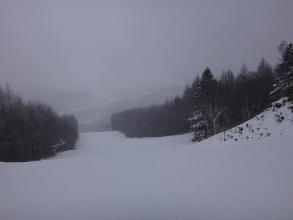

# 12月10日（土）の志賀高原は冷え冷え終日雪！だけど，そんなに積もらなかったよ（涙）

📅 投稿日時: 2016-12-11 00:09:29

はいはいはい．

ということで．

この週末も志賀高原に来ていますが．

土曜：前日から10cm，運が良ければ20cmの

　冷え冷え積雪あり！

　道路は完全雪道なので注意…

と書いた通り，上林チェーンベースを超えたあたりから，

完全パーフェクトつるつる積雪路面がお出迎えです．

途中で登れなくて息絶えている車が多数…

…おかげで．

道路はかなり混みましたが．

ゲレンデに出ると…

ををををを！

昨シーズンは，トップシーズンでもあまり

お目にかかれなかった新雪が積もってるよ！

積もっている新雪は，予想通り10～20㎝！！

リフトの景色も，冬っぽくなってますよ～．

で．

朝イチの焼額のゲレンデは…

うほー！ピカピカ圧雪！

そして…

がらがら！！

ふはーーー！

誰もいない！

気持ちよさそう～っ！！！！

…と，第2高速リフト側，唐松コースに

飛び込んだものの．

…

なんだ，こりゃ！！？？

コロコロが…

氷のコロコロが，コース全面に！（涙）

これは…

ちょっとかなり滑りにくい…（泣）

とはいえ．

先週と違って，リフトは一日中せいぜい

こんな程度の混雑で．

割とコースも広く．

コース上の混雑もせいぜいこの程度で．

ゲレンデの殺人コロコロさえ我慢できれば．

ガラガラの高速リフトをグルグルできる，大変シアワセな

ゲレンデ状況…

しかし．

ちょっと氷の殺人コロコロから逃れたくて．

時々第4ロマンス側，サウスコースに行ってみましたが…

うむ．

なぜか例年，こっちは殺人コロコロが出ないん

だよな～．

…これ，チョー気持ちいいんですが！！

やっぱり，サウスコース，雪がいいよっ！！

こちらのリフト待ちも終日0だったし．

コースは気持ちいい．

コースは圧倒的にこっちがいいんだけど…

でも．

だけども．

気温が⁻10℃近くと，強烈に冷え込んだ本日．

1㎞近い超長距離の低速ペアリフトに乗ると…

…体が冷え切って死んでしまいます（涙）．

ということで．

氷のコロコロがあるけどリフトが速い第2高速か．

雪は気持ちいいけど，リフト上で冷凍人間に

なる第4ロマンスか．究極の選択状態です…

しかし．

まぁ．今日は終日ガラガラで，

石ころなど全く踏む心配がない，

冷え冷え雪の恵まれたゲレンデ状態なので．

…雪不足の去年を考えると，ぜいたくな

悩みかな～

と，思いながら．

雪が終日ぱらつく天気の中．

焼額のリフトストップの4時まで

滑り続けたのでした…

が．

なぬ？

一の瀬は，4:30まで営業だと？？？

ということで，瞬間移動を繰り出し．

ナイター照明がつく一の瀬ファミリーを

滑ってきました～！！！←アホ

一の瀬ファミリーは．今日はペアA線とB線，

両方が動いてましたが．

今日積もった新雪が荒らされた感じのコブコブで．

ちょっと滑りにくかったかな…

ということで．

終日雪がぱらついた本日ですが．

…今日の昼間は，積雪するほどの雪ではなく．

…夜0時現在，雪は降ってません…（涙）

これから明日までに，ちょっとは積もって

くれるのかな～．

焼額，第2ゴンドラはもう準備が進んでいるので．

雪さえ積もってくれれば，明日からでも

第2ゴンドラ動かせるらしいんだけどなぁ…

明日の朝目覚めたら，

宿の2階の私の部屋が雪で埋もれるくらい

積もっているよう，ちょっと祈ってみましょうか…←ないから．ありえないから．それ
