# 18，19日も冷えるけど，これから12月いっぱいのスキー場はいい感じに冷えて，雪が積もってくれそう！！

📅 投稿日時: 2021-12-17 02:41:32

🏷️ カテゴリ: [スキー天気予想](c6554f5c3c106093b511a8daae23757e8.md)

えー．

先週金曜日に体調を崩したおかげで．

金，土の2日間で1食だけしか食べなかった

のに．

快復祝い（？）に日帰り志賀チャレンジ

をして．

さらにそこでは，

朝昼をゴンドラ内でのおにぎりだけで済ませて，休まずひたすら滑り続ける

ということをした当然の結果として．

…ただでさえ減らしたくない体重を2kgも

減らしてしまった，Skier_Sです…（涙）

この時期，スキーダイエットの効果で，

体重減らすとなかなか増やせないのに…（泣）

…そして今日もご無体会議が夜まで続き，

夜ご飯はおにぎりだけ（涙）

仕事ダイエットとスキーダイエット，

さらに2日間のプチ絶食ダイエットの

トリプルダイエットで，あなたもすぐに

体重を減らせます！

ぜひお試しを！←誰も試さないから

ってなことで．

ここ数日，それほど志賀高原は冷え込んで

なかったにもかかわらず…

なんと，明日から，

焼額の白樺コースがオープン

です！！

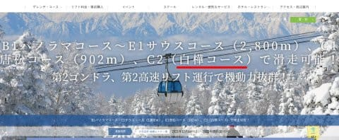

（[焼額山スキー場ホームページ](https://www.princehotels.co.jp/ski/shiga/winter/)より）

週末から第1ゴンドラ動いて欲しいけど…

まだ案内が出てないので，今週末の

1ゴン運転は期待薄かな（涙）

中央エリアは，この週末から一の瀬正面バーンが

オープンするほか，

・山の神

・タンネの森

・西舘クワッドのみ（フーディーはまだ）

・丸池トリプル

のリフトが動くようです…！

西館上部，東館，寺子屋はまだ案内が無いので…

今週末は動かないのかな…？

まぁ，山の神が動いてくれるので，

今週末から焼額と一の瀬エリアが繋がります！！

ちなみに，今日の志賀高原は…

朝から見事な全面シマシマ！

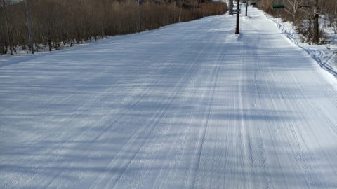

ただ，奥志賀エキスパートコースは

今日も圧雪車故障のため非圧雪だった

みたいです…

明日から圧雪がかかるとのこと！

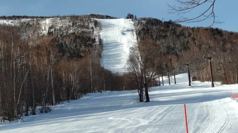

で．奥志賀第3ゲレンデもシマシマだし…

気温が平年より高い日が続き，

この1週間ほとんど積雪がないながらも，

壊滅的な高温や雨にならなかったので，

ゲレンデは比較的いいコンディションを

キープしてくれているようです…！！

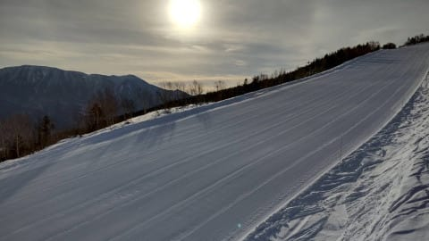

ってな感じの志賀高原．

18日はパウダーデーになると予告しましたが…

相変わらず，17日の夜の地上天気図は見事な

冬型の予想で…

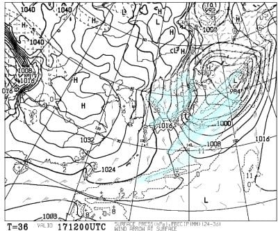

この天気図を拡大すると．

朝鮮半島の根っこから伸びるJPCZ．

こいつが能登半島より西に向かって

伸びているのが読み取れます！

この場合は，志賀高原でも積もるパターン…！

やはり，17日夜から18日にかけて，

ドサドサ積もりそう！

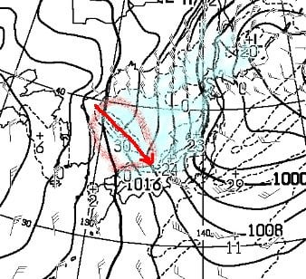

で．

これに対して，19日の日曜の地上天気図は…

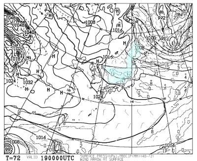

うーむ．

JPCZが東側にたなびいてます…

能登半島よりずっと東に向かって

伸びていて．

見事な西風であることがよく分かる…

これは，寒気が軟弱だと志賀高原は

すっきり晴れるパターンですね…

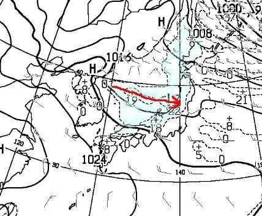

…なんだけど．

この日の500hpa図を見ると，-30℃という

結構強い寒気が入ってます！

これだけの寒気が入ると，西風でも，

根性のある雪雲は北アルプスを越えて

志賀高原まで届いてくるパターン！

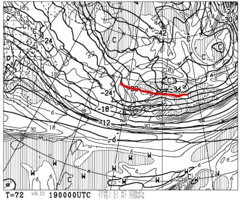

さらに，上の500hpa図の網掛け部分は，

専門的に言うと「湿数が高い部分」を指していて…

志賀高原近辺に網掛けがかかっていて，

湿数が高いということは．

このあたりにプチ低気圧があって，

上昇気流が発生していることを示してます．

だもんで…この日は西風でも，根性のある

雪雲＋低気圧による雲で，志賀は

降りそう！！

…ただ，土曜ほどドサドサ積もらず

日曜朝は10cm，多くて20cmかな…

とりあえず，この週末は，土日とも

雪が積もる週末になりますので，太板を

もっている方は準備してもっていきましょう！

ってな感じで．

週末の予想の細く解説をした後は．

今日は，1か月予報発表の木曜日なので，

さらに，1か月予報も見てみるわけですが…

（相変わらず内容が濃いブログだ…）←自分で言ってどうする

ふむふむ．

水色矢印で示したこの12月いっぱい，

平年より低めの気温で推移してくれそうです…！！

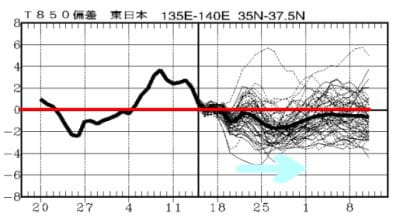

そして，気温傾向を見ると…

あれ？

1週目，18日からの1週間は平年並みが50％？

先週の予想では，冷える予想だったけど…

でも，2週目の25日からの1週間は，

冷える確率が50％！！！

激冷えになりそう！

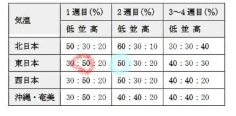

ざっくりとFCCX92を読み解くと…

え？

負の北極振動！？？

これ，冷えるってこと！？？

2週間前まで，暖冬を招く「正の北極振動」の

傾向があるって言ってなかった？？

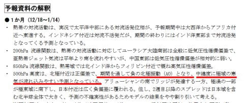

QXVV12から，今後１か月の500hpa高度線を

見てみると…

赤く印した円の中，北極圏は網掛けが

かかっておらず，ほぼ白抜きの正偏差．

北極圏から寒気の漏れ出しを表す

水色の5400ｍ高度線が，その周りに

飛び出すように激しく波打っていて，

赤丸から外は，網掛けの負偏差

部分が多いです！！

…確かにこれは，負の北極振動！

寒気が北極圏から低緯度に流れ出してます！

これは…冷える．冷える傾向だ！

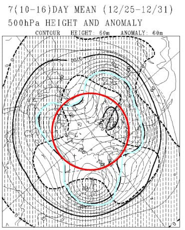

同じくQXVV12から，12月18~24日の850hpa

気温図を見ると…

平年より温度が低いことを示す網掛けに，

日本はすっぽり覆われていて．

赤い0℃線も，太平洋まで下がってます…！

18日から24日．平年並みの確率が50％って

言ってるけど…

これ，冷えるよ．平年より冷えますよ！

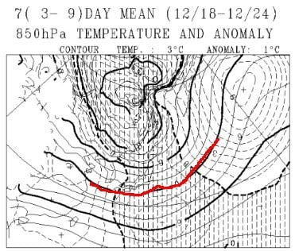

そしてさらに，25~31日までの850hpa気温も，

平年より冷える網掛けに日本はすっぽり

覆われてるし…

水色の-6℃線が志賀高原より南に

下がっているほど．

1週間平均で-6℃線が志賀高原にかかって

いるってのは，結構な冷え込み！

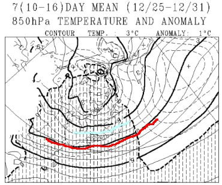

…ってなことで．

2週間前，

正の北極振動

という魔のキーワードを見た時はビビったけど．

この一か月予報が正しければ．

これから12月31日まで，平年より

寒い日々が続き．

雪もそこそこ積もってくれそう…！

これからしばらくは，雨が降ったり，

雪が融けたりする心配はなさそうですっ！

いや．

でも．

気象庁の一か月予報って．

一週間後に全然違う予報で

上書きされたりするんだよな…（ちょっと不安）

## 💬 コメント一覧

### 💬 コメント by (レインボー74)
**タイトル**: Unknown
**投稿日**: 2021-12-17 14:05:29

金曜日の志賀高原情報

朝の湯田中は雨。上林+4℃　蓮池0℃。

高天まで行くと、心地よい雪に。

今日から白樺コースopenのせいか人が多い。パノラマから白樺突入。左側の入口でガタガタの底付きしたものの、5cm程の新雪(重いけど)を刻むのは楽しい。

唐松も昨日までの至福を経験してしまった不幸な身には、感動なし。

9時22分のバスで奥志賀へ。夢よ三たび！

あれ？雪が降ってない。エキスパートが圧雪してある！

大喜びで飛び込んだものの、めちゃ重い。圧雪の上に20の積雪。そこへ雨がかなり降った感じ。

だけどもう一本と思ったら、あらら、ガスが一気に降りてきた。

一気に意欲メーターが0までダウンするも、バスの時刻まで滑り続けるしか道はない。

視界最悪で、おも～い三高のあと、バス停目指してダウンヒルへ。

ぎょぎょっ！新雪8cm未踏の地！いっただきまーす！

あれれ？ゴンドラが動いてる。勇んで乗り場へ行くと、試運転だそうな。だよねー！

10時10分のバスで再び奥志賀へ。

これが失敗。ほぼ視界のない三高をひたすら回し、やけびに戻って終了。やけびも荒れてきて芳しくないとの話を聞いて、ほっ！

明日はいよいよ太板様にお仕事してもらう時です。

### 💬 コメント by (レインボー74)
**タイトル**: Unknown
**投稿日**: 2021-12-17 19:50:05

金曜夜の湯田中

しんしんと、ベタ雪が降り始めました。

明日はとんでもないことになりそうです。

イチゴンした、ダイヤモンド

新雪が、今夜の夢に出てきそうです。

嬉しすぎて酒が止まらないレインボーでした。

### 💬 コメント by (umichan)
**タイトル**: Unknown
**投稿日**: 2021-12-17 22:05:07

初コメです✨

志賀高原の天気状況を参考にさせて頂いています

先日ヤケビ2ゴン乗車する時に100日ヤケビに来ている方にSさんのお話をお聞きしました✨

これからも引き続きこのブログを参考にさせてもらいますね♪

### 💬 コメント by (新米パパ)
**タイトル**: Unknown
**投稿日**: 2021-12-17 22:32:07

信濃町から信州中野インターで雪で立ち往生、通行止めのようですが、、、

明日は、とりあえず諦めます。

### 💬 コメント by (Skier_S)
**タイトル**: 明日，ゴンドラ動くかなぁ…営業開始遅れそう
**投稿日**: 2021-12-17 23:55:57

＞レインボー74さま

あら．今朝はそんなに良くなかったんですね…

大丈夫です！明日の雪で，これからのゲレンデは天国が続きます！…多分．

明日は寒くて風も強くて，滑るには適さないかも…

パウダーは楽しめそうですが

＞umichanさま

コメントありがとうございます～！！

もしかすると，100日ヤケビに来ているって…

レインボーさんたちですかね？

私は土日はヤケビで滑ってますので，また探してみてください～！

＞新米パパさま

あら…諦めましたか．

私は早めに出ますが，果たしてたどり着けるのか…？

### 💬 コメント by (Gokuraku Skier)
**タイトル**: Unknown
**投稿日**: 2021-12-18 19:16:41

＞umichanさま

Sさんとはお友達なので私がいればかなりの確率でお会いできますよ(^^♪

って、先日２高降り場でお会いしたときに一緒にいましたｗｗｗ

### 💬 コメント by (Skier_S)
**タイトル**: ＞Gokuさま
**投稿日**: 2021-12-19 00:10:27

今日，お会いできたのがumiちゃんさんですよね…

ゆっくりお話しできず申し訳ないです．

焼額にはいつもいるメンバーなので，またゆっくりお話しできれば…

って，Gokuさんはumichanさん，ご存じなんですね…

