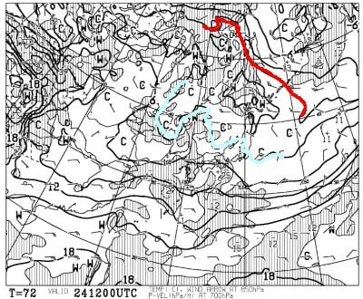

# 本日2021/10/22(金)イエティオープン！…今日は雨がぱらつくけど，土日は晴れ！23日は冷えるよ！

📅 投稿日時: 2021-10-22 03:06:09

先日に続き．

本日…というか，日付が変わってるから

もう昨日となる21日(木)も，志賀高原は

雪が降り続けたようで．

横手山は，真っ白になってます！

([横手山ドライブインFacebook](https://twitter.com/yokoteyama_d_in/status/1450989190988984331)より）

オープンまであと2週間ほどとなった

横手山も，冷えて雪がうっすら積もって

ますし…

人工降雪機も動かせたんですかね．

([横手山ホームページ](https://yokoteyama2307.com/news/16320/)より)

さらに今晩から土曜23日朝にかけても

かなり冷えみそうで…

人工降雪がガンガン打てそうな感じ！

で．

10月22日の金曜日と言えば…

そうです！

2021/2022シーズンのイエティの営業開始日です！！

今日からイエティで滑れますよ～！！

…でも．

22日の地上予想図を見ると…

うーむ．水色の降水域が太平洋側に

かかっているので．

Yeti，オープン日は雨が降ったりやんだり…

って天気になりそう．

寒い雨が降る一日になりそうなので，

防寒対策を忘れずに…！！

で．

翌23日の土曜ですが．

朝9時の850hpa気温図を見ると…

をををを！！

赤い0℃線が志賀高原にかかってます！

これは…また，志賀高原に雪が降りそう！

でも．

23日土曜の地上天気図を見ると…

あまり日本海側に水色の降水域がかかって

おらず，あんまり降らなさそうなので．

天然雪が積もるほどではなさそう…

あ，土曜のイエティは晴れますね．

この天気図なら．

でも．

22日夜から23日にかけては，横手山では

人工降雪機がガンガン動かせますよ！！

ただ…

24日になると．

850hpaの赤い0℃線は，北海道より

はるか北まで行ってしまってます(涙)

とはいえ，志賀高原近辺にはまだ

水色の-3℃線がかかっているので．

2000mを超えるところでは，24日までは

氷点下をギリギリキープするかな？？

ちなみに，24日もYetiは晴れそうです！

で．

その先ですが．

…本日（というか，日付が変わってるからもう昨日)の

木曜日と言えば．

そうです．

一か月予報が発表される曜日なので，←そんなこと知っている人少ないから

一か月予想各種時系列図，QXVV14を

見てみましょう…！

…

…

こ，これは…

見なかったことにしたい(涙)

水色で囲った冷え冷え期間は，25日ごろに

終わって．

それ以降は，平年比+1～2度ほど高い日が

続きそうです(激涙)

これは…

アサマ2000や丸沼，かぐらなど．

11月下旬にオープン予定のスキー場

にはかなり厳しい予想ですね(泣)

図で予想されている13日以降は，

強烈に急激に冷えてくれるのであれば

いいのですが…

一番厳しいのは，横手山オープン予定前の

一週間は，気温が高い日が続きそうな

ところですね…

この状況，去年の

スキー場がオープンしていない10月下旬に

無駄に冷えたのに，11月は高温で雪が

降らなかった

という悲劇を思い出してしまうので．

…天気の神様にメッセージが伝えられるの

ならば．

「冷えるのは今じゃない」

と，全身全霊をもって伝えたいところ…

とりあえず．

この不気味な一か月予報が外れるよう．

スキーヤーの皆様におかれましては．

冷えるのは今じゃない，11月下旬に冷えてくれ踊り

を，これから11月下旬まで，ひたすら

休まず止まらず，全力で踊り続けて

くださいますよう，よろしくお願いします…

## 💬 コメント一覧

### 💬 コメント by (ikkun)
**タイトル**: Unknown
**投稿日**: 2021-10-22 15:07:56

我が山頂も初冠雪を迎えました ま消えてしまいましたが……有るときに必要なだけ欲しいとねがうのは雪国人の想い かもしれません  スキーの匠の居酒屋さんにて 以前一緒の学校にいた指導員さんに会いました  「いよいよだね」と しかし色々心配なことばかりで困ります  が  白いゲレンデをと考えたら少しは気が楽です

### 💬 コメント by (かず)
**タイトル**: Unknown
**投稿日**: 2021-10-22 18:58:03

イエテイじゃないですが  以前Sさん海外の方とリモートで打ち合わせって言っていたような…？

コロナ少し落ち着いてきてますが  Sさんと仕事してる海外の方これからの入国規制どんな感じですか？

### 💬 コメント by (Skier_S)
**タイトル**: 明日ついに初滑り！
**投稿日**: 2021-10-23 00:22:31

＞ikkunさま

雪は必要な時に必要なだけ，スキー場にだけ降ればいいんですけどね…

今シーズンは果たして，十分な雪が降ってくれるのでしょうか？？

＞かずさま

もう，リモート打合せがあたりまえになったら，わざわざ高い金と時間を

かけて海外に行こうってのは無くなってきましたね…

向こうからこちらに来る例も，コロナ以来一度もなく，今どうなっているのか分からないです…

