# 4月22日土曜の志賀高原は…あれ？時折日が差すものの，曇り空．雪も割と早めに緩んだかな…

📅 投稿日時: 2017-04-23 00:29:51

🏷️ カテゴリ: [2017スキー滑走日記](c7d777cecfc91bdf0fa464ad62c6d49ab.md)

ということで．

本日の志賀高原．

気温はこの時期としては低めだったものの．

朝方の冷え込みが弱かったからか，

結構雪はザクザクになっちゃいました…

うーん．

ちと想定外だったかな…

とりあえず．

朝．

路面は完全ドライ，夏タイヤで突っ切れるレベルの

道路で快適に志賀高原へ…

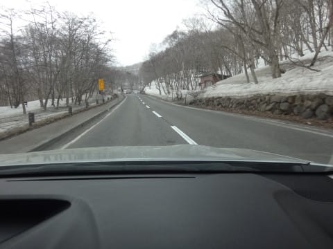

交通量も異常に少なく．

スタックしてるような車がいないので，

すごい順調に登ってこれますね…

で．

本日は，一の瀬スタート！

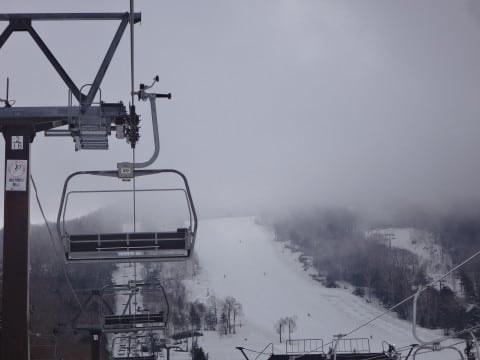

朝方は予想通り，雲が多め…

というより

これは，ガス？？

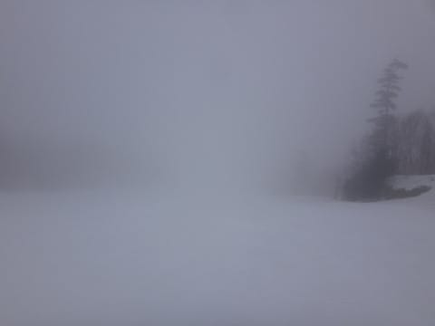

山頂の雪は…

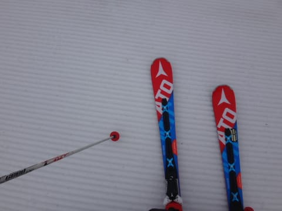

朝イチは，がちがちバーンというわけではなく．

しっかり固いけど，エッジが利くいい感じの

締まったバーン！

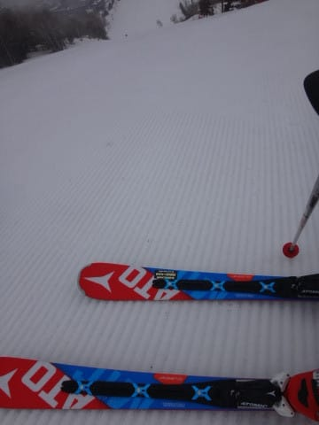

うはははは．

朝イチ最高！

…と，滑っていると．

時折ガスが…（涙）

でも．

ガスが流れてきたのは一瞬．

大体はこんな感じで，視界は十分．

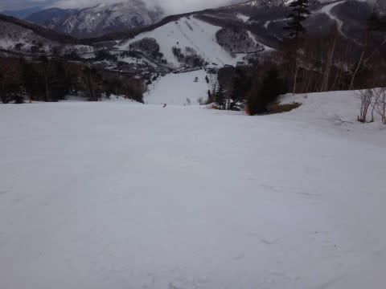

で．

天気は，ガスは時期に晴れて，そのあとは曇ったり，

こんな感じで日が差したり…

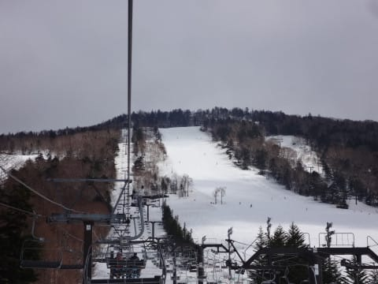

というのを繰り返す天気でした．

すっきり晴れない，そういう天気だからか．

あるいはGW前だからか．

ゲレンデの人は驚くほど少なく…

ええ？？

一の瀬正面バーン，

もう，ほとんど人が滑ってないんですが？

この写真も誰も写っておらず．

土曜午前の一の瀬正面バーンと思えない

ガラガラさ…

当然，リフトなんかも飛び乗り．

人が少なく，硬くて飛ばし放題だった斜面も，

10時過ぎには緩みはじめ．

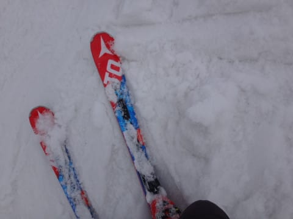

うーむ．

11時には，結構重い雪になってきちゃいました…（涙）

ちょっと標高が高い寺子屋は，もしかしたら雪が良かったり

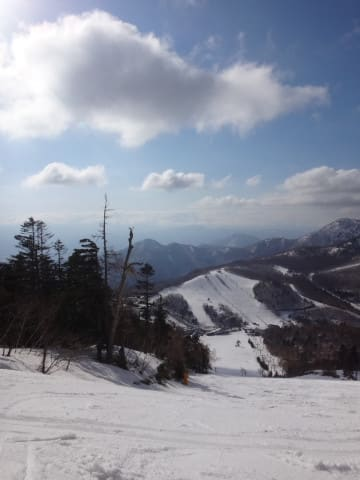

しないかな…？

と，昼過ぎに寺子屋を覗いてみましたが．

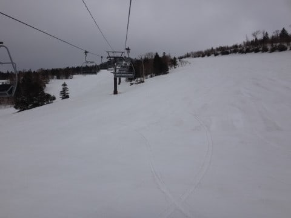

ありゃ．

ここも，重い雪ですか…（残念）

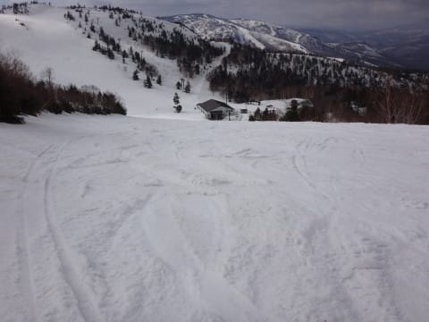

そして，コース真ん中に．

風が強くて雪が積もらない寺子屋スキー場定番である，

コース真ん中の土が出始めてました…（泣）

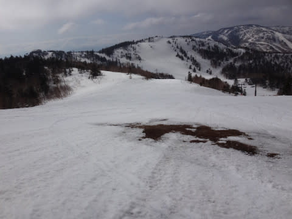

あぁ．残念．

でも．

人が少ないから，それほどひどい荒れになってなかったですね～．

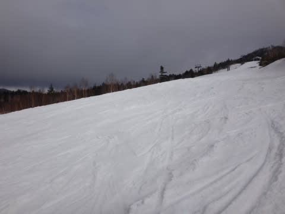

そして，午後3時過ぎ．

再び一の瀬ファミリーに戻ってくると…

やはり，雪質は改善せず，

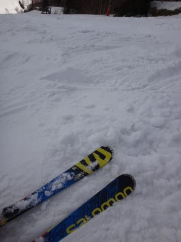

ザラ目が融けたような，ちょっと荒れ気味のバーンコンディションが続いてます…

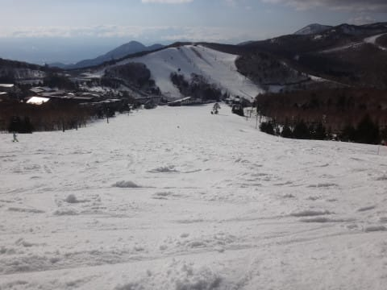

という感じで．

結局，夕方までゲレンデは荒れ続けたけど…

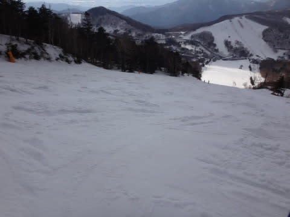

午後4時半のラストリフトまで，滑り続けたのでした…

うーむ．

今日は意外と，11時には結構溶けかかたザラ目のような，

比較的重めの雪になってしまいましたが…

明日こそ，晴れて冷えるはずなので．

明日はもう少し硬い斜面で滑れるんじゃないかな…

## 💬 コメント一覧

### 💬 コメント by (かず)
**タイトル**: Unknown
**投稿日**: 2017-04-23 02:42:06

8時から奥志賀でした　朝はSさんのよみどうりゴンドラ下　ガリガリで第3はいい感じでした　1時間位したら　ゴンドラ側いい感じに緩みましたが　そこからすぐ第3でもザブザブでしたね　30分で状況が変わる感じします　山頂にバンクが出来て朝は硬くて楽しめましたよ

### 💬 コメント by (FCAMEL)
**タイトル**: Unknown
**投稿日**: 2017-04-23 21:48:45

昨日は11過ぎに雪が重くなるとしばらくしてヒザが熱くなり、危険を感じ撤収。車で来ていなかったものでバスに飛び乗ってしまいご挨拶できませんでした。失礼しました。またご一緒させてください！

### 💬 コメント by (FCAMEL)
**タイトル**: Unknown
**投稿日**: 2017-04-23 21:58:32

↑ ×11過ぎ→○11時過ぎ

### 💬 コメント by (Skier_S)
**タイトル**: 今日は午前中は良かった
**投稿日**: 2017-04-24 02:39:27

＞かずさま

土曜は奥志賀だったんですね．

日曜は終日一の瀬だったんですか？

こちらは午後は奥志賀に移動しました…

でも，今日も緩み始めると一気でしたね（涙）．

＞FCAMELさま

試乗はいい板が見つかりましたでしょうか？

今シーズンもGWまでガッツリ志賀で滑ってますので，

またご一緒しましょう！

