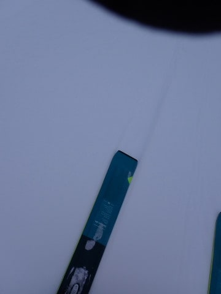

# 2024/1/13(土)の志賀高原焼額山スキー場は…雪降りの一日で、午後はちょっと雪が荒れたけどすいてたよ！

📅 投稿日時: 2024-01-14 10:10:37

🏷️ カテゴリ: [2024スキー滑走日記](c453f687e8a0f05679e95831d0a02cd0c.md)

あれ…

この記事、昨日の夜投稿してたつもり

だったのに投稿されてなかった…

せっかく昨日眠い中書いたのに…(泣)

朝10時と、ちょっと遅れたけど投稿し直し！

ってなわけで．

先週の連休に滑れなかった恨みを晴らすべく、

今週末は志賀高原で滑りまくってきました～！！

まず、信州中野から先の高速道路は

チェーン規制が入っていたので、結構雪

積もっていると期待したけど．

中野市街地は全く雪が降ってなかった

です…（涙）

でも，志賀高原の上り坂はかなり本格的な

雪道だったので，ご注意を！

ってなことで．

いつも通り，８時半の営業開始前に

焼額山に到着しますが…

第１ゴンドラの営業開始待ちの列は

そこまで長くなく．

今日はそこまでこまなさそうな予感…！

朝イチの山頂の気温は-10℃と，

-8～9℃の予想から1-2度のずれで

ほぼ正解！

で．

天気は…

ここも予想通り、朝から雪がぱらつく天気で．

昨晩からの積雪は，10㎝程度(泣)

うーん。昨日の20cmくらい積もってくれるか…

という予想より、木曜の10cmの予想が正解だった…

あさイチの圧雪コースは，

圧雪の上に5㎝程度のうっすら積雪．

もう少し積もってほしかった…

で．

本日オープンのオリンピックコースへ

行ってみましたが．

非圧雪のオリンピックコースもせいぜい

10㎝ちょいで，ブーツパフ程度…

せっかく本日オープンのコースですが．

そこまで深いパウダーじゃなく，

下地がガタガタで重い雪だったので，

あんまり楽しくない…（残念）

だもんで．

非圧雪コースのオリンピックコースより，

圧雪コースのほうが面白いかな！

あさイチはGSコースもかなり良かったし…

ゴンドラ待ちも，今日は一番混む朝10時で

ゲートの外ぎりぎりにいくかどうかで，

それ以外は搬器数台，午後になると飛び乗り

だったし…

リフト待ちは終日ほぼゼロ！

正月休み，そしてそのあとの3連休が終わった

週末なので，人が少ないみたいでガラガラ！

だったけど…

昼前になると，これもまた私の予想通り、

雪がかなり強く降り始めてきて…

午後は，時折視界が悪くなるくらい

降ることもあり，気温が昼間も-10℃近くから

全く上がらず，寒いし見えないし…

そして，昼間にもゲレンデに雪が積もっていった

のもあり．

積もった柔らかい雪が蹴散らされて，

コースが結構凸凹になっていっちゃいました（泣）

そしてそれが見えない視界の悪さで…

結構手強い感じ…（涙）

天気が悪く，

雪も降り，

寒いしバーンも荒れていくし…

やはり，

根性のないスキーヤーふるい落とし機能

が働くよね…

という予想通り．

午後はゲレンデがガラガラになっていきました…！

誰も滑ってません！！

（凸凹だけど）

ってな感じで．

昼間もガンガン雪が降っていき，

視界も悪くバーンが凸凹になっていく本日．

気持ちよくて楽しかったか？？？

と言われると，ちょっと微妙な感じでしたが．

コンディションが悪かったぶん，

週末とは思えないガラガラ具合で，

午後になってもうっすら新雪が積もって

行き，せいぜい10㎝程度とはいえ

雪不足のバーンコンディションも改善

していってくれたし．

とりあえず，今日は朝までの積雪はわずか

10㎝だったけど．

車を見てみると，昼間の積雪もトータルで

この程度積もってくれたし．

さらに，夜10時くらいまでさらに10～20㎝は

積もったみたいだし．

まだオープンできないコースがあり，

完全に雪不足は解消しきってはいないけど．

今日積もった雪が圧雪されて，明日はいいコンディションに

なりそうです～！

## 💬 コメント一覧

### 💬 コメント by (おおすぎ)
**タイトル**: Unknown
**投稿日**: 2024-01-14 15:00:54

S様　

遅くなりましたが、本年も楽しい日記をどうぞよろしくお願いいたします。

＞この記事、昨日の夜投稿してたつもり・・・

わたしのPC環境では、昨日（1/13 PM11時ごろ）拝見出来ていましたよ。

### 💬 コメント by (地元民)
**タイトル**: Unknown
**投稿日**: 2024-01-14 16:59:24

明日から、大雪予報です。

冬型、長続きしないですね。半日しか続かない。やはり、暖冬。

### 💬 コメント by (Skier_S)
**タイトル**: 眠い…
**投稿日**: 2024-01-15 03:00:23

＞おおすぎさま

昨晩投稿したはずなのに，なぜか投稿が上手く反映されない時が

あるんですよね…

何度も投稿ボタンを押して，2重投稿になってたのを発見して一つだけ消したつもりが，

翌日は一つも投稿されてない状態になっていたので，夜中に2重投稿になってたタイミングの

記事を目にしたのかも…

＞地元民さま

15，16日は，そこそこ積もってくれるんじゃないかと期待しているのですが…

今回は2日間北風が続きそうと思ってます…！

### 💬 コメント by (油漏＠あちこち)
**タイトル**: Unknown
**投稿日**: 2024-01-15 23:50:56

本当にお疲れ様です。

「ゴンドラ待ちも，今日は一番混む朝10時で

ゲートの外ぎりぎりにいくかどうかで・・・」の写真の後ろ姿、私です。友人も写っていました。

月曜日の今日も滑っておりました。よく冷えて滑りやすい雪でした。一ノ瀬は修学旅行生で賑わい、焼額、奥志賀は外人さんが殆どでした。

### 💬 コメント by (Skier_S)
**タイトル**: ＞油漏れ＠あちこちさま
**投稿日**: 2024-01-16 02:39:39

あ，この週末ちらっとお見かけした気がしたのですが…

やっぱりいらっしゃったんですね．

しかし，写真に写っていたのは気づかず．

今日も滑ってらしたんですね．雪が降って寒くなかったですか？

### 💬 コメント by (油漏＠あちこち)
**タイトル**: Unknown
**投稿日**: 2024-01-16 19:23:06

Skier_S様

寒さを感じないくらい楽しかったです。。。

今日は筋肉痛がひどく、久しぶりにロキソニンを飲みました。もう漏れる油も残っていません。

### 💬 コメント by (Skier_S)
**タイトル**: ＞油漏れ＠あちこちさま
**投稿日**: 2024-01-17 00:06:37

今日はすごい天気だったみたいですが，楽しめたのですね…

特派員からは，滑るのをあきらめたレポートが続出だったのですが，その中を滑っていたんですか！

しかし，ロキソニン飲むほどひどい筋肉痛ですか．

お大事に…

