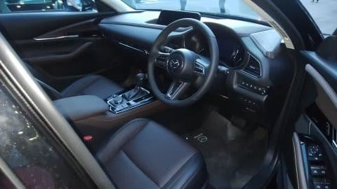
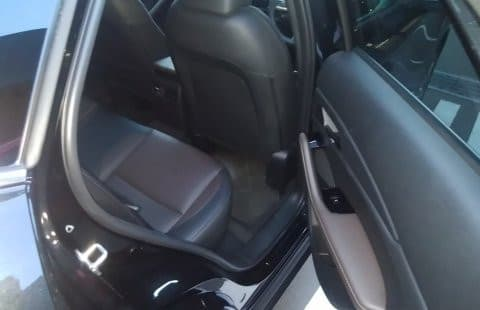

# Mazda CX30に試乗してみた…早くも試乗車が出てたけど，今回ちょっと正しく評価できてないかも？

📅 投稿日時: 2019-10-03 00:08:32

この週末．

ちょいと時間があったので，

マイナーチェンジしてアテンザから

名前が変わったばかりのMazda6に

試乗してみようかな～…

と，Mazdaに行ってみたのですが．

本日試乗車が来たばかり！

というCX30があったので，

「え？？なに？もうCX30，試乗できるの！？？」

と，喜び勇んで試乗してきて

みました…

このCX30．

基本的には，Mazda3のプラットホームを

流用したSUVですが．

外装・内装をほぼ流用した

インプレッサとXVと違って．

Mazda3とCX30は，外装は共有

されている部分が無くて，

全く見た目が違いますね…

大きさは，CX3よりちょっと

大きくなりました…

内装も，Mazda3と同じコンセプトで，

見た目は似た感じですが．

インパネからドアトリムまで，全て

Mazda3からは変更されてますね…

内装は，想像を上回る，かなりの高級感．

…とはいえ，300万越えの車と

考えると，

「このくらい高級であってほしい…」

という感じですが，

でも，いろんなところのタッチ＆フィールは

300万クラスの車にふさわしい品質．

後ろ座席は．

うむ．このクラスならこのくらいかな…

という広さ．

さっそく試乗してみます．

乗ったのは，1.8Lディーゼルですが…

うむ．

やはり，Mazda3に乗った時と同じで．

期待するより，ちょいとトルクが細い感じ…

2.2Lディーゼルと比較しちゃダメなんでしょうが，

ぐっとアクセルを踏み込むと，

エンジン回転数がかなり上がります．

ATのロックアップが外れて，

エンジン回転数がぐぐぐッと上がって，

そこから加速していく感じ．

エンジンはディーゼルと考えると

かなり静かなので，加速時に

うるささは感じないのですが．

もう少しパワー感があると嬉しいかな…

で．足回りは，このクラスとしては

十分な出来．

ボディ剛性がしっかり高く，

強い突き上げなどもしっかりと

受け止める，ストロークも十分に

ありそうな足なのですが．

タイヤがかすかに跳ねる感じが…

車高が高い分，Mazda3より

バネレートを上げているのか，

タイヤのサイドウォールが硬いか，

空気圧が高かったのか…

ばね下のダンピングがわずかに

足りないような乗り心地．

路面の継ぎ目や凸凹で

ばね下のホイールが跳ねて，

それが車体に伝わっている

感じがするし，

路面の荒れた高周波の振動が

ちょっとボディに伝わってきます．

段差の乗り越えも，Mazda3で感じた

驚くべき足回りの完成度を感じられず，

惜しい感じ…

タイヤが跳ねてる感じがしたので，

おそらくタイヤの空気圧を下げると

良くなりそうな気がしたのですが…

指定空気圧より高めにエアが

入ってたんじゃないかな～．

たぶん，Mazda3もCX30も

タイヤの空気圧にセンシティブな

気がします．

タイヤの縦バネ＆ダンピングに

かなり頼っている足回りのように

感じるので，タイヤの空気圧を

上げると，せっかくの足回りの

完成度を殺しちゃうようです．

Mazda3で細かな振動があった…

というコメントを残してくれた人が

居ましたが．

もしかするとこのことかな？

と思いました．

そして．

ブレーキペダルのフィールも

サーボがちょいと弱いのか，

ちょっと多めに踏力を入れないと

止まらない感じ．

うーむ．

このあたり，Mazda3はすごくいい

ブレーキフィールだったのに…

まだ数kmしか走ってない新車だったから，

ブレーキパッドにまだあたりが

出てないとかかな…？

とりあえず．

Mazda3がすごいいい出来だったので

期待したCX30ですが．

乗ってみると，このクラスとしての

標準レベルは十分にクリアしているものの．

Mazda3に乗った時ほどの驚きは

感じず．

「あれ？どうしたのかな？」

って感じでした…

ただ，タイヤの空気圧が適正じゃ

なかった可能性が高いので，

このレポートでは，この車の実力を

正しく評価できてない可能性があります．

このレポート，そのあたりを考慮して

読んでください…
