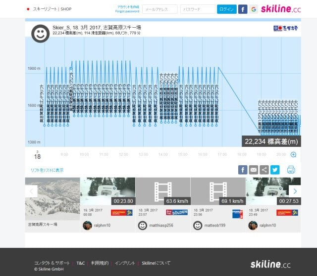
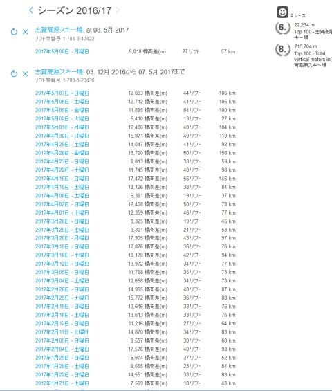
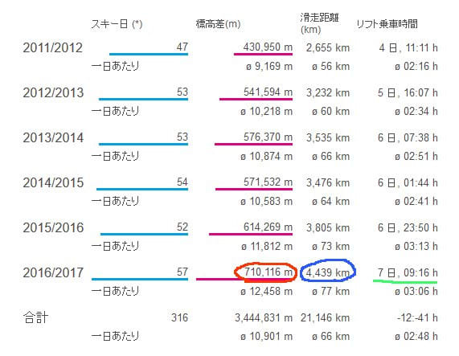
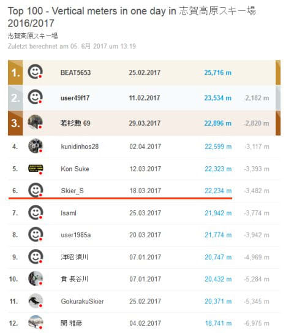
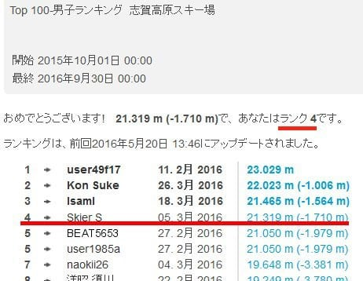
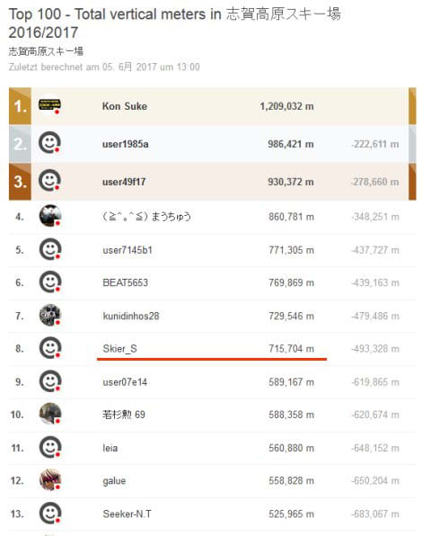
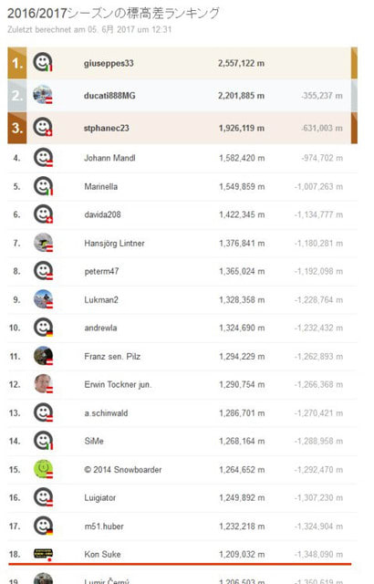
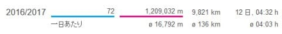

# 志賀高原のシーズンも終わったので…2017シーズンのSkilineの結果を眺めてみる

📅 投稿日時: 2017-06-08 02:15:32

🏷️ カテゴリ: [スキー雑談](c1f9d2cb7478308da16419928ea3945e9.md)

えー．

今週末も，土曜日の月山は．

低気圧の接近で荒れ荒れの雨降り＆ガスの

一日になりそうで．

…まぁ，日曜は天気が回復しそうなものの．

今の天気図だと，土曜は月山に行かない方が

よさそうな感じがする，今日この頃．

皆様いかがお過ごしでしょうか…

まぁ．

どちらにしろ．

今週末は用事があるため，月山には

行けないSkier_Sです（涙）．

ということで．

もう，6月になったわけですが…

…

…って，もう6月かっ！！！

もう2017年が半分近く終わっているとは…っ！！

…と，驚きを禁じ得ないのですが．

とりあえず．

6月になり．

志賀高原の2017シーズンも終わったので．

このあたりで，定番の，

今シーズンのSkilineの総括をやってみましょうか…

あ，このBlogを読んでいる人で，知らない人は

いないと思いますが．

[Skiline](https://www.skiline.cc/home)って，志賀高原をはじめとする，

国内5か所，世界で240か所以上のスキー場が

採用しているシステムで．

リフト券にかかれている番号をWebで登録すると…

こーゆー感じで，一日どのくらい滑ったかの

詳細が確認できたり，シーズンでどのくらい滑ったか

とかがチェックできる，

そーゆーシステムですが…

こいつで，自分の記録をざっと眺めると…

これですべてではないのですが．

ここに出ている一部分だけを見ただけでも．

…今シーズンも滑りましたね～…（しみじみ）

で．

2016/2017シーズンのまとめを見てみますと．

ふむ．

今シーズン，志賀高原での滑走日数57日ですか…

…どうやら，自己記録を更新しましたね．

しかし．約60日となると．

毎日滑っても，まるまる2か月かかるくらい滑ったわけですか…

アホですね．やっぱり．←アホであると，自覚してたのか…っ！！

で，赤丸で記した部分．

シーズン滑走標高差71万m…！

昨シーズン初めて60万m超えたばかりというのに．

今シーズンは70万mを超えてしまうとは．

着実に滑走標高差が伸びて行ってますね…．

娘が大きくなって，子連れスキーでも

そこそこの標高差が稼げるようになった…

というのもありますが．

どうも，やはり．

20000mクラブな方々と知り合うようになってから

着実に滑走量が増えてますね…

そして，青丸で囲った部分．

シーズン滑走距離4400km．

東京から真南に向かうと．

パプアニューギニアくらいまで滑っちゃった

距離に匹敵しますか．

…

これは．

スキー板が1シーズンもたないのも

仕方ないのか…

日本からパプアニューギニアまでの距離を

滑ってもヘタらない板，無いかな～←無いから．無理だから

そして．

一番右端．緑の下線を引いたところ．

リフト乗車時間が，7日と9時間16分！？？

まさか，1シーズンのリフトに乗ってる時間をすべて足すと．

丸々一週間以上ずっとリフトの上で過ごしている

ことになるとは…っ！！

このうち，かなりの時間が焼額第1ゴンドラで過ごしている時間

だと思うので．

焼額第1ゴンドラに住んでいる

と言われても仕方ないのかも…←いや，違うと思う．

今度は，一日標高差ランキングをみてみると．

一日標高差ランキング，6位ですか…

昨シーズンは4位だったので．

二つ順位を落としましたが…

なんと．

今シーズンは，20000m超えの人が11人もいますね…

昨シーズンは20000m超えの人は6人しかいなかったのに．

（昨シーズンのランキング）

これは．

どうも，[昨シーズン末に公式化](e688dd723e3d1367c88701b81540a2a04.md)した

20000mクラブの影響か．

「ゴールドステッカーを狙ってやれ！」

という人が，4人ほどいらっしゃったようで．

それで増えたのもありますが…

うーむ．

世の中．

奇特な人チャレンジ精神にあふれる人が

やっぱりいるんですね…！

そして，シーズンランキング．

トータル滑走標高差は…

うーむ．

8位ですか…

まぁ，去年より一つ順位を上げたけど…

そう．

いろんな人と知り合った今シーズン．

気づいたら，自分より上の順位にいる方

全員と知り合いになってしまったわけですが．

＃というか，13位までで知らない人は1人しかいない…

＃知り合いが増えたもんだ…

で．

自分より上にいる人たちの顔を思い浮かべると．

自分が絶対に抜けるわけがないという超人（サイボーグ）たちが

揃ってます．

これ，自分より上位は．

完全にスキー用サイボーグのリストです．

無理だ．これ以上の順位に行くのは，無理だ…

自分はこの順位で妥当です．

自分より上の人たちは鉄壁な人たちです．

ええ．

人間の常識を超えるおかしい人すごい人（サイボーグ）たちです．

特に．

いつも話題にしてしまう，トップのKon Sukeさん．

100万mを超えたどころか．

2位以下を大きく突き放しての，ぶっちぎり独走の120万m越え．

一人遠いかなたの地平まで行ってしまっていますが…

この方．

世界ランキングを目指す

という崇高な目標のもと．

なんと…

世界18位に入ってますよ…っ！！！

違う．

次元が違いすぎる…

しかし．

この方の記録．

一日平均16800m？

滑走距離9820kmって…

約1万kmですか…！？？

地球1/4周，ひとシーズンで滑ってますね…（驚愕）．

うーむ．

しかし．

世界には，このKon Sukeさん以上に滑る人が

17人もいるのか…

世界レベル，恐るべし…！！！

## 💬 コメント一覧

### 💬 コメント by (しんちゃん)
**タイトル**: よい子はマネしちゃだめ
**投稿日**: 2017-06-08 22:06:25

恐るべし20000mクラブの皆様ですね。

超人たちのマネはできない、といいますか、マネをしてみようかと思ってはいけない記録の数々ですね(笑)

来シーズンもいい雪がたくさん降って、土日は晴れてゲレンデでたくさん滑れますように。。。

### 💬 コメント by (Goku)
**タイトル**: 神様
**投稿日**: 2017-06-08 23:15:26

BEAT5653さんまでが世界TOP100に入っているんですよね。

日本人で入っているのが７人なので、そのうち６人が志賀高原の方々って凄くないですか！

私から見るとほとんど神様です。

### 💬 コメント by (olaf2125)
**タイトル**: 闘いの場？
**投稿日**: 2017-06-08 23:42:02

ゴンドラスピードが速くなったらどこからともなく集まって来て、遅くなったら散って行く…

そして常にどこのゴンドラ・リフトが速いか目を光らせてる…って、

凄すぎます。

20000mメンバー VS 志賀高原索道協会 ？

### 💬 コメント by (Skier_S)
**タイトル**: 凄すぎますから，この人たち…
**投稿日**: 2017-06-09 03:10:01

＞しんちゃんさま

恐るべしです．ホントに…

真似をしようと思っていけない以前に，

マネしようとしてもできませんから（笑）．

＞Gokuさま

ホントだ…！

BEAT5653さんが99位ですね…

すごい．100位に入っている…！！

まぁ，この方々と比べると．

我々がいかに凡人か良く分かりますね（笑）

＞olaf2125さま

もう，20000mな人たちは，

どのリフトは1本回すのに何分かかって，

減速するとどのくらい乗車時間が伸びるか…

というのを完全に覚えてますから（笑）

乗った瞬間に「減速してる！遅いよ！」と

気づくのはわかりますが．

一の瀬ファミリーからはるかかなたの

ヤケビのゴンドラを見て，減速してるか

どうかわかるというのも，

ある意味「超人」の域に達しているかと…

私には，一の瀬から見て，ヤケビのゴンドラが

減速してるかどうかはわかりません（笑）

### 💬 コメント by (Unknown)
**タイトル**: Unknown
**投稿日**: 2017-06-09 08:46:04

>スキー板が1シーズンもたないのも仕方ないのか…

使用日数で耐久性を評価される SX が可哀想です。

せめて、使用標高差を指標にしてあげましょう。

### 💬 コメント by (Skier_S)
**タイトル**: Unknownさま
**投稿日**: 2017-06-10 03:07:51

スキー板に，車みたいに走行距離（滑走標高差計？）

がついてればいいのかも(笑)．

中古で売るときの目安になりますよね～．

でも…

でも．

滑走距離が長くて仕方ないとはいえ．

やはり滑走60日程度でヘタってしまうのは，

悲しいのです…

### 💬 コメント by (BEAT5653)
**タイトル**: １００日ぐらい
**投稿日**: 2017-06-10 11:06:17

やはり板の耐久性は１００日ぐらいはもって欲しいところです。通りすがり様も言っていましたが、最近の板はやわになっているのかも知れません。

　今シーズンは、諸事情により何時来れなくなるかわからないので、滑れる時に滑っておきたい気持ちが強かったんです。普段は昼間滑れる時にはナイターにはいかないです。３年前のS様のブログを見てからですね、かなりハードに滑るようになったのは。

### 💬 コメント by (Skier_S)
**タイトル**: BEAT5653さま
**投稿日**: 2017-06-10 23:59:09

ホントに，100日はもってほしいのですが…

最近の板は根性無しになってる気がします．

ってか，ATOMICだけなのかもしれませんが(笑)．

しかし，今シーズンはお互いに滑りましたね～．

私も皆さんと滑るようになってから，引きずられるように

滑走量が伸びてます…

私は割とゲレンデの途中で止まる人だったのですが，

ここ2シーズンくらいコース途中で止まらなく

なってきました…

