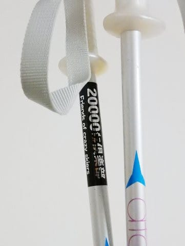

# 娘の危険発言…娘の育て方を間違えたのか？？…そして，明日はスキーに行けず（涙）

📅 投稿日時: 2017-12-09 03:15:08

🏷️ カテゴリ: [スキー雑談](c1f9d2cb7478308da16419928ea3945e9.md)

ということで．

いろいろ大人の都合で，明日は

スキーに行けないSkier_Sです（激涙）

…仕事じゃないのに，土曜に滑りに行けないとは…（泣）．

それも．

どうやら．

明日から．

なんと．

焼額は，[白樺コースやらビギナーズコース
（旧パノラマインコース）がオープン](https://www.facebook.com/yakebitaiyama/photos/a.533933973368620.1073741847.116999658395389/1508801102548564/?type=3)するというのに…っ！！

…しかし．

これで，第2ゴンドラ側のコースはほぼ全面可能になりましたね…

今週はせいぜい15cm～20cm程度の積雪しかなかったのに．

まさか滑れるゲレンデが拡大するとは…っ！

私の知る限りにおいて．

12月第2週の白樺コースオープンは史上初めてですね．

素晴らしい．

素晴らしすぎる…っ！

そして．

この土曜日は．

朝に10cmくらいは積もってくれそうなので．

土曜の朝は，昨日予想したように．

新雪が圧雪された最高のコンディション

だろうなぁ…

なのに．

なぜこの土曜は滑りに行けないのか…（涙）．

まぁいい．

日曜は滑りに行くっ！！

土曜からの積雪は無いけど，

日曜は滑りに行くのだっ！

…午後から曇ってきそうだけど…（ちょい涙）

あ，日曜ですが．

昨日の予想では，日本海側は午後は降る…と書きましたが．

最新の天気図を見ると，日本海側も降らずに

済みそうです…

…ってことで．

本題．

銀のお札…

ならぬ．

20000mクラブのシルバーステッカーを

ストックに張っている，わが娘．

この週末の志賀高原で，20000mクラブな

皆さんと一緒にゴンドラに乗ることが

多かったわけで．

20000mな皆さんが貼っている怪しげな金のお札

ゴールドステッカーを見て，娘が一言．

娘「私も金色のシールが欲しい～！！！」

ちょっと待て．

…娘よ．

この怪しげな金のお札ゴールドステッカーは．

一日20000mの滑走標高差を滑ったという，

逝ってしまった人素晴らしい人しか貼ることが

許されないんだよ…

…ということを伝えところ．

娘「ふーん．そうなんだ～」

分かってくれたか…

娘「じゃ，私も20000m滑る！！」

…

分かってなかったか…（涙）

それからあと．

ゴンドラに乗るたびに．

娘「これで何m滑ったの？」

と，私に毎回尋ねる娘．

私「…まだ4000m」

って感じで答えてたわけですが．

私「そんなに金色のシールが欲しいの？」

娘「欲しい！私もみんなみたいに

　金色のシールが貼りたい！！」

私「…いくらなんでも，子供には20000mは無理だよ．

　20000mって，すごくいっぱい滑らないとダメだから」

娘「どうやったら20000m滑れるの？」

私「まず，焼額では無理．

　一の瀬ファミリースキー場で，

　朝から晩まで，止まらず休まず飲まず食わず

　トイレに行かず滑り続けないと，

　20000mには行かないから…

　普通の人間には無理だから！」

（ってか，昼間で20000mはサイボーグ

　じゃないと不可能だから…）

と説得したところ．

娘「うん，分かった！」

やっと分かってくれたか，娘よ…

　

娘「じゃ，次に来たときは，朝から

　一の瀬ファミリーで滑ろうね！！」

…ぜんぜん分かってなかったか（涙）

娘「早く金色のシール欲しいなぁ…！」

…いや…無理．

たぶん，普通の人間には無理だから…．

…ってか，お前を20000mを狙うような人間に

育てた覚えはないから…っ！！！

私「娘よ…お前，今日の朝から夕方まで滑って，9000m

　くらいしか滑ってないんだけど．

　この倍以上滑らないとダメなんだけど」

娘「今日はゆっくり滑ってたもん！

　もっとスピード出せるもん！

　絶対行けるもん！」

…ということで．

わが娘．

20000mチャレンジをやりたいようです．

でも．

いくらなんでも小学生には無理だろうなぁ…

高校生くらいになったら行けるのかな～？？

…とか，考えていたけど．

わが娘を，史上最年少の終わった人の証ゴールドステッカー

保持者という，若くして何か進む方向を

間違えた人行くところまでいって

しまった人にしてしまうのも考えモノなので．

娘のシルバーステッカーの上から，黄色マジックで色でも

塗ってやろうか…？

と考えている，Skier_Sなのだった…

うーーん．

娘の育て方を間違えたか…

## 💬 コメント一覧

### 💬 コメント by (yama)
**タイトル**: ゴールドステッカー
**投稿日**: 2017-12-09 07:59:05

娘さんがSさんを超える日も近いですね。今日は一之瀬から高天原の予定です。朝から予報が当たり、よく晴れています。

### 💬 コメント by (しんちゃん)
**タイトル**: 初滑り
**投稿日**: 2017-12-09 22:29:37

本日のご用事、お疲れ様です。

本日初滑りでした。天気・雪質・仲間に恵まれいいシーズン開始ができました。

娘さん、アスリートですねぇ(^^ゞ

カエルの子はカエル。親に似たのでは･･･(笑)

年内にまた登場しようと思いますので、その時はよろしくお願いします。

### 💬 コメント by (Skier_S)
**タイトル**: 土曜は良かったみたいでうらやましい…
**投稿日**: 2017-12-10 05:46:05

＞yamaさま

一ノ瀬は良かったですか？

冷え冷えガラガラだったのでは…

日曜は焼額グルグルしてます～

…娘には抜かれないよう頑張ります(笑)

＞しんちゃんさま

初滑りでかなり良いコンディションで滑れたようで、

良かったですね…

昨シーズンと違い過ぎて、嬉しい今日このごろ。

今回はお会いできなくて残念ですが、また次回に

ご一緒しましょう！

