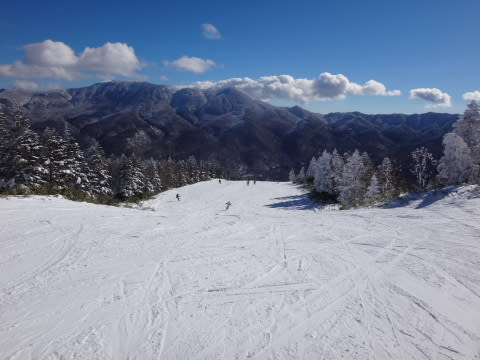
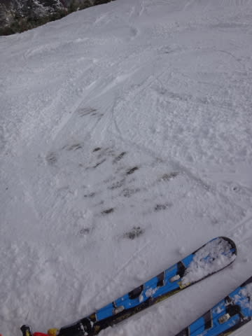

# ってことで，年末年始は8日間志賀高原で滑ってたわけだが

📅 投稿日時: 2016-01-07 04:12:58

ということで．

9連休だったこの年末年始．

9日中8日間，志賀高原で滑るという，

本来であれば大変シアワセなはずの，

このお休みだったわけなのですが．

…ですが．

レポートで報告したように，

雪がもう少しないと，

シアワセになれない感じの年末年始だったわけで（涙）．

そのおかげか，20000mクラブの人たちも

それほど滑走量を稼げなかったようで．

この年末年始，子連れでゆるゆると滑っていた私が，

1月2日に最大瞬間風速とはいえ

なんだか．

Skilineでの志賀高原の今シーズンランキング，

トータル滑走標高差3位，

一日最高滑走標高差2位

につける瞬間もあり．

あれれれ？

って感じだったんですが…

まぁ．

でも．

本当に，もう少し雪が欲しい…

と切に願う年末年始でした（涙）．

で．

毎日の志賀高原レポートで，正直に

その旨を毎日つづっていたわけですが．

…ある日．

ふと思ったわけですよ．

「このBlog．

　読んでる人なんてそんなにいない，

　マイナーなBlog…って，安心していたけど．

　…もしかしたら，焼額のスタッフにも

　読んでる人がいるんじゃなかろうか？？？？」

これまで．

スタッフが読んでいるなんてことは

想定していなかったけど…

もし，焼額のスタッフの人が読んでいたら．

あまりにも毎日．

「雪が少ない，ひどい状態」

と書きまくっていたので．

焼額にやとわれたヒットマンに消されるんじゃないか？

と，ちょっと心配になったSkier_Sだったのでした…

＃こんなマイナーなBlogは読んでいないはず…と信じたい

## 💬 コメント一覧

### 💬 コメント by (デーコン)
**タイトル**: Unknown
**投稿日**: 2016-01-07 07:00:45

おはようございます。

マイナーなブログじゃありませんよ。

スキー場のスタッフブログは、雪が降ってきましたと

か雪の予報ですとか微妙な表現でよくわかりません。

その点、雪が減る様子とか見れてほんと助かってます。

ありがとうございます。！！

### 💬 コメント by (デーコン)
**タイトル**: Unknown
**投稿日**: 2016-01-07 07:08:11

おはようございます。

マイナーなブログじゃありませんよ。

スキー場のスタッフブログは、雪が降ってきましたと

か雪の予報ですとか微妙な表現でよくわかりません。

その点、雪が減る様子とか見れてほんと助かってます。

ありがとうございます。！！

### 💬 コメント by (びわ湖)
**タイトル**: Unknown
**投稿日**: 2016-01-07 07:21:45

お疲れ様です。「安心して下さい。見てますよ」

私のホームは12/30からオープンでした

ブッシュとボードを避けながら頑張っています。

特にボードの滑走ラインが読めず、毎回冷や汗の

連続ですね。特に背面に入らない様に意識してます。Sさんは、ボードと仲良く滑っておられる様に思いますが？

### 💬 コメント by (べべ)
**タイトル**: 夜道にお気をつけ下さい…
**投稿日**: 2016-01-07 10:47:21

確かにこのブログを見て、志賀高原に行くかどうか決めることが多いので影響力大ですね(笑)

今日は少し雪降ってますね。

週末までにドサドサ積もると良いのですが…

### 💬 コメント by (Goku)
**タイトル**: 全員集合！
**投稿日**: 2016-01-07 23:06:50

一度やってみますか！

○月○日○時、焼額山１ゴン前にブログ読者集合！

その時、Ｓさんは知らぬ顔して何処かで見ている（笑）

１ゴン８人がブログ読者で埋まるのを見てみたいな～

でも誰が読者か分からないから目印がほしいね

### 💬 コメント by (Skier_S)
**タイトル**: あまりにもターゲットが狭いBlogなので…
**投稿日**: 2016-01-08 01:04:56

＞デーコンさま

いや…

志賀高原の天気予想と滑走レポートという，

あまりにもスイートスポットが狭いBlogですから（笑）．

普通の人が読むBlogではないかと（＾＾；

ただ，志賀高原に行く人には役立つBlogだといいな…

と思って書いてます～

＞びわ湖さま

お久しぶりです～．

ホームゲレンデ，オープンしましたか！

まだオープンできないスキー場が

多数あるようですから，オープンして

良かったですね…

…ボードの滑走ラインは，たしかに

読みにくいですが．

まぁ，スキーヤーでも予想外の動きを

する人はいますし，ボードでも上手い人は

大体動きが読めますし．

ボードやスキーヤーと分類せず，

「動きが読める人」と「読めない人」で

分類しています（＾＾；

気を付けているのは，前の人がターンしている

外側を追い抜くこと．

ラインがクロスしないように，必ず前の人が

ターンに入ってから，その外側を抜くように

しています．

### 💬 コメント by (Skier_Ｍ)
**タイトル**: いつも、見てますよｗ
**投稿日**: 2016-01-09 09:53:40

スキー大好き・志賀高原大好きで、いつも拝見させて頂いてます。ゲレンデ状況がよくわかり、大変参考になります。影響力は、大ですよ!!ヒットマンに狙われない程度に頑張ってください（笑）それにしても過去にないくらいの雪不足ですね。白馬方面に浮気しようかな・・・

### 💬 コメント by (Skier_S)
**タイトル**: Skier_Mさま
**投稿日**: 2016-01-09 22:26:52

コメントありがとうございます～．

ようこそ，この駄文置き場へ（笑）．

志賀高原大好きですか…！

ってことは，もしかしたら私を見かけたことが

ある方でしょうか…

とりあえず，今後も焼額非公認ブログとして（笑），

ヒットマンにやられない程度にやっていきます（＾＾

ちなみに，今日の焼額は結構よかったですよ．

