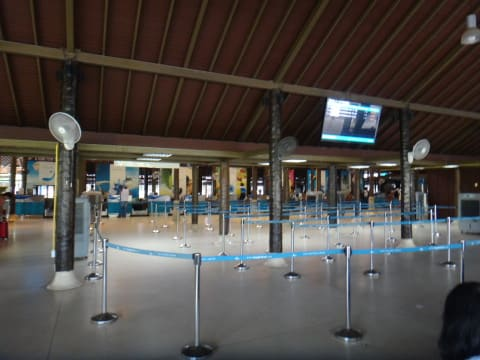
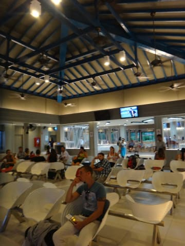
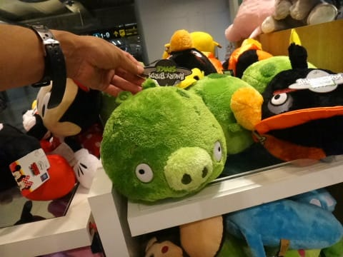

# 2013年9月　子連れタイ・タオ島ダイビング旅行記　その33…日本への帰路

📅 投稿日時: 2013-12-06 00:33:41

🏷️ カテゴリ: [ダイビング日記](ce3a7a8d424d112fce83ee85c81a0e344.md)

えー．

本日．

焼額のWebページを見て．

いいニュースを発見！

＃ほとんどの人に関係なさそうだけど…

昨年度，フードつき高速クワッド(第3高速)でのナイターをやめて，

トロいペアリフト(4ロマ）でのナイター営業に切り替わってしまい．

「あんなくそ寒い夜に，乗車時間10分超えるトロいリフトに乗ってられるか～！！」

と思うと共に．

あの高速クワッドリフトでぐるぐるできる最高のナイター，

もう楽しめないのね…

と悲しみに浸っていたのですが．

なんと．

今シーズンから．

[第3高速でのナイター，復活](http://www.princehotels.co.jp/ski/shiga/news/news_120202_01.html/)です～（ぱちぱちぱち）

期間は2月22日までと短いのがちょっと惜しいけど…

という本題がおわったところで．

おまけのダイビング旅行記へ，Go!　←もう，やけくそになっている

-----

ってことで．

象さんに乗った後は．

送迎車に10分ほど乗って…

サムイ空港へやってきます．

サムイ空港，田舎の空港のわりに．

日本の地方空港よりも，ショップとか多いかも…

こんな感じで，チェックインカウンターの外のエリアに，

ショッピングモールみたいな感じでお店が並んでます．

…どーせ，セキュリティエリアに入っちゃうと何もできないだろうから，

こんなにお店があるのなら一通り見ておこうかな～，

…と，チェックイン後に，お店を冷やかしたり，

アイス屋さんで休憩したりしてから．

ぎりぎりに手荷物検査をくぐって

セキュリティーエリアに入ったところ…

なんだ？この待合室，結構いいじゃないか．

…驚くことに，バンコクまでの国内線の待合室というのに．

無料のドリンクやらお菓子やら，軽食が準備されてるよ！

…そして，待合室隣にも，結構立派な売店が…

うーむ．

サムイの空港．

地方空港のわりに，観光客向けに，かなり気合の入った空港ですな…

そして．

サムイ→バンコクの国内線に搭乗しますが．

なんとこの国内線．

1時間ちょっとの飛行時間というのに…

機内でもこんな軽食が出るとは！

…コストダウンが徹底している，LCCや米国路線とは対極だなぁ…

…って感じで．

快適な1時間のフライトでバンコクへ．

バンコクの巨大空港に到着すると…

また，ここは大量に免税店とかがあるので，

冷やかしに見に行ったところ…

うーむ．

タイでは，こんなものが流行っているのか…

そして．

なぜ，ドーモ君…
