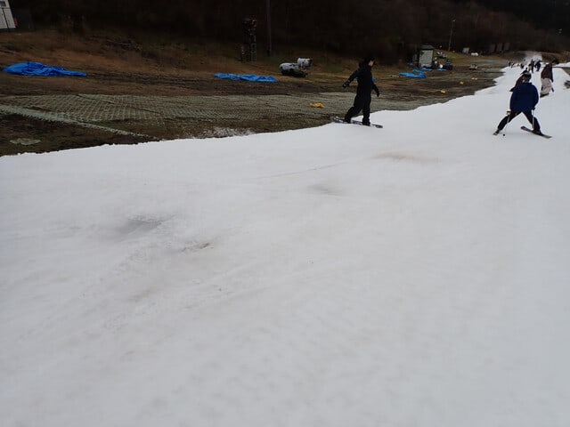

# 2024/11/16(土)のイエティ滑走速報レポート＆ゲレンデ状況動画…リフトの混みはそこそこだったけど，コース幅が狭く人口密度が高め（泣）

📅 投稿日時: 2024-11-17 01:13:00

ということで．

本日土曜，予告通りイエティで滑って

きました～！

今日の天気は午前は一瞬日が射すことも

あったけど，基本的に曇り時々小雨．

午後2時ごろと3時過ぎくらいに，

「あれ？降ってるかな…？」という程度に

ポツポツ雨が降ってました…

気温はこの時期としては高めだけど，

ウェアのジャケットを着ないと寒く感じる

くらいなので，しっかりジャケットを着て

行きましょう．

あとで動画を見てもらうと分かりますが…

コース幅はこの1週間で，そこまで広がって

ません（泣）

まぁ，先週よりマシですが，11月中旬と

考えるとかなり狭めですね．

例年のオープン翌週くらいの感じの幅で．

スタートの人数制限もやっていなかったので

コース上の人口密度は高く，快適度が

先週よりはずっと低め…（泣）

雪は悪天候で融けちゃった反省を踏まえ

厚めに積んであんまり広げてないので，

土や石が出てるところは無かったですが．

数か所だけ，ちょっとうっすら地面が透けて

見える部分も…

でも，2-3か所くらいかな．

今シーズンオープンから採用されている

コース途中，最後の急斜面手前の一旦停止は

今日もやってましたが，

係員が止めることはなかったので，ここで

待ちができることは数回しかなかった

ですね～…

スタートの人数制限もコース途中で詰まる

こともないので，今日はリフトに待ちができて

ました．

リフト待ち3-5分程度なので，まぁ，天気が

そんなに良くないこともあり，例年の今の

時期のイエティよりは少ない感じですか．

…うーん．

でも，同じ待つならスタートで待って，

クリアなコースが滑れた方がいいかも…

そして今日はナイターもやりましたが…

コース幅が狭めなので，人数が少なくても

抜くチャンスがなくて，ちょいと快感度は

低めな感じ…（泣）

ということで．

今シーズンのこれまで2回，スタートの

人数制限をやってくれたおかげで，割と

人口密度が低めの状態で滑れたけど，

今日は久しぶりにラッシュアワー並みの

イエティを滑った感じ…

どんな感じか，動画を見てもらえれば

分かるかと（笑）．
