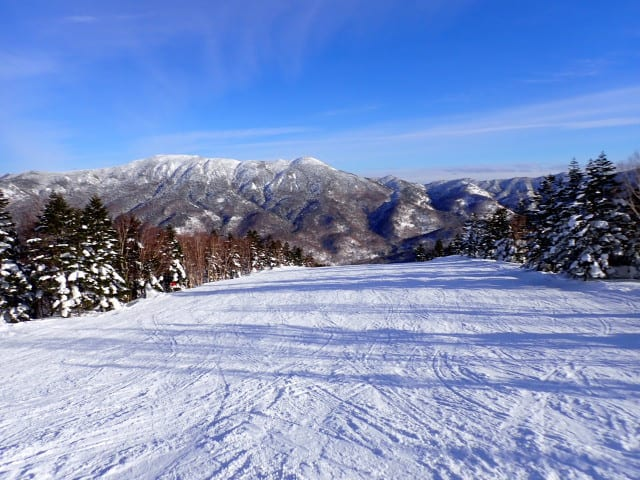

# 2025/1/19(日)の志賀高原焼額山スキー場詳細レポート！…晴天の下，いい雪質だったのにガラガラでバーンは最後まで荒れず．今シーズンベストの1日！

📅 投稿日時: 2025-01-22 01:37:02

これから今週いっぱい，ニュースとかで

やってるように気温が上がりそうですが…

でも，志賀高原では雨が降ったりするほど

気温が上がらなさそうなので．

少なくとも志賀高原の標高では，雪不足の

昨シーズンみたいに，1月や2月に雨が降る

悲劇を味わうことはないので，ご安心を…！

ということで．

昨日速報レポートした，最高のコンディション

だった日曜の焼額山の詳細レポートです！

まず．

いつも通り，朝8:30の焼額営業開始を狙って，

ふもとの宿から志賀高原を登っていきますが…

上林のチェーン装着場までは，路面は

完全にドライで．

土曜はふもとは意外と気温が上がったんだな…

とはいえ，スキー場に近づいたらやっぱり

積雪しているので，当然のごとくスタッドレスを

履いてきてくださいね～！

そして，朝8時半の第1ゴンドラの営業開始前に

並びますが…

営業開始直前でせいぜいこの程度の混雑なので．

今日は混まなさそうですね…！

ってなことで，山頂に行くと…

朝の気温は-6℃ですか．

-5℃前後と気温が高めの朝になるという

予想，ほぼぴったり正解！

朝イチは晴れずに薄曇りの天気でしたが…

ゲレンデは…

うおおおお！！！

これはいい感じのシマシマだ～っ！！

冷えた雪が圧雪でしっかり押さえつけられ，

板が潜ることなくガッツリ気持ちよくエッジが

食い込んでくれる硬さで，板もしっかり走って

くれる，最高級の超快楽激烈快感スーパー

お楽しみバーンだっ！！！

もう，こういう日はGS板を履くしかない！！

こういう日にGS板を履かずにいつ履くんだ…

とばかりに，人が少ない超快楽バーンを

GS板でガシガシ滑っていると…

朝のうちは曇っていた空も，だんだん青空が

見え始めてきて…

バーンに日が射して明るくなってきましたよ…！！

営業開始から1時間半くらい経った10時

過ぎには，なんと，すっきり青空になり

ましたよ…！！！

そして，晴れているのにコース上の

人は，びっくりするくらい少ないですよ…！！

こんな晴天なのに，こんなに人が少なくて

いいんですか…！？？？

第1ゴンドラも今日はこれが最大ピークで，

朝10時過ぎに一瞬ゲートの外まで並んだ

ことが1回だけあったけど…

それ以外はずっとガラガラ！

待って搬器数台，ヘタすれば飛び乗りという，

経営が心配になるレベルのガラガラ具合！

昼間は予想通り，気温が0℃近くまで

上がっちゃったけど…

焼額の温度計，最高気温は0℃を越えな

かったですね…

ってなことで，思ったより気温も上がら

なかったので，雪も終日ずっと良いままの

状態をキープ！！

それも結構締まり気味の雪で，

かつ人も少ないので．

いつもなら午後になったらちょっと

荒れ始めるGSコースもずっとフラット

だったし…

パノラマコースの急斜面も終日フラット！

っていうか，人がいない！

人がいないので，凸凹になりようがない！！

これだけフラットで人がいないバーンを，

ひたすら大回りで好きなラインで

滑りたい放題の，このシアワセときたら…

1年365日，ずっとこんな日が続くと

いいな！！←だから8月もこんなだったら異常気象で大ごとだから

昼を過ぎると，リフトも完全に飛び乗り

状態だし…

誰もいないガラガラバーンを気持ちよく

飛ばせるけど，ちょっと人がいなさ過ぎて

寂しいくらい…

だもんで．

普段なら午後には凸凹になるGSコースも，

午後の遅い時間になっても，この程度で

結構フラットな状態でいてくれたし．

ボコボコになることが多いオリンピック

コースも，まったく人がいなくて，

夕方になってもまだ大回りが

できるレベルでフラットだったし…

いや…ホントに人がいないんですが？？

こんなに雪が良くて天気がいいのに，

こんなにガラガラでいいんですか！？？

ということで．

今日も日が暮れ始める営業終了の時間まで，

ひたすらヨロコビに浸りながら滑り続け…

いつも通り16:15の営業終了まで，

しっかり滑り倒してきたのでした…

いやーーー．

ホントに良かった…

この週末は良かったよ…

この月・火はかなり気温が高めで，

さすがの志賀高原も雪が緩んじゃった

みたいだけど．

でも，これからはそこまでひどく気温も

上がらなさそうだし．

今週末も，いいコンディションが続くと

いいなぁ…

これだけすいてて天気が良くて雪がいい

週末が続きますように…！！

## 💬 コメント一覧

### 💬 コメント by (油漏＠あちこち)
**タイトル**: １８日と１９日
**投稿日**: 2025-01-22 18:54:28

同じく志賀を滑ってました。

こんなにいい天気・雪質、閑散ぶりなのに、家内同伴でゆっくり、安全に、小刻みに滑る二日間でした。

でも、ＧＳコースでのＳさんの大回りを一度だけ拝見できました。

家内はシーズン券ではないので、共通二日券を買いましたが、一泊の宿代よりも高かったです。ガソリンが上がったタイミングとも重なり、負担感を実感しました。宿泊者へのお得なリフト券の設定も検討してほしいところです。（一応ありますが、土日は割安感に乏しい）

### 💬 コメント by (ジミ～高橋)
**タイトル**: 本日出陣いたしました
**投稿日**: 2025-01-22 19:24:42

本日1/22(月)焼額山スキー場に出陣しておりました。平日なので空いていました。朝は薄曇り、その後は日が差してきて穏やかなスキー日和でした。コースは終日荒れることなく、楽しい一日でした。こんなに楽しくて良いのでしょうか(良～いのです！)

今更ながら、焼額山スキー場圧雪隊のスキルの高さに敬服しております。

### 💬 コメント by (ジミー高橋)
**タイトル**: 曜日間違えました
**投稿日**: 2025-01-22 19:29:57

先程のコメント投稿、×1/22(月)→〇1/22(水)に訂正いたします。すみません。

### 💬 コメント by (lonelywalker)
**タイトル**: Unknown
**投稿日**: 2025-01-22 19:33:24

昔行った時は、ダイアモンドダストが出るくらい寒かった。

### 💬 コメント by (Skier_S)
**タイトル**: コメント回答遅れてごめんなさい
**投稿日**: 2025-01-24 00:02:58

＞油漏れ＆あちこちさま

あら…？？志賀で滑ってらしたのですね！

全然お会いしませんでしたね…

しかし，志賀高原の値上がりも厳しいですよね…私も自分はシーズン券だから

いいけど，家族で来るとリフトと宿代が辛い…

＞ジミ～高橋さま

22日も志賀で滑ってらしたんですね…！

気温は上がったけど，そこまで雪が緩まなかったんですか．うらやましいです…

今週末もいいコンディションでありますように！！

＞lonlywalkerさま

今シーズンはまだダイヤモンドダスト見てないですね…

昨シーズンはダイヤモンドダストもサンピラーも見えたので，今でも冷える時は冷えますよ！！

