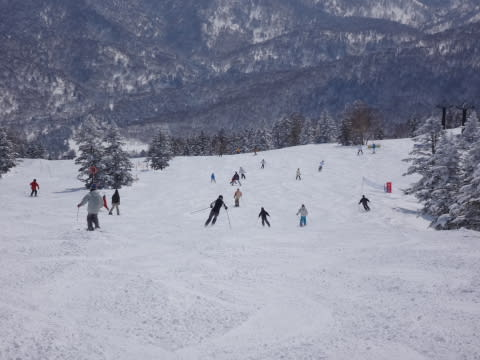

# 3月14日の志賀高原は…うははははは！最高の雪に恵まれた一日だったのだ！

📅 投稿日時: 2015-03-14 23:03:41

🏷️ カテゴリ: [2015スキー滑走日記](c09ea645cfc085f86dfcd80f49599dd89.md)

ということで．

本日の志賀高原は…

うふふふふふふ．

すごく良かったのだっ！！！

まず，朝．

志賀高原の上り坂は…

ふむ．

今朝も雪が積もったらしく，本格積雪路面ですな…

…途中，登れなくなって死に絶えている車，多数．

…これは，ゲレンデも結構な新雪か？？

と，期待してゲレンデに到着すると…

ふははははは！

なんとすばらしい晴天ではないか！

そして，山頂気温は…

をを！

マイナス10度！

この時期の晴れの天気としては上出来の冷え具合！

冷えひえです！

そして，山頂の雪は…

超やわらかい，トップシーズンの

ふわふわ圧雪っ！

じゅるるるる（よだれがたれる音）

…こ，これは，新雪を狙いにオリンピックコースへ行かねば…！

と，オリンピックコースへいってみたところ．

あり？

意外と雪は薄いな…

10cmくらいか？

だけども，結構軽い雪で．

朝イチは，雪煙をあげつつ，

気持ちよくシュプールを刻めるのだっ！！

うひょうっ！

気持ちいいっ！！

新雪に気持ちよいシュプールを何本か刻んだら，

今度は圧雪コースへ向かうのだ！！

ふははははっはっははっは！

圧雪コースも，超快楽幸せハッピー脳内麻薬でまくりピカピカ最高雪質の

圧雪バーン！

雪質も，日が差す3月の昼間とは思えないほどさらさらなのだ！

いやー，きもちいいねぇ…

と，楽しんでいたのも10時前ごろまで．

あれれ？

ふぐぐ…

ちょっと，人口密度があがってきちゃった…（悲）

でも．まあ．

ゴンドラ待ちはせいぜい最大2-3分ってところなので．

許せる範囲内か…

そして．

時折雲が流れて，わずかに雪がちらつくタイミングもあったものの…

そういうタイミングを除けば．

午後も，すっきり晴天！

んで．

すごいのは．

この時期の晴天というのに…

え？昼間の最高気温，マイナス4度ですか？？

で，雪質はぜんぜんトップシーズン並みなんですが…

これ，ホントに3月中旬の，晴天の昼間の雪か？？

信じられないほどのGoodコンディションなんですけど．

なんだか，先週，先々週まで「ホントに2月か？」

「4月の雪だよ，こりゃ…」って雪が続いたけど．

この悪天候の埋め合わせを，今日やってくれたとか…なのかな？

って感じで．

午後2時ごろまで，ゲレンデの人はちょっと多めではあったものの．

それ以降は人も少なくなり…

時折，天気予想通り，いきなり雲がかかって雪がちらつくタイミングも

あったりしたものの←一応，予想が完全に外れたわけではない，と言い訳をしておく

基本的に，晴天が続いた一日で…

だというのに．

夕方まで超最高のトップシーズン並みの雪質をキープし．

ええんか？

こんなにシアワセで，ええんか？？？？

…という．

超シアワセな一日を過ごしたのだった…

…

…で．

当然繰り出す，ダイヤモンドナイター．

ええ．

行かないわけがありません．

こんなに雪がいいんですもの．

行かなかったら悶絶死します．

当然，おいしいシマシマをいただきに，出撃っ！

ぐはーーーーっ！

気温はマイナス11度と低く．

冷えたいい雪質の雪が，いい感じに締まった，

シーズンでもそうそうない，最高の圧雪なんですけど～っ！！

ナイターも，超シアワセ～っ！

…で，ナイターで滑っている人は少なめだったので．

ナイター営業終了まで，ところどころシマシマが残ったままという．

トップシーズンでもそうそうない，スーパーベリーグッドラッキーハッピーコンディションな

ナイターだったのでした…

いや．

もう．

言うことはありません．←いっぱいレポート書いてるけど（ツッコミどころ）

もう，最高の一日でしたよ～！！

いやーー．

私が日ごろの行いを良くしておいたおかげですね！←先週と先々週の悪天候はどういいわけするつもりだ？

明日も，一日天気がよさそうな感じになってきました…

昼間は今日より気温が上がり，雪はちょっと重くなりそうだけど．

まぁ，朝のうちは冷えた締まった最高圧雪が楽しめるかなっ！！

今日ほど恵まれてはないけど，明日も楽しめそうですよ～

## 💬 コメント一覧

### 💬 コメント by (マルハバ)
**タイトル**: いやぁ～・・♪
**投稿日**: 2015-03-16 19:19:03

ご一緒に滑ることができて感激でした！

実は○十年ぶり？のナイターでした。

Ｓさんのスルドイ深回りターンを追いかけて

テンション上がりっ放しでした（笑）

当初は見学だけと思っていたのですが

1時間だけでも・・と

思い切ってホントに良かったです。

ありがとうございました！

### 💬 コメント by (Skier_S)
**タイトル**: マルハバさま
**投稿日**: 2015-03-17 00:53:43

先日はご一緒いただきありがとうございました～！

私もかなりかっ飛ばして滑ってましたが，

しっかり追い越されてしまい，ヤラレタ～！

と思ってしまいました（笑）．

濃厚な一時間でした！

また，チャンスがあれば志賀にお越しください～．

