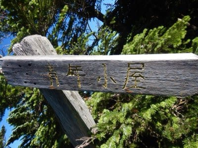

# 2021年7月，編笠山リベンジ＆権現岳へ！その4…権現岳へ向かう

📅 投稿日時: 2021-08-22 00:10:34

昨日，金曜日の夜…

一週間の仕事を終えた後，11時過ぎに

倒れてました．

死んでました．

久しぶりに外が明るくなる前に寝た気がする…

という微妙な日々が続いた今日この頃．

とりあえず，人間夜は寝るべきですね…

ってなことで．

今日も編笠山の山登りレポートです！

一応，明日はまたスキーネタをやる予定です…

(このままだと登山ブログになりそうなので)

ーーーー

ということで．

編笠山山頂にて，年にそうそうない

超快晴の絶景を楽しんだら．

次は青年小屋に向かいます…

前回は，この山頂から青年小屋に向かう，

この道を歩き出したころで，

すぐに膝が痛み始めたんだよな…

でも，今回は全く痛む気配なし！

青年小屋への下り坂でも，軽快に

歩けます．

…素晴らしい…

痛みなく下りが歩けるって，すばらしい…

そして，前回，曲げられない膝で死ぬ思いを

しながら降りた，青年小屋目の前の

岩ゴロゴロ地点．

ここもなんの苦も無く，軽快にひょいひょいと

岩の頭を伝って降りていけます…

すばらしい．

痛くないって，素晴らしい…(感動の涙）

…しかし．

前回は膝を曲げられない状態で，

よくこんなゴロゴロ岩場を降りてきた

もんだなぁ…

（この写真の左側の人比べると，岩の大きさが分かる）

ってなことで．

極めて軽快に青年小屋まで降りてきましたが．

山頂からここまで，コースタイム17分の

ところ，20分．

…って，あれ？

コースタイム以上かかっちゃった？？

どうもこのコースタイム，ゴロゴロの

岩場でのタイムロスを考えてないのかな．

まぁ，前回40分かかったところを20分で

降りてきたので．

前回比半分ペースなので．

まぁ早かったということかな…

で．ここまでかなりのペースでとばして

来たものの．

身体の重さもなく，膝の痛みも全く

気配が感じられなかったので．

下山コースではなく，予定通り

権現岳へ向かいます！

権現岳への登りはいきなり

結構な急登で始まりますが…

このあたりから，花も多くなってきて…

そして，花を愛でながらしばらく

登ると，森林限界を超えてきて，

また見晴らしがよくなってきます！

振り返ると，前回登った西岳山頂を超えて，

遠く中央アルプス方面も見えますし…

これから登る権現岳も，目の前に

見えてきました！

いや．

これ．

今日はホントに絶好の山登り日和だよ…！！

と．

膝が軽いのも相まって．

気分も軽く，サクサクとハイペースで

足取り軽く登り続けたのでした…
