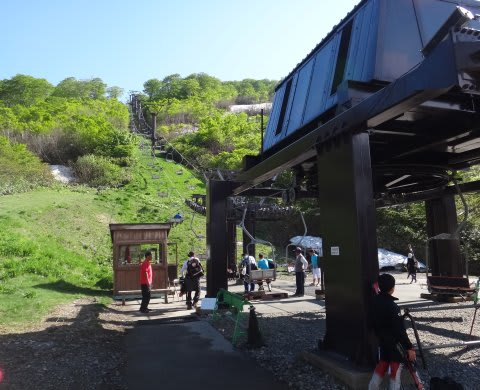
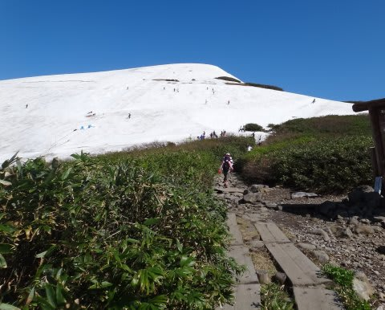
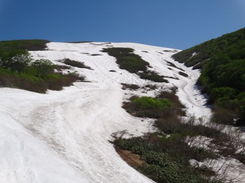
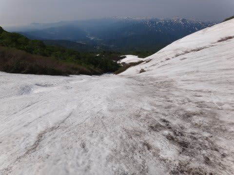
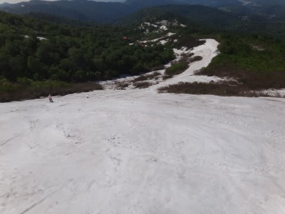
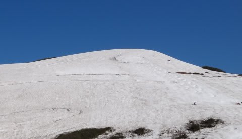

# 6月19日　月山スキー場速報

📅 投稿日時: 2011-06-20 01:44:59

🏷️ カテゴリ: [2011スキー滑走日記](ca488c98cfb9169941c3e73770dcefb56.md)

って感じで．

禁断症状に耐えられず，月山に行ってきたわけですが．

とりあえず，速報をば…

あーーー．

リフトは，スキーを脱いで乗り降りするようになりました．

乗り場の建物下から，ちょっと登ってリフトに乗り，

リフト降り場から，足場の悪い岩場をしばらく歩いて

やっと雪面にたどり着ける，

という…

ふもとから山頂まで，30分コースになりました．

で．

コースは．

まだ，大斜面と…

沢コースがいけます．

沢コースは，コース自体はまだ大丈夫そうですが，

ふもとの部分，木が出始めてるので来週は無理っぽいですね…

大斜面は，幅がちょっと減りましたね～．

左右から，藪が迫ってます．

あと，クレバス部分でコースが上下に切れているのが惜しい．

でも，まだ上半分はいけますね～

Tバーコースは，まだぜんぜん大丈夫です．

コブラインが2本ほどついてますね…

天気には恵まれましたが…

やっぱり，リフトの乗り降りに歩くのはきついです…

詳細は，明日以降に…
