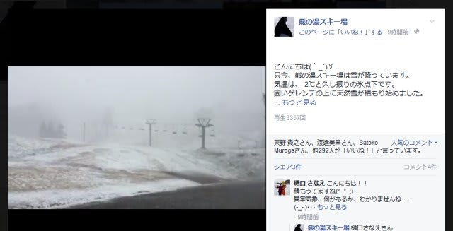
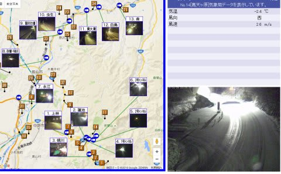
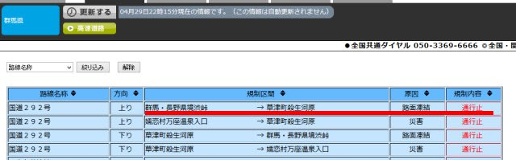

# 3連休中日，明日は熊の湯へ滑りに行くよ！

📅 投稿日時: 2016-04-29 22:47:03

ということで．

これまでの睡眠不足を解消すべく．

本日は午後3時ごろまで寝てしまった

Skier_Sです．

ふはー．

これまでの睡眠不足を取り返し，

とりあえず生き返った…

ってことで．

明日は，私にとって今シーズン最後となる志賀高原．

熊の湯まで，日帰りで行ってきます…

＃まさか，4月で志賀高原が実質終わるとは思わず…(泣）

しかし．

本日何件かコメントいただきましたが．

志賀高原は，やっぱり本日かなり冷え込んで，

そこそこ積もったようですね…

（[熊の湯スキー場Facebook](https://www.facebook.com/kumanoyulift/videos/vb.167231266652976/1093797580663002/?type=2&theater)より）

今も，志賀高原は路面に雪が積もっているようですし…

（4/29 22:40現在)

志賀・草津道は積雪通行止めのようです（涙）．

うーむ．

この時期の雪って，ゲレンデコンディション改善には

あまりつながらないし．

さらに，積雪路面になるので．

あまりうれしくないかも…

明日は信州中野経由で行かないといけないのか…

まぁ．

ゲレンデがどんな感じだったか，

また戻ってきたらレポートします．

では，

あと5時間後に出発です～

これから寝ます．

おやすみなさい～

＃でも，今日はたっぷり寝たので大丈夫
