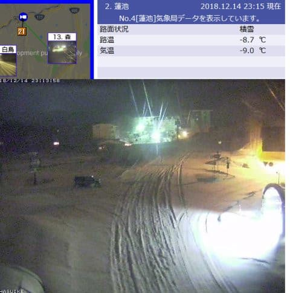
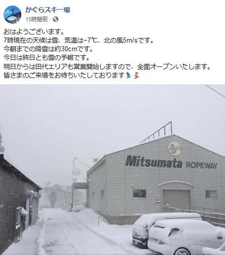

# 明日も焼額滑ってます！…明日は第2高速も動き，天然雪も乗っていい感じになりそう！

📅 投稿日時: 2018-12-14 23:34:04

🏷️ カテゴリ: [日記](cc4b5682fb7b8b144980957a978653fb0.md)

ってなわけで．

降ってます．

志賀高原．

それほど激しい降りではないものの．

積もる程度には降っていて．

…予想通り，明日の朝までには10cmほどの

積雪になりそう…！

気温も-9℃程度まで冷えてるようです！

そして，焼額は今日から第2高速リフトも動いてます！

熊の湯もクワッドは動かないけど，

明日からは山頂から滑れるようになり，

横手も本日から第1，第5ゲレンデがオープンと，

続々滑れるエリアが広がってきています…

…でも．

一の瀬ファミリーと高天ヶ原の両方揃って，

この週末もクワッドは動かないようです（涙）

志賀高原の中央エリア．ほかのスキー場に比べて，

ちょっと努力が足りない感じがする…（泣）

で．

かぐらは，この週末から田代・みつまた含め

全山オープンになるようですね…！

（[かぐらFB](https://www.facebook.com/snowkagura/posts/1826217224172256)より）

そのほか，

八方もリーゼンのみオープンするようで…

うーむ．

以前は兎とパノラマからオープンだったのに．

リーゼンが先にオープンとはちょいと違和感を

感じますが．

リーゼンに人工降雪機を新たに設置した

効果でしょうね～．

何にしろ，ロングコースが滑れるのはいいことですね．

で．

この週末の焼額の天気は．

土曜のあさイチは，人工雪と天然雪の

ミックスが圧雪された上に，うっすら

新雪が乗った，いい感じのバーンでしょう…！

昼間は急斜面はちょっと固めの

下地が出てくるかも…

でも．

終日気温は冷え冷え．

昼過ぎくらいまで，雪は降り続けて．

午後は止んでくるかな…

夕方には日も射すかも．

残念ながら，土曜の積雪だけでは，

日曜からゴンドラが動くのは

厳しいかな…

とりあえず，土曜の午後には雪は

止んじゃうので．

土曜昼までにガンガン積もってくれる

ことを期待！

そして，日曜は．

朝はすっきり晴れでスタート！

（積雪が無いのは残念だけど…）

放射冷却で朝は結構冷え込んで．

人工雪が圧雪された，締まったハイスピード

バーンかな…

昼に向かってグングン気温は上がるけど．

0度程度まで上がるくらいで．

雪質が悪化するほど気温は上がらず．

午後からは雲が増えそうだけど．

おそらく昼過ぎまで天気がいいので，

絶好のスキー日和になりそうかな…

ってことで．

今週末も焼額を滑ってます～！

## 💬 コメント一覧

### 💬 コメント by (若杉勲71)
**タイトル**: Unknown
**投稿日**: 2018-12-15 06:39:14

昨日のヤケビ情報。

２高が

動いて満足。２高から上がってきた一人がファースト。切れ切れの人だなあと思って追いかけたら、なんと初滑りだというコンスケさんでした。今日はたかまと言っておられましたが、動かないならヤケビかも。

２高ですが、パリパリの氷の上にサラサラが10センチ乗ってるという感じ。15センチの氷の塊もありました。

### 💬 コメント by (komu)
**タイトル**: 土曜午後から
**投稿日**: 2018-12-15 08:00:30

焼額でスタンバイ中です。

第2ゴンドラ動かすかも？との事です。

### 💬 コメント by (若杉勲71)
**タイトル**: Unknown
**投稿日**: 2018-12-15 13:38:41

komuさん、今日は２高　一番乗り、良かったですね。10時半から２ゴンが動き、一番乗りしました。ゴンドラ降り場は地肌も出てましたが、来る日も来る日も４ロマだけだった私には、美味しいご馳走でした。

そして、予想通りコンスケさんはヤケビに戻ってきましたね。

### 💬 コメント by (Skier_S)
**タイトル**: 祝！第2ゴンドラ運転開始！
**投稿日**: 2018-12-16 01:41:09

＞若杉さま

今シーズンのゴンドラ一番乗り，おめでとうございます．

ゴンドラ乗り場で索道係の方から報告を受けました(笑)．

今日もちょっと下地が硬いのが惜しかったけど，

楽しめましたね…！

明日も朝イチはいいと思いますよ～！

＞komuさま

第2ゴンドラ，無事動きましたね…

第1ゴンドラはまだ運転開始予定は全く未定だそうです．

来週までには動かしたいなぁ…

とは言っていましたが．

もう一降りほしいですね～！

