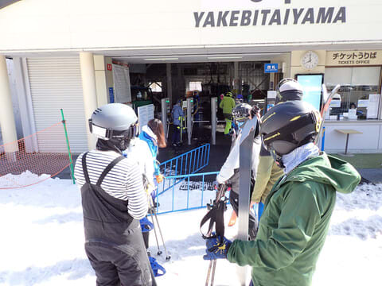
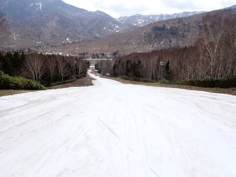
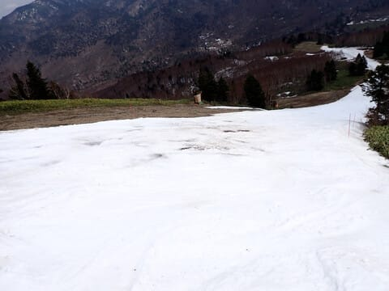
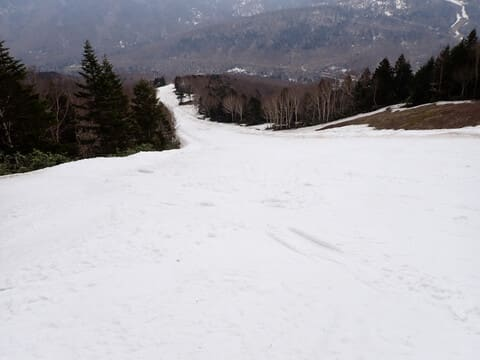

# 2024/4/29(月・祝)，GW前半3連休最終日の志賀高原焼額山スキー場は…晴れのち曇りの高温（泣）．GSコースは明日で終了！サウスコースはまだいけるよ！

📅 投稿日時: 2024-04-29 22:31:50

ってなことで．

GW前半３連休，初日・中日といろいろ

用事があり，志賀高原に行けませんでしたが…

本日志賀高原へ舞い戻ってきました～！！

GW前にオープンした志賀草津道を越えて

志賀までやってきましたが…

雪の壁はまだ結構高いですね～！

そして，渋峠の駐車場は朝６時半には

もう満車．

ちなみに，志賀高原まで問題なく夏タイヤで

やってこれました～！

…で．

焼額に行く途中で見た一ノ瀬エリアですが．

高天ヶ原はNHKバーンのみ幅いっぱいに

滑れる感じで．メインバーン，モーグルバーンは

滑走不可．

一ノ瀬ファミリーは上半分は幅1/3，

下半分もかなり幅が狭くなっていて…

どうやら本日でファミリークワッドは

終了，明日からは下のペアリフトのみに

なるようです（涙）

さらに，寺小屋は昨日で営業終了したみたいです．

奥志賀もゴンドラ沿いのダウンヒルコースは終了．

エキスパートコースも何とかぎりぎり滑れる

感じですが…

実質滑れるのは第３，第４リフトのみと

思ったほうがいいです．

GWの早朝営業は中止になりました（泣）

横手・渋はまだ山頂からふもとまで，

熊の湯も第２が山頂から滑れて，

イベントコースも滑れるようですが…

その中で，やっぱりゴンドラ2本と

ロングコース2本が滑れる焼額はすごいな，

と思っていたところ．

残念ながら焼額のGSコースも，明日で

終了のようです（涙）

でも，焼額山は明後日以降もまだ

第2ゴンドラ沿い，パノラマ～サウスコースの

ゴンドラ1本分滑れますよ～！

さすが3月に入っても人工雪を打ちまくった

だけのことはある感じ…

ってなことで．

本日の焼額山ですが．

さすがに早朝営業に間に合うように

家を出るのは無理で，通常営業の

8時開始を狙って到着しますが…

いつも通り，早朝営業のほうが混んでいて．

朝8時の通常営業待ちはわずか5人ほど．

で．

山頂につくと…

朝8時の段階ですでに10℃越え（泣）

そして．

今日も朝から晴天で日差しが強く…

朝から雪は緩み気味（涙）

緩斜面では，さすがに朝はフラットでしたが…

斜度があるところは，朝から荒れてるんですが（泣）

早朝営業の2時間で，かなり荒らされちゃった

ようです…

とはいえ．

パノラマコースは，まだ雪もいっぱい

残ってるし．

サウスコースも，気合を入れて人工雪を

打っただけあって．

まだ幅いっぱい滑れるのが驚き…！！

ただ，第2ゴンドラ側のサウスコースから

第1ゴンドラに戻る連絡路．

雪も減ってきているし…

完全廊下状になっちゃってて．

そして，水が流れ込む影響で，

えぐれて融けている部分もあり，

果たして，あと何日もつか心配…

でも，逆に言うと．

この状態で，GWまでもたせた

スタッフの尽力がすごい…

第1ゴンドラの乗り場も，かなり狭くして

雪を集めて，何とか滑りこめるように

維持されてます！

ただ．

GSコースは…

上のほうはまだ幅がかなりありますが．

この辺りから幅が狭くなり．

この辺りは結構狭くて…

5－10m程度かな．

幅が狭いところを人が集中して

滑るので，通常営業のころには

もうかなり雪が凸凹してました（泣）

ただ．

朝のうちは，幅が狭いもののまだ雪の厚みは

ありそうかな？

…と思っていたところ．

あさイチから，右に向かって落ち込む部分．

すでに雪が薄いところが…（涙）

で

そこから下，ゴンドラ連絡コース側は，

まだ雪がまともだったものの…

ゴンドラ迂回コース側は，

かなり雪が薄くなっており…

ゴンドラ迂回コース一番最後の，

この先の部分．

こんな感じに雪がかなり薄くなっており…

ゴンドラ迂回コースは明日は厳しいかも…

そして．

朝は晴れてたけど，昼前から曇り空に

なってきた志賀高原．

日差しで雪が解けないので，

曇ってくれてよかった…

と思ってたけど．

昼間の気温は+15度と超高温（涙）

そのため，かなりぎりぎりだったGSコース．

土が結構出始めてきて…

うーん．

コースを横切るように，土が出てきちゃったよ…（涙）

GSコースで一番ヤバい，右に落ち込むあたり．

ここも，かなり地面がコンニチハしている

ところが出てきました（泣）

まぁ，下から見るとこの程度なんですが…

先週からもう土が出始めていたこの部分．

営業終了後に毎日雪を他から運んで

コース復旧を図っていたのですが．

おそらく，この部分を埋める雪の在庫が

明日で切れるので，GSコースは明日で

営業終了なんだと思います…（残念）

パノラマコースも，夕方の営業終了の

頃になってくると．

ゴンドラ降り場の雪も薄くなってきて…

連絡通路の一部に一か所

雪が出てきて…

パノラマコースの壁の下の

この部分も．

土は出てきてないものの，

水たまりっぽくなってるところが

あり．

うーん．

こうなると一気に融けそうに感じるけど．

周りはまだいっぱい雪があるし．

さらに，この写真の分岐の右側，

クローズしたパノラマインコースから

雪が運べるので…

もう少し持つかな？

ってなことで．

GSコースは残念な感じだったけど．

今日はGWの3連休というのに，ゴンドラは

第1ゴンドラもガラガラだし…

第2ゴンドラもほぼ飛び乗りの

ガラガラ！

そして．

パノラマコースもごく一部土が出てきた

ところを除くと，まだ問題なく滑れるし．

サウスコースに至っては，

気合を入れて人工雪を打っただけあって，

営業終了時間になっても穴が開くような

ところはなく，まだ幅いっぱい問題なく

滑れるし．

今日は午前中から緩斜面は滑りが悪め

だったけど，斜度のあるところでつんのめる

ようなストップ雪にはならなかったし．

うん．

今シーズンはGWに滑れると思ってなかった

から．

GWにガラガラゴンドラでぐるぐる滑れる

だけシアワセ…

と，いつも通り営業終了まで滑り倒したの

でした…！！

ってなことで．

明日も志賀高原を滑ってますが…

うーん．

明日，雨が降るか降らないか，ぎりぎりの

天気図…

明日も気温が高そうなので，雨が降らず

曇りでとどまってくれるように

祈っておこう…
