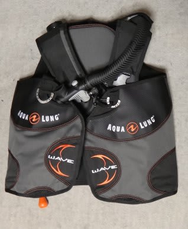
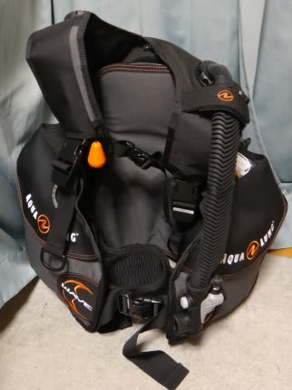

# 今回，BCを新しくしたのだが

📅 投稿日時: 2013-08-30 01:54:13

🏷️ カテゴリ: [日記](cc4b5682fb7b8b144980957a978653fb0.md)

えー．

[昨年の9月のダイビング](ec98a006a47afaa77adc456396ee3f27a.md)途中で．

これまで10年間ほど使っていた，かなり年季の入ったBC,

MaresのSyncro840．

買った当時，マレスでは一番安いBCでしたが．

このBCに穴が開いて，空気がもれるようになってしまったんですね…

どうやら，縫い目から漏れているので直せない，

直してもまたすぐ同じところから漏れてくる…

ということらしく．

泣く泣く修理をあきらめたわけですが．

今回，座間味に行くにあたって．

さすがBCを買い換えなくてはならない，と．

で．

そこそこのを買うべきか？

[車](eb1b0e385b422753c3e3aad5a58c12234.md)と[買うつもりのなかったスキー板](e9a16d9757c2d52b7254fe8a802071c63.md)を買ったばっかりなので．

激安BCを買ってみるか…？

と，悩んだ結果．

買ったのがこのBC.

なんと，29800円．

…ダイビング用のBCとしては破格．

はっきり言って，400本クラスのダイバーで買おうと思う人はいないのでは…？

という激安BC.

…でも．

スキーは板の違いで全然滑りが変わるけど．

BCの違いで全然もぐりが変わる，という話はあまり聞いたこともないし．

私は基本的にウエイト軽めで．

BCにそんなに空気を入れずに潜ってるし．

＃最大深度10m程度のダイビングだと，BCに

＃エアを入れることはほとんど無い

まー，BCなんてポケットつきベストみたいなもんだから，

ポケットがあればいいか，

…という感じで買ってみて．

このBCでもぐってみたけど．

…はっきり言って，29000円のBCで十分だな

ってことで．

激安BC.

問題なく使えて，よかった…

## 💬 コメント一覧

### 💬 コメント by (伽羅)
**タイトル**: 同感です。
**投稿日**: 2013-08-31 13:20:50

私はここのところ、海外でたまにBCレンタルするのですが、BC違って困ることってあんまりないので、何でも良いのかなーと思いました。

今週、GoProのテストもしてきたのですが、カメラもこれで良いんじゃないかと思ってしまう、怠けものダイバーになってしまいました。

身軽で潜るって良いですね。

### 💬 コメント by (Skier_S)
**タイトル**: そうですよね～
**投稿日**: 2013-08-31 23:00:40

はっきり言って，BCとレギュって，

高いやつと安いやつの違いがイマイチ

分かりません…(笑）．

最近は年間20本も潜らないから，

安いやつでいいや～，って．

GoProもいいじゃないすか．

そうやって，荷物が軽くなっていけば

理想かと(笑）．

### 💬 コメント by (マルハバ)
**タイトル**: ダイビング機材
**投稿日**: 2013-09-01 22:48:24

＞はっきり言って，BCとレギュって，

高いやつと安いやつの違いがイマイチ

分かりません…(笑）．

全く同感でございます。

ダイビングはエキスパートになれば成る程

機材はどうでもいいモノになっていくスポーツ

なのではないでしょうか？（笑）

### 💬 コメント by (Skier_S)
**タイトル**: マルハバさま
**投稿日**: 2013-09-02 00:34:17

やっぱり，同感でしたか(笑）．

そうですよね～，やっぱり．

そして，ウェットも柄物から黒一色に

なっていくという…

こだわりが必要な道具って，フィンくらいでしょうか？

…私はダイビングを始めたときに買ったプラフィンを

まだ愛用していますが(^^;

このフィンに慣れすぎて，他のフィンではいろいろな

小技が使えないんです(笑）．

