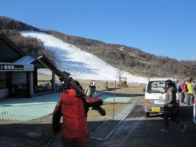
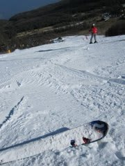
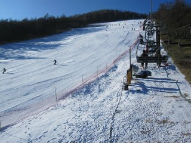
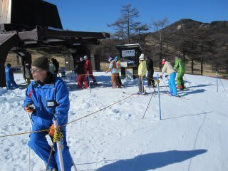
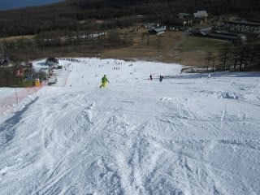
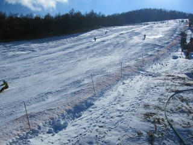
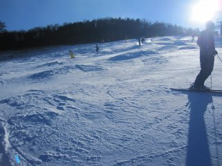
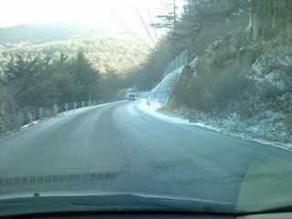

# 11月20日　アサマ2000

📅 投稿日時: 2010-11-20 23:37:58

🏷️ カテゴリ: [2011スキー滑走日記](ca488c98cfb9169941c3e73770dcefb56.md)

気温：5度前後．予想よりあったかい

天気：晴れ！！！

雪質：人工降雪．ところどころ固い

積雪：40cm程度

リフト：最大待ち5分，平均1分．がらがら．

路面：最後100mほどわずかに白くなっているけど…

ということで．

この週末，予告どおりアサマ2000に行ってきました．

結論から言うと…

最高．

天気もよく，雪も人工雪とはいえ，アイスクラッシュではない，

しっかり締まったいい雪．

コース幅も30mほど．

気持ちよーーーーーく大回り可能．

で，人が少ない．

リフト待ちは，朝11時まで3-7分程度．

11時を過ぎると，リフト待ちがなくなってしまった！！

それ以降，2時過ぎまで，リフト待ちは搬器4-5個待つ程度，

短ければ待ち完全に0という，先週の丸沼から見れば

天国のような待ち時間の短さ．

8時半リフト営業開始ですが，2時までで40本滑れたという

効率の良さ！！！

んで，コースが広いし，雪が締まっていて大回りOKとくれば…

どーしてみんなアサマに来ないの？

どーしてこんなにがらがらなんでしょう？？？

雪自体は，11時を過ぎたころからところどころに固い

下地が顔を出し始め，12時ごろには小回り道部分は

アイスバーン的な固い雪，小回り道の外はざくざく雪の

コブ，という感じになり…

午後2時には完全に小回り道と

それ以外のでこぼこ斜面に．

フラットバーンを滑れるのは，まぁ12時前くらいまででしょうか．

しかし．

この時期としては，

リフト待ち時間のみじかさも含めて，最もいいコンディションの

スキー場ではないでしょうか．

うーん．

前日に雪が降ったから，道が凍結しているのを危惧して

みんな上がってこなかったのかな？

高峰高原ホテルを超えた峠の向こう側，100ｍほど

白くなってましたが，夏タイヤで突っ切りました．

午後には道の上の雪は溶けちゃうだろう，と思っていたら，

夕方まで白く残っていたのには驚き…

でも，恐れるほどではないです．

ちなみに，今週の営業は朝8時半～午後3時まで．

早めに終わっちゃうので，リフト1日券は3000円に

なってます．

さぁ．

悩んでいる人はアサマへGO!
