# 10月25日に発表された3か月予報を読み解いてみる…今シーズンのスキー場は，12月，1月はちょっと冷えて雪も降る，いい冬になりそうな予感！

📅 投稿日時: 2021-10-27 03:06:14

ということで．

10月25日に気象庁から，11，12，1月の

「全般季節予報支援資料  ３か月予報」

が発表されたので．

この冬，冷えて雪が積もるのか，

気になって毎晩毎晩踊りを踊って

しまう人のために，この資料を基に

冬の天気を占ってみましょう…

まず．3か月予報資料，[FCXX93](https://www.sunny-spot.net/chart/FCXX93.pdf)から見てみますが．

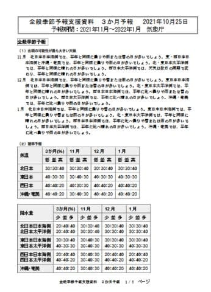

書かれている気温の確率予報の表を見ると．

ふむ．

11月は平年並みが40％で一番多いけど．

12月は平年より冷える確率が40％で，

1月も平年より冷える確率が40％と．

まぁ，12，1月は平年よりちょっと

冷えそうですね…！

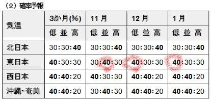

そして．

降水量の確率予報を見てみると．

東日本日本海側では．

11月は平年並みが40％で一番多いけど．

12月，1月は降水量が多い確率が40％と．

12月，1月は，雪が平年より多そう…！！

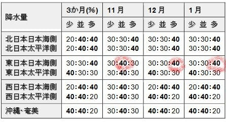

ふむ．

前回の10月～12月の3か月予報では．

12月は冷えて雪が多そう…ということ

でしたが．

今回新たに出た1月の予想も，

冷えて雪が多そう

ということで．

やはり，この冬は，そこそこ冷えて雪が

多そうな感じ…！

…11月はダメだけど(ちょい涙)

ということで．

この冬は期待できそうです～！！

…

…

…

というところで．

基本的な本題は終わりなんだけど．

ここから先は，

普通の人は読まない方がいい，

マニアックな人に向けたいつもの詳細解析をば…

まず．

3か月平均の詳細内容を読み解くと．

一つ目の赤線部に，

「ラニーニャが発生する可能性の方がより高い」

と書かれています．

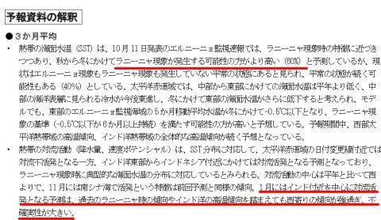

…これは，3か月予想ではなく，

気象庁の「[エルニーニョ監視速報](https://www.data.jma.go.jp/gmd/cpd/elnino/kanshi_joho/kanshi_joho1.html)」のページで

確認することができて．

こんな感じで．11，12月はラニーニャの確率が

70％と．

ほぼ確実に，冬に冷える傾向がある

ラニーニャになりそうな感じ…！

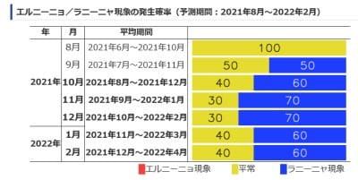

で．

この部分の2カ所目の下線部．

「1月にはインド付近を中心に…

不確実性が大きい」

という部分ですが．

これは，[QXVX43](https://www.sunny-spot.net/chart/QXVX43.pdf)，[QXVX44](https://www.sunny-spot.net/chart/QXVX44.pdf)から，

200hpa velocity potential図を見てみると．

普通のラニーニャ現象の時は，

こんな感じで200hpaの循環予想．

網掛けの対流活動が活発な部分の

中心が，赤く印したようにフィリピン～

インドネシア近辺となるんですが．

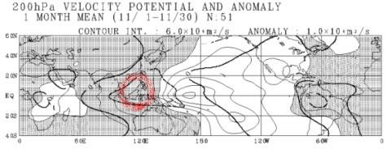

この1月の予想は，なぜか赤く印した

対流活動の中心がこんな感じでインド洋

～アラビア海付近まで西にずれて

しまっていて．

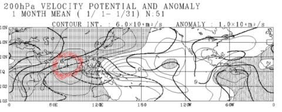

「あれ？ラニーニャにしては，対流活動の

中心場所おかしいんじゃない？」

ということで，

さっきの下線部の「不確実性が大きい」

＝「この予想，ずれてそうだよね…」

ということを意味してます．

これ，また後の1月の予報に影響するので，

ちょっと覚えておいてください．

で．

続いて，11月の解説文を読むと…

赤線の部分，「850hpa気温は，日本の北から

東にかけて正偏差が…」

と書かれてますが．

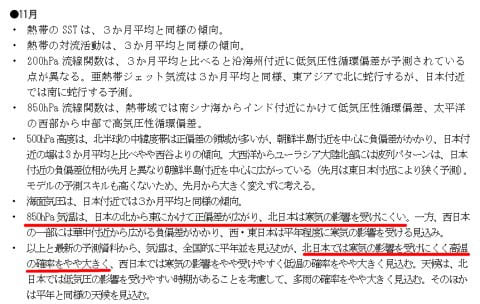

[QXVX47](https://www.sunny-spot.net/chart/QXVX47.pdf)を見てみると…

網掛けの負偏差部分は西日本だけを

覆っていて．

東日本にはかかってません…

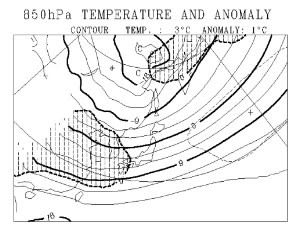

この網掛け部分がかかっている部分が

平年より気温が低いところなので．

網掛けに覆われてない東日本は

平年より冷えない

ということです(涙）．

やはり11月，東日本は寒気の影響を

受けにくそう…

そして．

続いて，12月の解説文を読むと．

赤線の部分に，

「850hpa気温は，シベリアから…寒気の影響を受けやすい」

と書かれています．

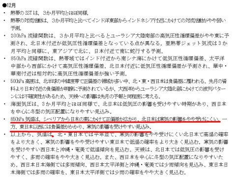

だもんで．

12月の850気温の図を見ると．

うむ．北海道(北日本)は網掛けが

かかってないけど．

東日本以西は網掛けがかかって．

平年より気温が低そう！

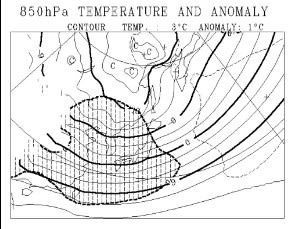

ってなことで．12月は，東日本も

寒気の影響を受けやすく，冷えますよ～！

そして．

最後の1月を見ると…

赤線の一カ所目．

「850hpa気温は，…日本の東の正偏差の

北日本付近の張り出しが強いが…傾向を抑えて考える」

と書かれています．

これはどういうことかというと．

850hpa図を見ると，日本は九州以外には

例年より冷える網掛けがかかって無くて．

本来なら，東日本とかは平年より気温が

上がることを意味しています…

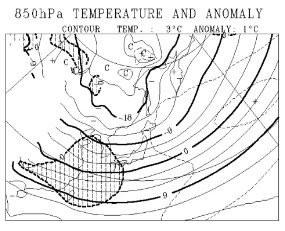

ただ，この水色の下線部のように，

最初の方に説明した，

「なんだか，インド洋中心に対流活動の中心が

あるっておかしくない？」

という「不確実性」が影響して，正偏差の予想が

実態より西にずれてる可能性がある…

ということを考えているようで．

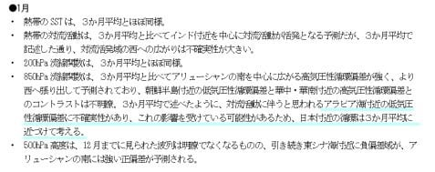

だもんで．

この赤下線部の2カ所目，

「寒気の影響をやや受けやすい東日本で

低温の確率をより高く見込む」

と書いてあるように．

コンピューターの予想をそのまま使わず，

人間の経験に基づき冷えた方にずらして

「冷える確率が40％」

としたようです…

ってな感じで読み解いていくと．

純粋なコンピューターの予想値，

[QXVX50](https://www.sunny-spot.net/chart/QXVX50.pdf)だと，1月の東日本は

気温が高くなる確率が45％で一番

高いのに．

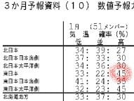

人間がこのコンピューターの結果を

そのまま信じずに

「冷える確率が一番高くて40％！」

と直した過程が読み解けます…

気象庁の人は，コンピューターの予想を

そのまま使うのではなく．

「経験からコンピュータ予想に補正をかける」

という，職人技を繰り出しているんだなぁ…

って感じの，意外とアナログなところが

透けて見えて，面白いです…

…

…今日もちょっとマニアックすぎたか…

## 💬 コメント一覧

### 💬 コメント by (naoちゃんねる)
**タイトル**: Unknown
**投稿日**: 2021-10-27 10:03:06

結局のところ、私達は気を抜かず冷え冷え踊りを踊り続けた方がいい！！という結論ですねε≡≡ﾍ( ´Д`)ﾉ

### 💬 コメント by (m&t m)
**タイトル**: Unknown
**投稿日**: 2021-10-27 10:04:10

そんな事なく、めっちゃ面白いです

### 💬 コメント by (スシネコ)
**タイトル**: Unknown
**投稿日**: 2021-10-27 12:21:20

本当に凄いです。気象データーの読み方の勉強になってます。データ補正の解説、とても面白かったです。

### 💬 コメント by (Skier_S)
**タイトル**: 面白いと思ってくれる人がいるとは…
**投稿日**: 2021-10-28 00:57:25

＞naoちゃんねるさま

そうです！

11月に予定通り横手・熊が開くかは厳しいところと思っていますので，

踊り続けてください…

冷えるのは12月に入ってからなので，12月第1週から焼額ゴンドラが

動くかどうかも，冷え冷え踊りにかかってます！！

＞m&t mさま

あ…この記事を面白いと思ってくれる人がいたとは…

ちょっと感動

＞スシネコさま

あら．

面白いと思ってくれる人が，まさか2人もいるとは！！

2時間近くかけて読み解いて記事にしたけど，これを面白いと

思ってくれる人なんて完全に0人だよね…と思いながら書いていたので…

ちょっと励みになりました(笑)．

