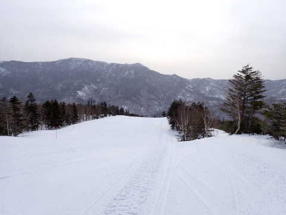
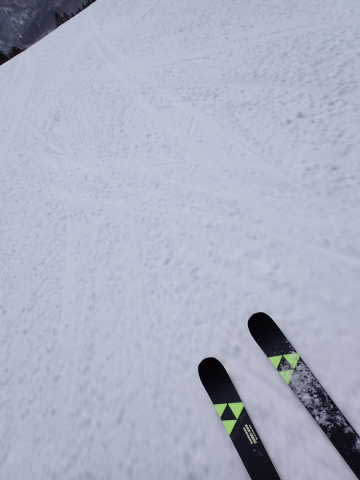
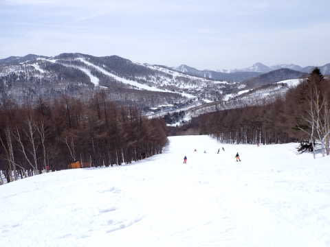
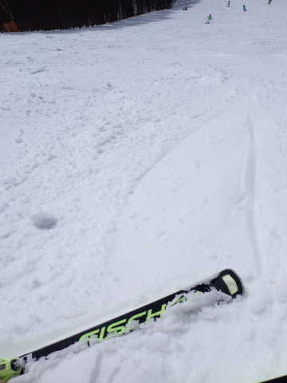
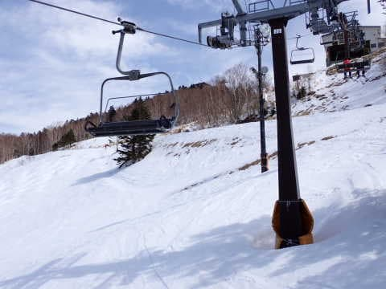
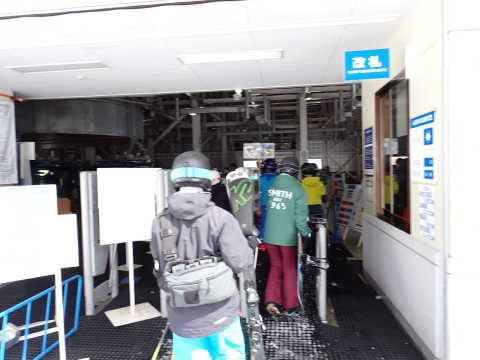
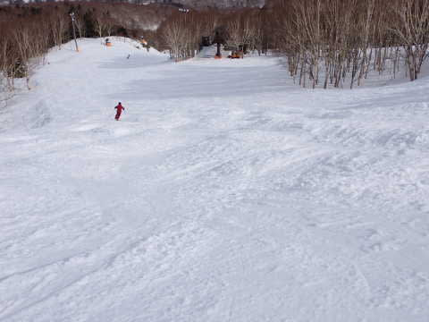

# 2023/3/12(日)の志賀高原スキー場は…昼間の気温+10℃で晴天って，GWか？暑すぎて雪がダメになった週末

📅 投稿日時: 2023-03-13 01:47:59

🏷️ カテゴリ: [2023スキー滑走日記](cd943df30cfcc3d0896469e2ff98720cd.md)

ということで．

今日も志賀高原で滑っていたわけですが…

スキーをやっているどころの状況じゃ

ないにもかかわらず，ついついラスト

まで滑ってしまい，

帰宅が深夜になってしまいました…

これからまだ一仕事やっつけなくては

ならないので，今日の志賀高原を速報モードで

レポート！

今日は朝から晴れでスタートでしたが…

晴れと言っても，冬のようなすっきり晴れ

というより，春霞がかかったような空で…

そして．

あさイチからプラス気温(涙)

4月中旬並みの気温のおかげで…

あさイチバーンから緩いんですけど！？？

普通はGWでも，冷える時は朝は

締まったバーンなんですけど！？？

なぜ3月上旬のあさイチでこんなに

雪が緩いのか…(泣)

気温は最高+10℃まで上がり，

さらに終日晴れ~うす曇りと，日差しが

ゲレンデに降り注いだので．

雪はあっという間に緩んで…

朝9時過ぎにはユルユルになり，早くも

バーンは荒れ始めてきました…(涙)

とても3月上旬の志賀高原の午前中の

雪には思えないんですけど…

一体なんの仕打ちだ…（止まらない涙）

あまりにも雪が悪いので，今日も

午前中の日差しが弱い西斜面の一の瀬・

高天ヶ原方面に行ってみたけど…

一の瀬も昼前には完全に緩んでしまって，

さらに高天ヶ原は，早くも土が

見え始めてきています…（激涙）

ヤバい…これはヤバいよ…

しいて言えば，リフトもゴンドラも，今日は

それほど混まなかったのがまだ良かった

けど．

でも，午後2時すぎにはバーンも重い雪の

荒れ荒れ斜面になってしまい…

うーん．

残念．

残念だよ…

でも．

雪があって滑れるだけマシ

と．

達観状態に入ってしまった私は，

いつも通りラストまで滑り続けたのでした…

しかし．

とても3月上旬とは思えない気温だし．

この1週間でかなり雪が融けました…（涙）

月曜はちょっとだけ雪が降りそうだけど．

積もって10cmくらいだし．

これから1週間も気温が高そうです…

あぁ…

ダメだ．

ダメダメな3月上旬でした…

きっと，この反動が来る．

自然界はバランスをとるようにできているので，

これまで暖かかったぶんの反動が来るはず！！

3月下旬は激冷えになり，

毎日マイナス10℃以下の気温で，

冷え冷えの腰パフパウダーが毎晩積もり

続けるはず…！！！←ありえないから

あぁ…

もう一回，冷え冷えの最高雪で滑りたい…

## 💬 コメント一覧

### 💬 コメント by (レインボー75)
**タイトル**: Unknown
**投稿日**: 2023-03-13 11:53:04

月曜日の志賀高原情報

朝の湯田中は雨。上林+11℃　蓮池+4℃。

昨日はシャルマン火打で、愛弟子(逆やろ！)の大会の応援。景品の肉を没収して焼肉パーティー。満足です。

今朝は強風でゴンドラ運休。雨のなか、よんろまから二高回し。

みんながためらうなか、「貸しきりだ」と勇んで出陣したものの、徐々にミゾレになってゴーグルにへばりつく。鎧を履いているのにお尻がべとべと。おまけに降るのはストップ雪。僅か40分であっさり終了。

そのあといちごんが動いたと情報が入ったけど、びしょ濡れ男に再開の気力など残っているはずもありませんでした。明日です！

### 💬 コメント by (ランランだー)
**タイトル**: Unknown
**投稿日**: 2023-03-13 12:14:58

同じく昨日滑りに行きました。

焼額も、一ノ瀬も雪が重く、板が走りませんでした。

いつまでも寒いのは良いんですが、暑いのは嫌ですね。

### 💬 コメント by (環境破壊による温暖化、異常気象だと気付けよ)
**タイトル**: Unknown
**投稿日**: 2023-03-13 19:54:42

環境破壊による温暖化、異常気象だと気付けよ

対策しないといけない

普段からきちんとできることしてるか？？

### 💬 コメント by (Skier_S)
**タイトル**: ラニーニャは真冬は冷えるはずだけど…
**投稿日**: 2023-03-14 01:44:31

＞レインボー75さま

今日は修行お疲れ様でした．

ゴンドラが動かない雨の中，びしょ濡れの第2高速で滑るとは…！！すごい…

で，明日は雪は降らなさそうですが，朝は気温が冷えるのでバーンはカチカチかも！！

気を付けて滑ってください～！

＞ランランだ―さま

昨日，滑ってらしたんですね…

もう，かなり重い雪でしたね（涙）

確かにスキーヤーとしては，少なくともスキー場は年がら年中いつでも冷えていて

ほしいところです…

＞環境破壊による温暖化，異常気象だと気づけよさま

うーん．

これを突き詰めると「全人類を抹消する」のが環境には一番いいんですよね…

