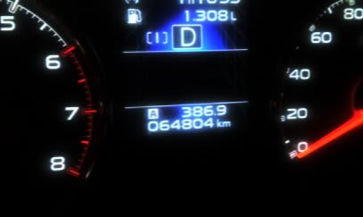

# BRレガシィ君，2周年記念

📅 投稿日時: 2015-06-11 01:31:12

🏷️ カテゴリ: [車](cba0e8330b3f2ded7c1addfacc75d4547.md)

えー．

おととしの6月に納車された，わがBRレガシィ君．

…気づくと．

もう，納車2周年を迎えたようです…

まぁ，2年乗ってみましたけど．

雪道での安定性はバツグンだし．

通勤にも使って，ここ10000kmでの平均燃費は

リッター13km超えて．

4WDでルーフボックスつけてるワゴン車としては

燃費はそこそこいいし．

今のところ無故障で走ってくれてるし．

けっこー満足してます．

で．

2年間での走行距離は…

6万4800kmですか…

順調に過走行一直線ですね（笑）．

2年で約6.5万kmってことは．年間3万km以上なので．

来年の車検まで乗ると，約10万kmですね…

その場合．

乗り換えても，下取り価格は限りなく0かな…

…

…

これは．

もしかしたら．

お値段がつく，今のうちに乗り換えた方がいいのか…な？

…いやいやいやいや．

ない．

まだ，プロジェクトX2は，ない．

レガシィBR君，気に入ってるし…

なにより，お財布が…もたないから．
