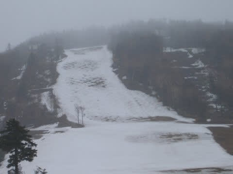
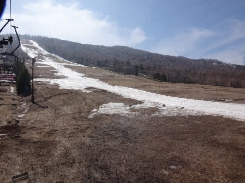
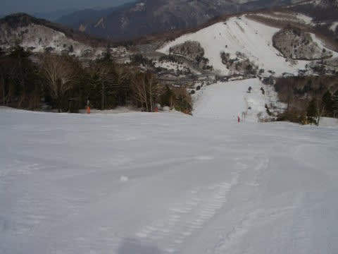
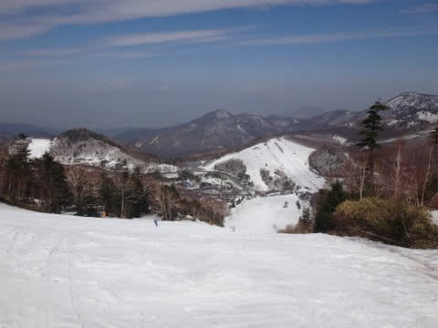
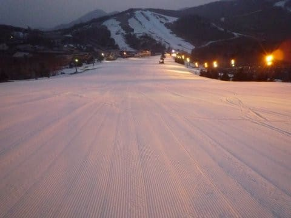

# 志賀高原のGW営業情報が出たよ…焼額・横手は30日まで，奥志賀・熊の湯は5/6まで

📅 投稿日時: 2018-04-27 03:09:19

未だに信じられないのですが．

本日，一の瀬ファミリーの営業が終わってしまいました．

あぁ…

過去の記録を紐解くと．

私が記録を残している過去20年間で，

GWまで一の瀬ファミリーがもたなかったのは，

2年前，2016年の小雪の年だけだったのに．

それ以外は，2007年にGW営業残り2日の時点で，

雨による雪解けが進んで，山頂からの

滑走が不可能になったことが1回だけあったけど．

それでも，下のペアリフトはGW最終日まで

営業していたので．

基本的に，GWの最後まで滑れなかったことは

40年に一度の暖冬に襲われた一昨年だけで．

この年以外は，GW途中で営業終了…ということも

一度も無かったというのに．

（2016年のGW一週間前の一の瀬ファミリー）

なぜか，中1年挟んだだけで，また

GWの最後まで滑れないどころか，

GWに入る前に滑れなくなるという

年がやってきてしまいました（泣）

なんということか…（激涙）．

2006年とか

去年とかは．

GWの営業が終わっても，まだ1m近く雪が残ってる

くらいだったのに…

そもそも．

2010年まで．

そう，例の大震災の前の年までは，

GWの最終日前日まで，ナイターで

滑れるくらいだったんですよね～（遠くを見る目）

（2010年のGWのナイター）

あぁ…

なんてこった…

なぜ，神はこのような試練を与えるのか…（激涙）

とりあえず．

現時点での志賀高原のGW営業情報を集めると．

高天ヶ原トリプル　4/30まで

焼額第1ゴンドラ　4/30まで（6:30～早朝営業あり）

奥志賀ゴンドラ，第4ペア　5/6まで

第2ペア，第3ペア　5/6まで（6:00～早朝営業あり）

熊の湯第2ペア　5/13まで　（5/6まで，6:00～早朝営業あり）

横手山第2，第3，渋峠　4/30まで　（状況によっては延長あり）

という感じのようです…

GW後半までの営業を明言しているのは，

奥志賀と熊の湯のみ．

ここは，奥志賀がどこまで頑張ってくれるかに

かかってますね…

5月3日に結構雨が降りそうなので．

それを乗り越えられるかどうか…

あぁぁ…

これから超奇跡が起きて．

5月3日，どしゃ降りじゃなくて，ドカ雪にならないかなぁ…（切望）←だから，無理だってば．ありえないから

## 💬 コメント一覧

### 💬 コメント by (もりや)
**タイトル**: まだまだ滑りますよ
**投稿日**: 2018-04-27 04:33:35

今月に入り一気に雪解けが進みましたね。今シーズンはSさんを始め、たくさんの方と知り合い一緒に滑る事が出来、ホントにスキーをする事が凄く楽しかったです。そんな知り合いの方々も週毎に減って来ると、なんだか寂しい気持ちになってしまいます。今シーズン残り僅かですが日曜日早朝からラストまで滑りますよ。5月の連休は3・4・5と熊の湯か奧志賀で早朝から滑る予定です。13日熊の湯で今シーズンラストにします。では、日曜日ヤケビでお会いしましょう。

### 💬 コメント by (Skier_S)
**タイトル**: もりやさま
**投稿日**: 2018-04-27 20:49:33

いや…

4月の雪の融け方は半端なかったです…

すごい寂しいですね（涙）

しかし，今シーズンは知り合いが増えたので，

だんだん人が減っていくと寂しいですね…

私はGWは3連休にヤケビ＆奥志賀滑ってますので，

また，日曜にお会いしましょう！

