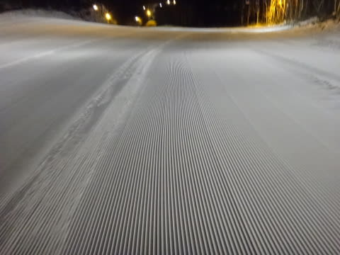

# 12月24日，クリスマスイブの志賀高原にサンタさんが雪のプレゼント！ゲレンデ状況復活だぁ！

📅 投稿日時: 2016-12-24 22:19:52

🏷️ カテゴリ: [2017スキー滑走日記](c7d777cecfc91bdf0fa464ad62c6d49ab.md)

そうです．

サンタさんはきっといるのです．

いるに違いありません．

サンタさんが雪を降らせてくれたおかげで，

今日のゲレンデ状況，一気に回復です！！

…とはいえ．

一晩で積もったのはこの程度．

20cm程度の積雪で，ドサドサパウダーってわけで

ないですが．

でも，この雪のおかげで．

ゲレンデのブッシュはほとんど隠れました～！

とりあえず．

[水曜の天気予想](e8dcb91171034bf8254da2d332d5dc74f.md)で．

　朝は10cm～20cmの積雪かな？

と書いたのが，多い方に当たって，良かった…！

で．

本日山頂の気温は…

ちょっと見にくいけど，-9℃といい冷え込み！

そして，ゲレンデは…

ゲレンデは…

ゲレンデはっ！！！

昨日と打って変わって，最高じゃありませんかっ！！！

ここ…昨日はこんな感じだったし．

今日はこんな感じのところも…

昨日はこんなだったんだよな…

もう，一晩でこんなに回復するとは…っ！！

コースわきの積雪はこんな感じで．

結構軽い，いい雪ですよっ！！

まさに，

　昨晩からの雪で，朝はアイスバーンが隠れる．

　だもんで，朝はやわらか圧雪のいい感じ！

という予想通りのコンディション！！←天気予想を当てたことを必死になてアピール

しかし．

朝9時半ごろまでは，ゴンドラ飛び乗りで．

コースもガラガラだったけど…

10時近くになってくると．

あれ？

ありゃりゃ～…

ちょっと人が増えてきましたね…

でも．

ゴンドラ待ちはせいぜいこの程度．

昼頃になっても，気温は低いままで．

午後まで，雪質はやわらかいフカフカ状態を

キープ！

…しかし．

ゲレンデの人が多くて．

雪が柔らかいということは…

そうです．

昼過ぎには…

うーーーむ．

かなりの荒れ荒れ凸凹バーン化しちゃったのですが（涙）

かなりの疲労蓄積バーン化してきたのですが…

天気は，基本的に曇り．

時折一瞬雪が強く降って，視界が悪くなる

こともあったけど…

でも．

夕方になると，日も差してきて．

終日雪質もよく．

（おかげでかなりの荒れ荒れ凸凹になったけど…）

…荒れ荒れバーンで疲れたとはいえ，

ブッシュだらけバーンに比べれば，

100倍シアワセ…

と，喜びに震えつつ．

今日も，16時のゴンドラストップまで，

焼額を堪能したのでした…

…で．

今日もいつもの瞬間移動！

16時のラストゴンドラに乗ったのに．

なぜか16:25には一の瀬にいる私．

一の瀬も，雪が積もったおかげで，かなり

凸凹でしたね…（ちょっと涙）

一の瀬正面バーンもオープンしましたが．

ここもかなり凸凹だったようです…

こんな感じの一の瀬を，16:40のラスリフトまで

しっかり滑った後…

ふはははははは．

そうです．

今日も来ました．

快楽の焼額ナイターっ！！

うはははは．

圧雪したての，最高雪質のシマシマっ！！

これだ～！！

焼額ナイターは，こうじゃなきゃ～！！

ってことで．

人が少なく，かなり時間がたってもシマシマの

ままだった，超最高雪質のピカピカ圧雪を．

たらふくいただいたのでした…

＃今日も第4ロマンスのみのナイターでしたが，

＃昨日と違って減速運転じゃなかったよ

いやーーー．

明日は晴れるだろうから．

明日の朝イチは最高だろうな！！

## 💬 コメント一覧

### 💬 コメント by (Goku)
**タイトル**: 明日の朝まで待てません(笑)
**投稿日**: 2016-12-24 23:05:00

朝イチは先週以上間違いなし！ですね

早く滑りたーーーーーーーい

### 💬 コメント by (はなげ親分)
**タイトル**: こともあろうに・・・
**投稿日**: 2016-12-25 19:51:27

土曜日かみさん足首骨折です!

S様とゴンドラご一緒した後やっちまいました。

あー、年末年始は滑られないな～！

### 💬 コメント by (Skier_S)
**タイトル**: グッドな一日だったんですが
**投稿日**: 2016-12-26 02:55:45

＞Gokuさま

今日はお世話になりました～！

最後は結構なハイペースでしたね…

しかし，いいコンディションの一日でした！

＞はなげ親分さま

えええええええええええっ！！！！

ええええ！！！

骨折，ですか？

折っちゃったんですか？？？

それは，滑れないのは年末年始だけ

では済まない感じですよね…

全治どのくらいでしょう？？

…可能な限り早くの，奥様の早期完治と

今シーズン中のゲレンデ復帰を

全力で祈ってます！！

くれぐれもお大事に…

＞はなげ親分の奥様

大変なことと思いますが，

しっかり治療して，またゲレンデに

戻ってきてください．

お待ちしております…

### 💬 コメント by (はなげの女房)
**タイトル**: やっちゃいました…
**投稿日**: 2016-12-27 00:29:05

Sさん、優しいお言葉ありがとうございます。GSの最後の斜面で転倒し、右足首が痛くて救急病院に行ってレントゲンを撮ったら、腓骨骨折…そのまま副木をして包帯グルグル巻きで帰って来ました。今日からギブスで松葉杖です。今シーズンはダメかも…シーズン券が泣いてます。

### 💬 コメント by (Skier_S)
**タイトル**: はなげの女房さま
**投稿日**: 2016-12-27 09:00:55

腓骨骨折ですか！

それは長引きそうですね…

生活もいろいろ大変かと思いますが、

早く良くなることを祈ってます。

またゲレンデでお会いできる日を

待ってます！

