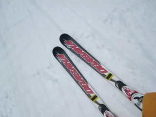

# OGASAKA Keo's　RFに乗ってみた

📅 投稿日時: 2011-04-09 00:34:08

🏷️ カテゴリ: [スキー板試乗](c0bd8048615710cee890e403a36cc9a2b.md)

私のポリシーとして．

「ブーツサイズが合う板は履いてみる」

…というのがありまして．

今回，一緒に行ったメンバーに，Keo's　RFを履いている人がいて．

んで，ブーツサイズが一緒だったから，履いてみたわけですね．

…

これは，意外と．

なんか，OGASAKAって，どっちかっていうとどっしりした感じで，

ウッドコアサンドイッチっぽい感じがする板が多い気がするけど…

これは，ちょっとOGASAKAらしからぬ，軽快な履き心地．

履いた感じはすごい軽いです．

昔のイソコアとかの心材の板みたい…

でも，170cmという長さと，板の軽さから想像がつかない

板の落ち着きと，高速安定性がありますね～．

かなりのスピードを出しても，板が負ける感じは

ありません．

得意分野はミドル～大回りかな．

しかし．

同じように，ミドル～大回りを得意とする，

ATOMICのD2 DEMO Type-Aとも違う感じ．

ATOMICのD2 DEMO Type-Aは，

どんな低速でも，どのようなわずかな角付けでも

トップ部のアダプターデッキがぐぐぐっとたわんで板が回り始め，

それに伴い板全体のたわみが生じ，

どうしようもなく自動的にカービングへ導いてくれる…

って板ですが．

この板は．

内足を軸に，外足を動かしていくと，動かした量だけ

素直に曲がっていく感じ．

働きかければ働きかけただけ曲がってくれる板です…

その，働きかけの量とそれに応える板の曲がり具合が

もう絶妙．

ATOMICは，ハイスピードになってきたり，雪がやわらかくて

板のエッジが食い込むようなシチュエーションだと，

予想より旋回半径が小さくなることがあるので，回転弧の

コントロールを入れることがありますが．

この板は，すごい素直です．

まっすぐ落とすことも，小さく回ることも出来ます．

端的に言って，優等生的でとんがったところがないのですが．

いろんなシチュエーションで一日履き続けるには，

すごいいい板かも…

でも，ちょっとお値段高すぎかな～

さて．

今週末も，志賀に行ってきます．

あー．雨かなぁ．
